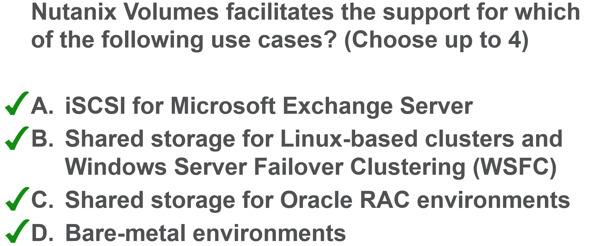

.. Adding labels to the beginning of your lab is helpful for linking to the lab from other pages
.. _ASS_answer_3:

-------------
Answer 3
-------------

Nutanix Volumes facilitates the support for all four use cases.

- iSCSI for Microsoft Exchange Server. Volumes allows Microsoft Exchange Server environments to use iSCSI as the primary storage protocol.
- Shared storage for Linux-based clusters and Windows Server Failover Clustering (WSFC). Volumes supports SCSI-3 persistent reservations for shared storage-based Windows clusters, which are commonly used with Microsoft SQL Server and clustered file servers.
- Shared storage for Oracle RAC environments.
- Bare-metal environments.  Volumes enables server hardware separate from the Nutanix environment to consume Acropolis DSF resources, so you can leverage existing server hardware investments against Nutanix storage resources. Workloads not targeted for virtualization can also use the DSF.

Back to the Question: :ref:`ASS_question_3`

Next Question: :ref:`ASS_question_4`

