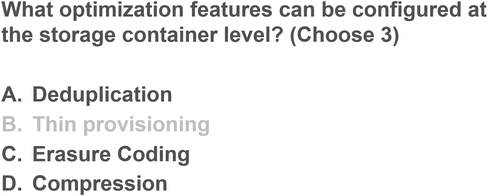

.. Adding labels to the beginning of your lab is helpful for linking to the lab from other pages
.. _ASS_answer_4:

-------------
Answer 4
-------------

Challenge-Handshake Authentication Protocol (CHAP) is a peer authentication protocol that allows an iSCSI client and target to authenticate based on a password, also referred to as a secret. 

CHAP includes both one-way and mutual authentication. With one-way CHAP, a target authenticates a client initiator when it connects.

With mutual CHAP, the client and the target authenticate each other based on their respective passwords. Volumes supports using both one-way and mutual CHAPs.

Back to the Question: :ref:`ASS_question_4`

Next Question: :ref:`ASS_question_5`

