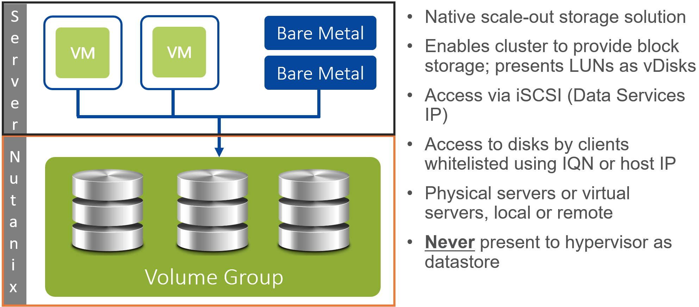
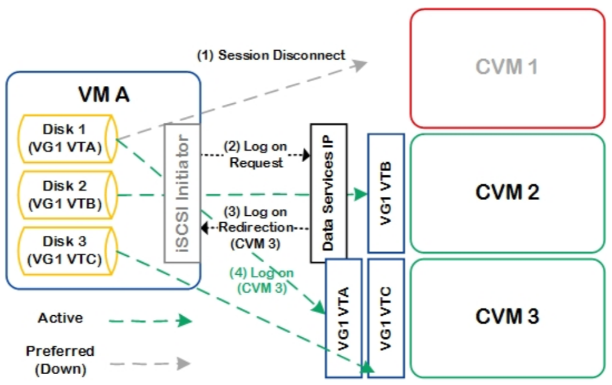
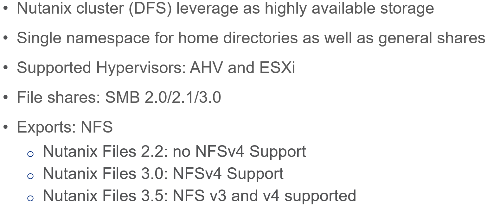
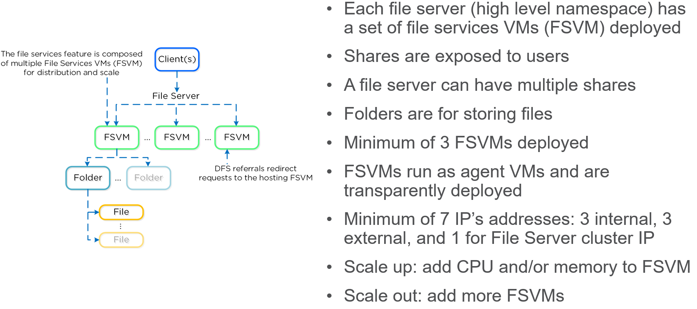
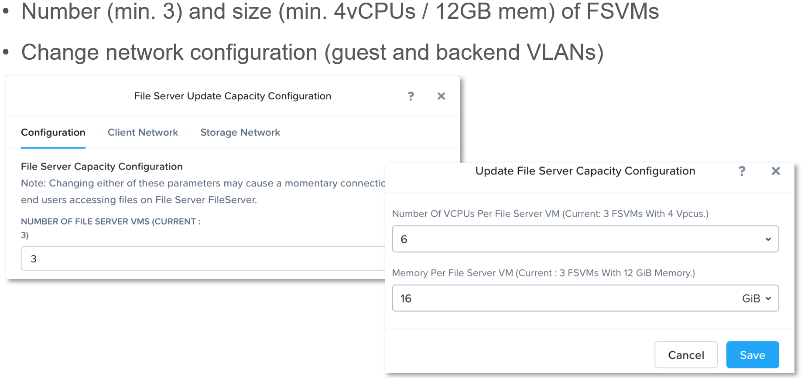
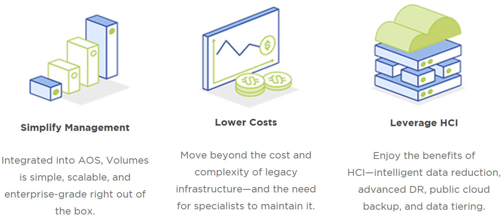
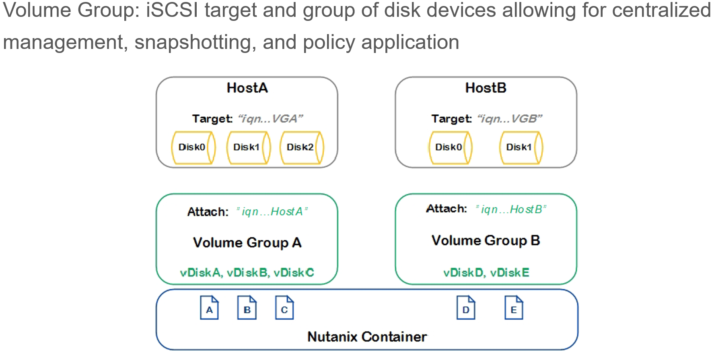
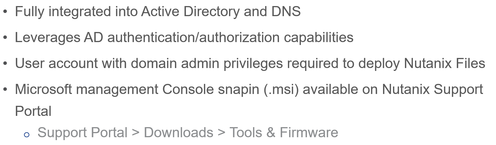
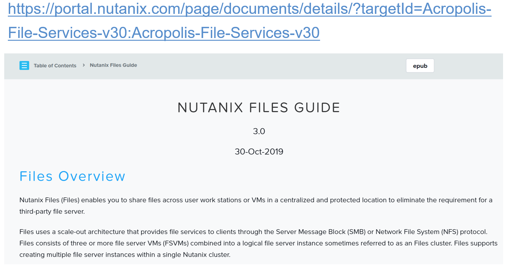
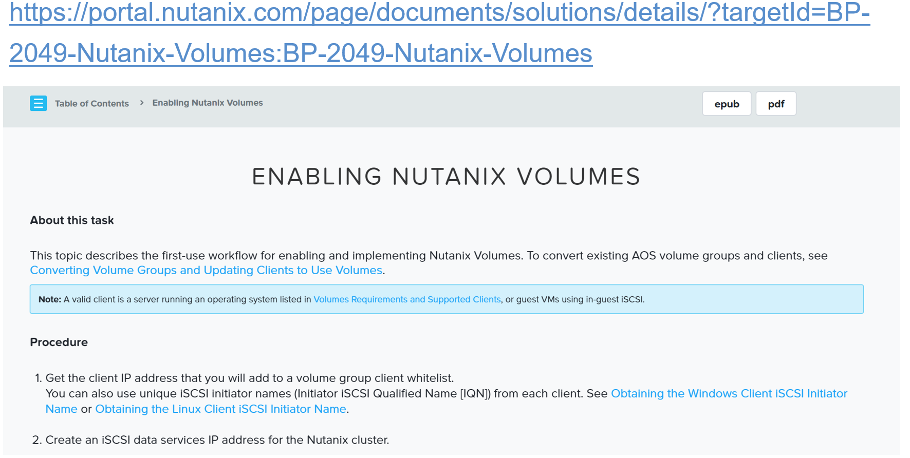

.. Adding labels to the beginning of your lab is helpful for linking to the lab from other pages
.. _Acropolis_Storage_Services_1:

--------------------------
Acropolis Storage Services
--------------------------

Session 8

-----------------------------------------------------

Nutanix Volumes
--------------------------

Nutanix Volumes Intro
+++++++++++++++++++++++++

**Formerly known as Acropolis Block Services (ABS)**

**What is Nutanix Volumes?**

- Nutanix Volumes enables enterprise applications running on external servers to leverage the benefits of the hyperconverged Nutanix architecture.

  - The Nutanix Volumes feature exposes back-end DSF storage to external consumers (guest OS, physical hosts, containers, etc.) via iSCSI.

- This allows any operating system to access DSF and leverage its storage capabilities. In this deployment scenario, the OS is talking directly to Nutanix bypassing any hypervisor.

**Nutanix Volumes constructs**

- Data Services IP:

  - Data Services IP acts as a central discovery/login portal for iSCSI login requests.
    - It can be configured using Prism by clicking on Gear icon  Cluster Details.
	
- Data Services IP can also be configured using NCLI or API.

- Volume Group:
  - Volume group acts as the iSCSI target. Disks are added to volume group which appear as LUNs to the iSCSI initiator.

- Disk(s):

  - Disks are created within Volume group and stored as vDisks on ADFS.

    - The disks appear as LUNs to the iSCSI initiator.

- Attachment:

  - Allow a specific initiator access to the volume group.

- Secret (s):

  - Secret used for CHAP/Mutual CHAP authentication.
    - iSCSI leverages IP protocol. IP does not verify whether the initiator and target are legitimate parties.
  - To improve security, an administrator can enable CHAP authentication.
    - CHAP allows initiator and target to authenticate each other before exchanging data.

-----------------------------------------------------
 
Failover Scenarios
++++++++++++++++++++++++++++++++++

**Failover Scenarios (Nutanix Volumes)**

- In the event that fails, a new iSCSI master will become elected and assigned the Data Services IP. 

  - Stargate health is monitored using Zookeeper for Block Services, using the exact same mechanism as DSF.
  - The initiator retries the iSCSI login to the Data Services IP, which will then redirect to another healthy Stargate.

- For failback, the default interval is 120 seconds. 

  - This means once the affined Stargate is healthy for 2 or more minutes, the system will quiesce and close the session, forcing another login back to the affined Stargate.

**Guest VM Data Management**

- Hosts read and write data in shared Nutanix datastores as if they were connected to a SAN.

  - From the perspective of a hypervisor host, the only difference is the improved performance that results from data not traveling across a network.

- VM data is stored locally, and replicated on other nodes for protection against hardware failure.

- When a guest VM submits a write request through the hypervisor, that request is sent to the Controller VM on the host.

  - To provide a rapid response to the guest VM, this data is first stored on the metadata drive, within a subset of storage called the oplog.

- This cache is rapidly distributed across the 10 GbE network to other metadata drives in the cluster.

  - Oplog data is periodically transferred to persistent storage within the cluster.

- Data is written locally for performance and replicated on multiple nodes for high availability.

- When the guest VM sends a read request through the hypervisor, the Controller VM reads from the local copy first, if present.

  - If the host does not contain a local copy, then the Controller VM reads across the network from a host that does contain a copy.

- As remote data is accessed, the remote data is migrated to storage devices on the current host, so that future read requests can be local.

-----------------------------------------------------

Nutanix Files
--------------------------

Nutanix Files Intro
++++++++++++++++++++++++++++++++++

**Formerly known as Acropolis File Services (AFS)**

**Nutanix Files (Files)**

Enables you to share files across user workstations or VMs in a centralized and protected location to eliminate the requirement for a third-party file server.

Files uses a scale-out architecture that provides file services to clients through the Server Message Block (SMB) or Network File System (NFS) protocol. Files consists of three or more file server VMs (FSVMs) combined into a logical file server instance sometimes referred to as an Files cluster. Files supports creating multiple file server instances within a single Nutanix cluster.

**Files manages a collection of file shares (SMB) or exports (NFS) distributed across multiple FSVMs. There are two types of shares or exports:**

1. Distributed. A distributed share ("home") or export ("sharded") means the data is spread across all the FSVMs to improve performance and resiliency. A distributed share or export can be used for any application. It is distributed at the top-level directories and does not have files at the root of the share or export. 
2. Non-distributed. A non-distributed share ("general purpose") or export ("non-sharded") means all the data is contained in a single FSVM. A non-distributed share or export is used for any purpose that does not require a distributed structure. 

**NFSv4**

The NFSv4 protocol is supported from 3..x on-wards, but not supported on 2.x branches. 
To know more about Client Support (NFSv4), Nutanix recommend to refer *Release Notes page Supported Configurations* section. 
Nutanix supports SMB and NFS protocol-based share and export configurations.

NFSv3 is a simple stateless protocol where the server does not keep state of individual files being accessed by clients.

-----------------------------------------------------

File Services Constructs Construct
++++++++++++++++++++++++++++++++++

**DFS referrals**

A DFS referral is an ordered list of servers that a client computer receives from a domain controller or namespace server when the user accesses a namespace root or DFS folder with targets. For example, the dfs targets are server \\NTNX_HR1\info and server \\NTNX_HR2\info. These are the real folder locations linked to DFS namespaces.

When creating a namespace \\\\ntnx.com\\HR\\info, a client who accesses \\\\ntnx.com\\HR\\info in fact accesses folders \\\\NTNX_HR1\\info and \\\\NTNX_HR2\\info. 

More info here: https://docs.microsoft.com/en-us/windows-server/storage/dfs-namespaces/enable-or-disable-referrals-and-client-failback

-----------------------------------------------------

Files Configuration
++++++++++++++++++++++++++++++++++

**Authentication & Authorization**

- The File Services feature is fully integrated into Microsoft Active Directory (AD) and DNS.

  - This allows all of the secure and established authentication and authorization capabilities of AD to be leveraged.

- All share permissions, user and group management is done using the traditional Windows MMC for file management.
- As part of the installation process the following AD / DNS objects will be created:

  - AD Computer Account for File Server
  - AD Service Principal Name (SPN) for File Server and each FSVM
  - DNS entry for File Server pointing to all FSVM(s)
  - DNS entry for each FSVM

-----------------------------------------------------

Questions
----------

:doc:`Questions`

-----------------------------------------------------

Bonus Material
--------------

-----------------------------------------------------
 
Nutanix Volumes Advantages
++++++++++++++++++++++++++

**Nutanix Volumes**

Take advantage of scale-out block storage built into AOS.

**Manage Effortlessly**

Provision storage with 1-click ease through Prism. Access block storage resources from both VMs and iSCSI simultaneously. Manage block, file, and objects from the same interface. 

-----------------------------------------------------
 
Attaching Initiators to Targets
+++++++++++++++++++++++++++++++

Hosts access NTNX VG through iSCSI Qualifier Name

**Attaching Initiators to Targets**

- Nutanix Volumes presents a volume group and its vDisks as iSCSI targets and assigns IQNs.  Initiators or hosts have their IQNs attached to a volume group to gain access.
- In the above picture, the administrator has created two volume groups, Volume Group A and Volume Group B.  Volume Group A has three vDisks and Volume Group B has 2 vDisks.  The hosts Host A and Host B have their iSCSI initiators configured to communicate with the iSCSI target (Data Services IP). The vDisks will be presented to the initiators as LUNs.

**Configuring Volume Group for Shared Access**

- In some cases, a LUN needs to be presented to multiple Virtual Machines or bare metal server for features like clustering.
- To share the volume group across multiple servers, select the checkbox Share across multiple iSCSI initiators or multiple VMs.

**NOTE:** Allowing multiple systems to concurrently access this Volume Group can cause serious problems.

-----------------------------------------------------
 
Volume Group Connectivity Options
+++++++++++++++++++++++++++++++++

.. figure:: images/VolumeGroupConnectivityOptions.png

**Volume Group Connectivity Options**

- The Data Services IP is leveraged for discovery.  .This allows for a single address that can be leveraged without the need of knowing individual CVM IP addresses.
- The Data Services IP will be assigned to the current iSCSI master.  In the event that fails, a new iSCSI master will become elected and assigned the Data Services IP.  This ensures the discovery portal will always remain available.
- The iSCSI initiator is configured with the Data Services IP as the iSCSI target portal.  Upon a login request, the platform will perform an iSCSI login redirect to a healthy Stargate.
- Define virtual IP address as iSCSI data services IP address
- One CVM “owns” iSCSI data services IP address 
- Set initiator’s iSCSI discovery portal to this address
- Initiators use address to locate volume groups and vDisks
- Initiators redirected to CVMs hosting vDisks

-----------------------------------------------------

Authentication & Tools Management
+++++++++++++++++++++++++++++++++

**Microsoft Management Console (MMC)**

.. Component of Windows 2000 and its successors that provides system administrators and advanced users an interface for configuring and monitoring the system.

The Microsoft management Console snapin is available on the Nutanix Support Portal under downloads > Tools & Firmware.

-----------------------------------------------------

References
++++++++++

`Nutanix Files <https://portal.nutanix.com/page/documents/details/?targetId=Acropolis-File-Services-v30:Acropolis-File-Services-v30>`_

-----------------------------------------------------

`Nutanix Volumes <https://portal.nutanix.com/page/documents/solutions/details/?targetId=BP-2049-Nutanix-Volumes:BP-2049-Nutanix-Volumes>`_

-----------------------------------------------------

.. figure:: images/NutanixFilesPerformance.png

`Nutanix Files Performance <https://portal.nutanix.com/page/documents/solutions/details/?targetId=TN-2117-Nutanix-Files-Performance:TN-2117-Nutanix-Files-Performance>`_

-----------------------------------------------------

.. figure:: images/Nutanix Files Tech Note.png

`Nutanix Files Tech Note <https://www.nutanix.com/go/simplifying-file-storage-with-nutanix-files>`_

