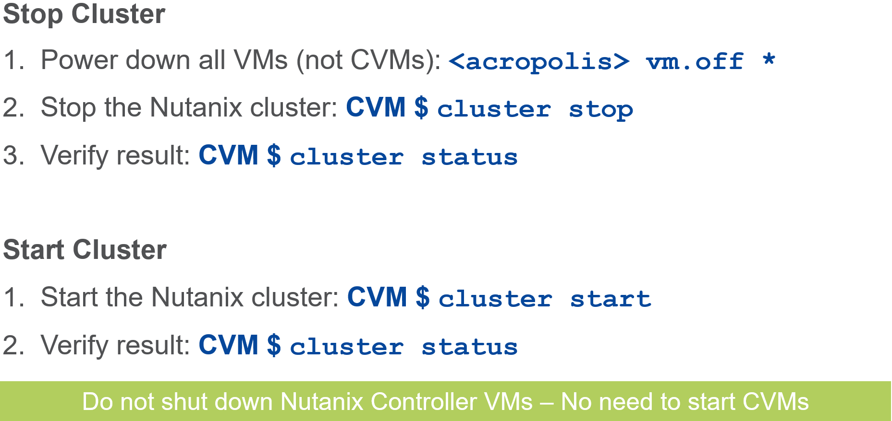
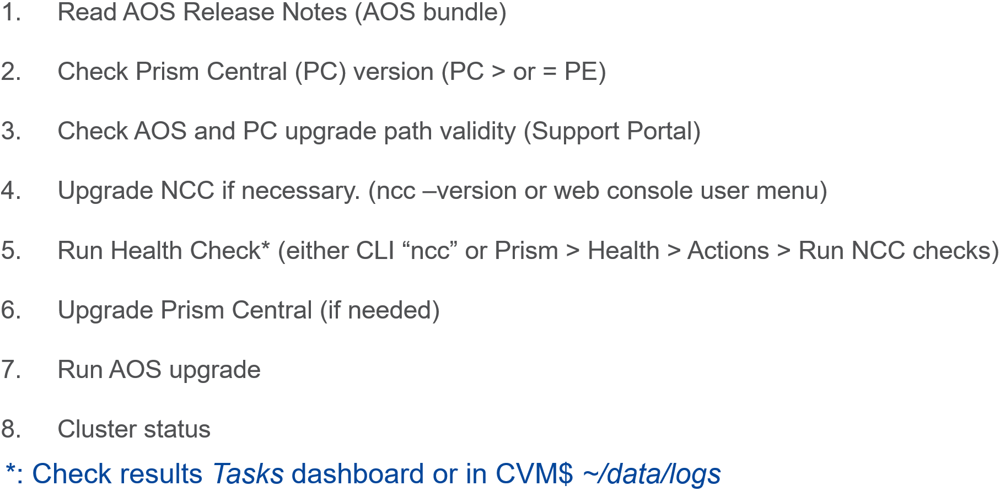
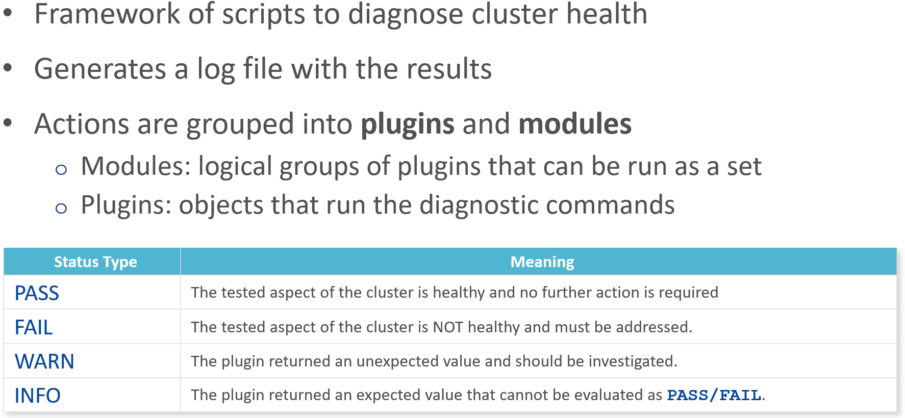
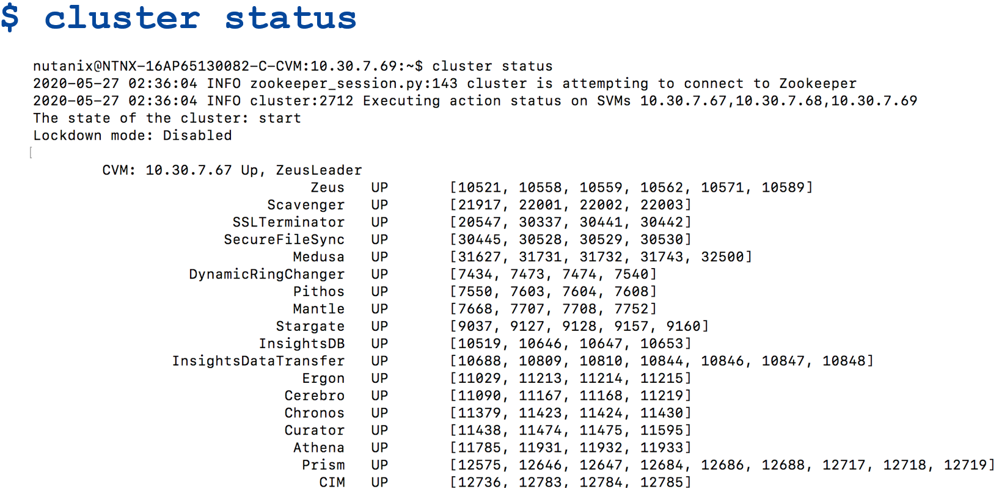
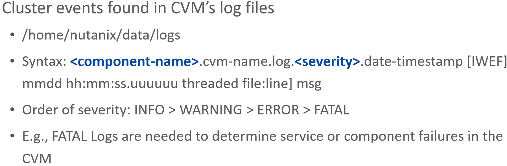
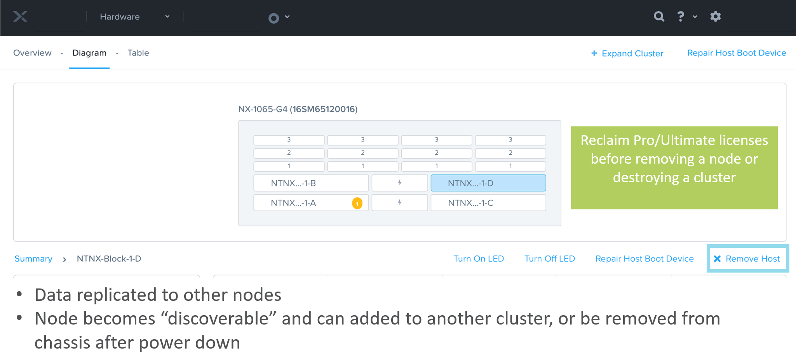
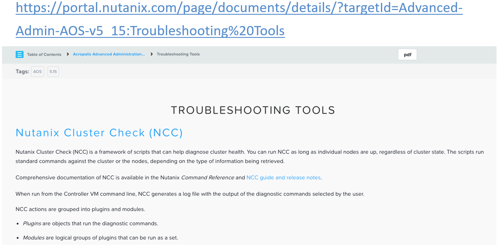
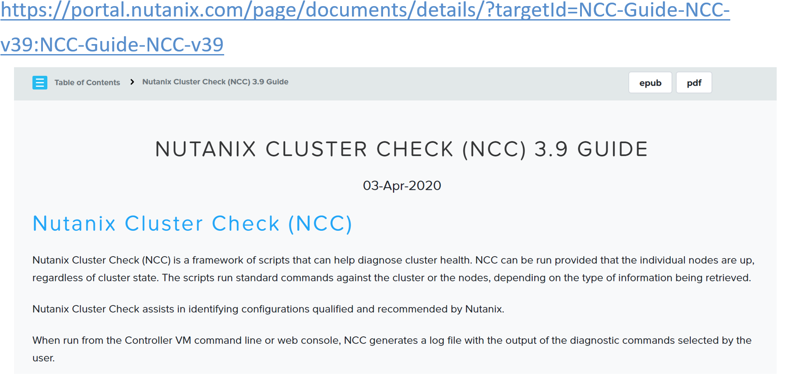
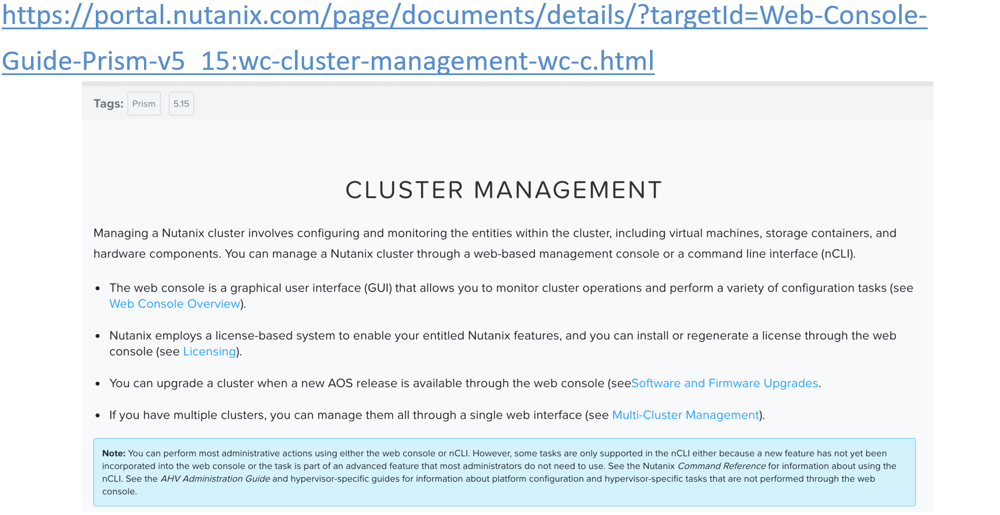
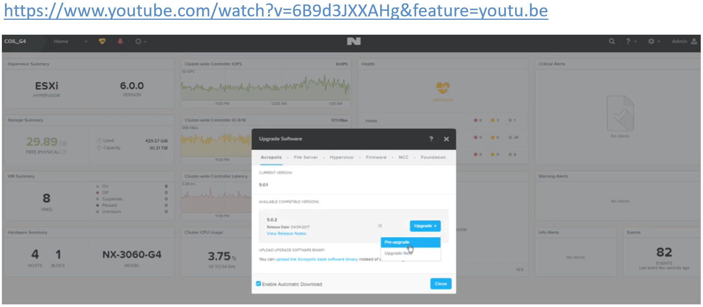

.. Adding labels to the beginning of your lab is helpful for linking to the lab from other pages
.. _Cluster_Maintenence_and_Lifecycle_Operations_1:

----------------------------------------------------
Cluster Maintenence and Lifecycle Operations
----------------------------------------------------

Session 12

-----------------------------------------------------

Node & CVM Start/Stop
--------------------------

Stopping/Starting a Cluster
++++++++++++++++++++++++++++++++

**Data Unavailability, no Data Loss as cluster is not destroyed**

**Stopping a Cluster**

- Before you begin:

  - Shut down all guest virtual machines, including vCenter if it is running on the cluster.
  - Do not shut down Nutanix Controller VMs.

- **Note:** If you are running Acropolis File Services (AFS), stop AFS before stopping your AOS cluster.
- **Note:** This procedure stops all services provided by guest virtual machines and the Nutanix cluster.

-----------------------------------------------------

Shut Down CVM/Host on Single AHV Node
+++++++++++++++++++++++++++++++++++++

.. figure:: images/ShutCVM.png

**Shutting Down a Node in a Cluster**

- To perform any type of maintenance on a node, it should be either in **maintenance mode** or be **shut down**.

  - Remember, you may only have **1 node** in this condition in an **RF2** environment.

- These slides show the process for AHV.

  - Consult the appropriate admin manual for other hypervisors.

-----------------------------------------------------

Starting a CVM on a Single Node (AHV)
+++++++++++++++++++++++++++++++++++++

.. figure:: images/StartCVM.png

Virsh commands are not recommended except in specific circumstances such as if a cvm does not automatically start when the hypervisor is restarted. 

If you are not a seasoned Nutanix admin, virsh commands should only be used at the instruction of Nutanix Support or engineering.

-----------------------------------------------------

AOS Upgrade
--------------------------

AOS Upgrade Path
++++++++++++++++++++++++++++++++

-----------------------------------------------------

AOS Release Notes
+++++++++++++++++++++++++++++++++++++

.. figure:: images/AOSReleaseNotes.png

Short Term Support (STS): 3 months of maintenance followed by an additional 3 months of support.

Long Term Support (LTS): 12 months of maintenance (after the Release Date) followed by an additional 6 months of support.

-----------------------------------------------------

Upgrade Paths
+++++++++++++++++++++++++++++++++++++

.. figure:: images/UpgradePaths.png

-----------------------------------------------------

Nutanix Cluster Check (NCC)
+++++++++++++++++++++++++++++++++++++

**CVM$ ncc health_checks run_all**

**Nutanix Cluster Check (NCC)**

- NCC can be run provided that the individual nodes are up, regardless of cluster state.

  - The scripts run standard commands against the cluster or the nodes, depending on the type of information being retrieved.

- **Note:** Some plugins run nCLI commands and might require the user to input the nCLI password. The password is logged on as plain text. If you change the password of the admin user from the default, you must specify the password every time you start an nCLI session from a remote system. A password is not required if you are starting an nCLI session from a Controller VM where you are already logged on. Comprehensive documentation of NCC is available in the Nutanix Command Reference.

**The NCC output log is also stored on the:**

- Foundation VM: */home/nutanix/foundation/log/ncc/’cluster_name’ /logs/ncc-output.log*
- The Cluster itself: */home/nutanix/data/logs/ncc-output.log*

-----------------------------------------------------

Software Upgrades
+++++++++++++++++++++++++++++++++++++

.. figure:: images/SoftwareUpgrades.png

Software and Firmware Upgrades

- An administrator can view the available upgrade options, start an upgrade, and monitor upgrade progress through the web console.

  - Upgrade Software, available from the main menu, shows the current status of your software and firmware versions.

- The slide above displays all the entities that can be upgraded directly from the console.

-----------------------------------------------------

Checking the Status of Cluster Services
++++++++++++++++++++++++++++++++++++++++

**Not all services and their PIDs are shown**

PID – Process ID, unique within the cluster.  Although the same services will be shown for each CVM, they have their own unique PIDs.

-----------------------------------------------------

Cluster Events: Log File Analysis
++++++++++++++++++++++++++++++++++++++++

**Not all services and their PIDs are shown**

Depending on the issue (broken hardware, broken service, performance issue, etc.) you may have to look at different locations.

If there is no obvious error in the Prism UI, you may need to look in the ~nutanix/data/logs folder on any CVM (via SSH).

There you will find the logs of all the Nutanix services: Stargate, Curator, Cassandra, Genesis, ZooKeeper, etc.

In this folder, you will find raw logs *<service_name>.out*, .INFO, .WARNING, .ERROR (i.e. errors only), and .FATAL. 

For example the file *~nutanix/data/logs/stargate.out* is the current log file for all Stargate logs and *~nutanix/data/logs/stargate.FATAL* is the current log file only for FATAL logs concerning Stargate.

-----------------------------------------------------

Cluster Expansion
++++++++++++++++++++++++++++++++++++++++

**IPv6 for node discovery**

.. figure:: images/Expansion.png

**Cluster Expansion**

- The ability to dynamically scale the Acropolis cluster is core to its functionality.

  - To scale an Acropolis cluster, rack / stack / cable the nodes and power them on.

- Once the nodes are powered up they will be discoverable by the current cluster using mDNS.

  - Multiple nodes can be discovered and added to the cluster concurrently.

-----------------------------------------------------

Removing a node – Process Details
++++++++++++++++++++++++++++++++++++++++

**Prism > Hardware > select node > “Remove Host”**

**Repurpose Equipment**

The Nutanix Operating System makes it easy to repurpose equipment as needed. You can switch a node from one hypervisor to another or take nodes offline in one datacenter where you’ve got excess capacity and move them to another where they are needed, eliminating expensive over-provisioning.

**Licensing**

- Nutanix Nodes are delivered with a default Starter license that does not expire
- Reclaim Pro/Ultimate licenses removing a node or destroying a cluster
- Ensure consistent licensing for all nodes in a cluster (Nodes with different licensing default to minimum feature set)

**Starter free license never expires (no need to register on portal)**

**Pro and Ultimate paid licenses have an expiration date**

- 60-day free trial
- Prism alerts you 60 days before expiration
- Be sure to reclaim licenses before destroying a cluster
- When moving nodes from one cluster to another, first reclaim the licenses and move the node(s) before re-applying the licenses.

**When upgrading license(s)***

1. Generate a cluster summary file in the Prism web console
2. Upload the cluster summary file to the Nutanix Support Portal
3. Generate and apply the downloaded license file to the cluster

***Applies to transitions between Ultimate and Pro**

-----------------------------------------------------

References
+++++++++++++++++++++++++

`Troubleshooting Tools <https://portal.nutanix.com/page/documents/details/?targetId=Advanced-Admin-AOS-v5_15:Troubleshooting%20Tools>`_
""""""""""""""""""""""""""""""""""""""""""""""""""""""""""""""""""""""""""""""""""""""""""""""""""""""""""""""""""""""""""""""""""""""""""""""""""""""""""""""""""

-----------------------------------------------------

.. figure:: images/SupportServices.png

`Support Services <https://portal.nutanix.com/page/documents/details/?targetId=Web-Console-Guide-Prism-v5_15:wc-support-management-wc-c.html>`_
""""""""""""""""""""""""""""""""""""""""""""""""""""""""""""""""""""""""""""""""""""""""""""""""""""""""""""""""""""""""""""""""""""""""""""""""""""""""""""""""""

-----------------------------------------------------

.. figure:: images/UpgradingNutanixClusterCheck.png

`Upgrading Nutanix Cluster Check <https://portal.nutanix.com/page/documents/details/?targetId=Acropolis-Upgrade-Guide-v5_15:ncc-ncc-install-pc-t.html>`_
""""""""""""""""""""""""""""""""""""""""""""""""""""""""""""""""""""""""""""""""""""""""""""""""""""""""""""""""""""""""""""""""""""""""""""""""""""""""""""""""""

-----------------------------------------------------

`Nutanix Cluster Check Guide <https://portal.nutanix.com/page/documents/details/?targetId=NCC-Guide-NCC-v39:NCC-Guide-NCC-v39>`_
""""""""""""""""""""""""""""""""""""""""""""""""""""""""""""""""""""""""""""""""""""""""""""""""""""""""""""""""""""""""""""""""""""""""""""""""""""""""""""""""""

-----------------------------------------------------

.. figure:: images/AOSAdvanced.png

`AOS Advanced Administration Guide <https://portal.nutanix.com/page/documents/details/?targetId=Advanced-Admin-AOS-v5_15:app-cluster-management-ops-c.html>`_
""""""""""""""""""""""""""""""""""""""""""""""""""""""""""""""""""""""""""""""""""""""""""""""""""""""""""""""""""""""""""""""""""""""""""""""""""""""""""""""""""

-----------------------------------------------------

`Prism Web Console Guide <https://portal.nutanix.com/page/documents/details/?targetId=Web-Console-Guide-Prism-v5_15:wc-cluster-management-wc-c.html>`_
""""""""""""""""""""""""""""""""""""""""""""""""""""""""""""""""""""""""""""""""""""""""""""""""""""""""""""""""""""""""""""""""""""""""""""""""""""""""""""""""""

-----------------------------------------------------

`Maintain Infrastructure with Zero Downtime <https://www.youtube.com/watch?v=6B9d3JXXAHg&feature=youtu.be>`_
""""""""""""""""""""""""""""""""""""""""""""""""""""""""""""""""""""""""""""""""""""""""""""""""""""""""""""""""""""""""""""""""""""""""""""""""""""""""""""""""""

-----------------------------------------------------

Questions
++++++++++++++++++++++

This is a link to the Questions : :doc:`Questions`

