.. Adding labels to the beginning of your lab is helpful for linking to the lab from other pages
.. _Data_Protection_1:

-----------------
Data Protection
-----------------

Session 10

-----------------------------------------------------

Inter-cluster Data Replication
++++++++++++++++++++++++++++++++

**Based on e.g. RPO and RTO considerations**

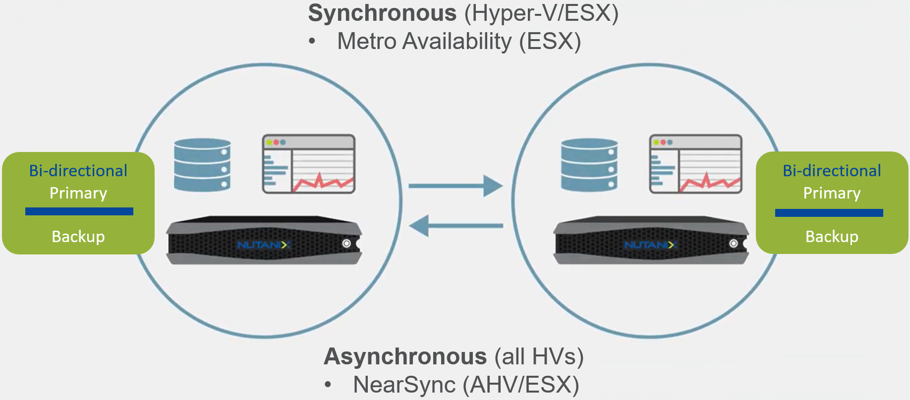

Picking the right solution always involves trade-offs. While a remote site is not your datacenter, uptime is nonetheless a crucial concern. Financial constraints and physical layout also affect what counts as the best architecture for your environment. Nutanix offers a wide variety of clusters for remote locations. You can select single- and dual-socket cluster options, as well as options that can reduce licensing costs.

Remote sites are a logical construct. Admins must first configure any Acropolis cluster—either physical or cloud based—that functions as the snapshot destination and as a remote site from the perspective of the source cluster. Similarly, on this secondary cluster, configure the primary cluster as a remote site before snapshots from the secondary cluster start replicating to it. Configuring backup on Nutanix lets an organization use its remote site as a replication target. You can back up data to this site and retrieve snapshots from it to restore locally, but you can’t enable failover protection (running failover VMs directly from the remote site). Backup also supports using multiple hypervisors. For example, an enterprise might have ESXi in the main datacenter but use Hyper-V at a remote location. With the backup option configured, the HyperV cluster could use storage on the ESXi cluster for backup. Using this method, Nutanix can also back up to AWS from Hyper-V or ESXi.

**Recovery Point Objective (RPO):**

- Tolerated time interval after disruption that allows for a quantity of data lost without exceeding the maximum allowable threshold.

  - RPO designates the variable amount of data that will be lost or will have to be re-entered during network downtime.

    - Example: If the data snapshot interval and the RPO is 180 minutes, and the outage lasts only 2 hours, you’re still within the parameters that allow for recovery and business processes to proceed given the volume of data lost during the disruption.

**Recovery Time Objective (RTO):**

- How much time does it take to recover after notification of business process disruption?

  - RTO is therefore the duration of time and a service level within which a business process must be restored after a disaster in order to avoid unacceptable consequences associated with a break in continuity.

  - RTO designates the amount of “real time” that can pass before the disruption begins to seriously and unacceptably impede the flow of normal business operations.

**RPO and RTO considerations:**

- Time Stream and Cloud: High RPO and RTO (hours), used for minor incidents.

  - Time Stream is a set of scheduled snapshots of a Protection Domain (more on PDs later) stored on the same cluster as the VMs.
  
- Synchronous and Asynchronous: (Near)-Zero RPO and RTO, used for major incidents.

-----------------------------------------------------

Multi-site Async Example
++++++++++++++++++++++++++++++++

**Multiple schedules available for single PD**

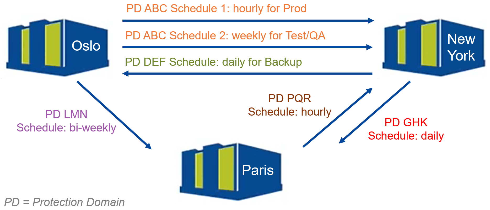

**VM-Centric Data Protection**

Disaster Recovery (DR) is an area of security planning that aims to protect an organization from the effects of significant negative events. 
DR allows an organization to maintain or quickly resume **mission-critical functions** following a disaster.

For environments that do not want to switch hypervisors in the main datacenter, Nutanix offers cross-hypervisor disaster recovery to replicate VMs from ESXi to AHV. In the event of a disaster, administrators can restore their ESXi VM to AHV for quick recovery or replicate the VM back to the remote site with easy workflows.

**Native (on-site) and Remote Data Replication capabilities**

- Data replication can be local or remote.
- Choose from backup or disaster recovery.

**Local Replication**

- This is also known as Time Stream, a set of snapshots.
- Snapshots are placed locally on the same cluster as the source VM.

**Remote replication**

- Snapshots are replicated to one or more other clusters.
- Remote cluster is physical server or Cloud.
- Synchronous [Metro]
- Asynchronous

-----------------------------------------------------

Synchronous Replication
++++++++++++++++++++++++++++++++

**PD = Storage Container**

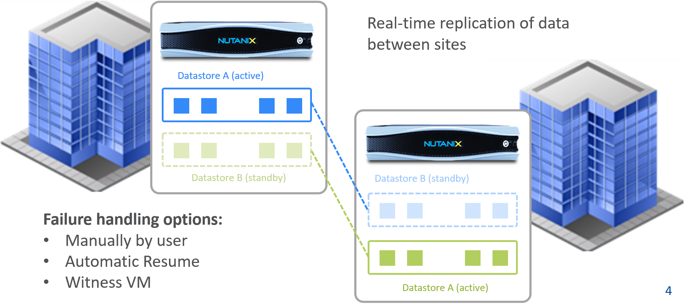

**Synchronous Replication**

- Metro Availability is a policy applied to a datastore that effectively spans across two (2) sites.

  - Nutanix provides native “stretch clustering” capabilities which allow for a compute and storage cluster to span multiple physical sites. 

    - In these deployments, the compute cluster spans two locations and has access to a shared pool of storage.

  - Therefore, container (datastore) names must be the same on both clusters (unlike async where container names need to be different).

- This expands the VM HA domain from one site to two sites providing a near zero RTO and a RPO of zero.

  - In this deployment, each site has its own Nutanix cluster, however the containers are “stretched” by synchronously replicating to the Remote Site before acknowledging writes.

- In the event of a site failure, an HA event will occur where the VMs can be restarted on the other site.

  - The failover process is typically a manual process.

- With the AOS 5.1 release a Metro Witness can be configured which can automate the failover.

  - The witness can be downloaded via the Portal and is configured via Prism.
  - Note that once a Metro Witness has been configured, it can fail (hence no need to have two witnesses) with the synchronous operation continuing without disruption.

- In the event where there is a link failure between the two sites, each cluster will operate independently.  Once the link comes back up, the sites will be re-synchronized (deltas-only) and synchronous replication will start occurring.

-----------------------------------------------------

Asynchronous Data Replication
++++++++++++++++++++++++++++++++

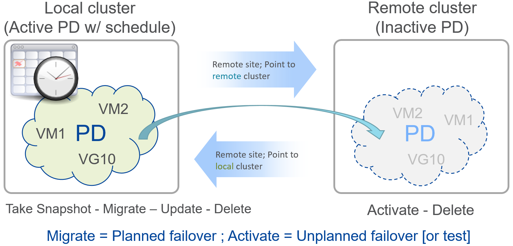

**Data Replication Setup Steps**

**Protection Domain (PD)** 

- Nutanix Backup and DR construct.
- Key Role: Macro group of VMs and/or files to protect.

  - A group of VMs and/or files to be replicated together on a desired schedule.  
  - A PD can protect a full container or you can select individual VMs and/or files.

- You can create multiple PDs for various services tiers driven by a desired RPO/RTO.

  - For file distribution (for example, golden images, ISOs, and so on) you can create a PD with the files to replicate.

**Consistency Group (CG)**

- Sub-set of Protection Domain.
- Key Role: Subset of VMs/files in PD to be crash-consistent.
- VMs and/or files which are part of a Protection Domain which need to be snapshotted in a crash-consistent manner.

  - This ensures that when VMs/files are recovered, they come up in a consistent state.

- A Protection Domain can have multiple consistency groups.

  - Group dependent application or service VMs should be in a consistency group to ensure they are recovered in a consistent state (such as App and DB).

- When both clusters are replicating to each other, simply add a mapping line that shows the containers involved. 
- If more than 2 clusters are involved, establish Async replication from example Cluster B to C as follows:

  1. Create a Remote Site on B that points to C.
  2. Create a Remote Site of C that points to B.
  3. Create the snapshot schedule on site B by updating the Protection Domain of site B.

-----------------------------------------------------

Consistency Groups
++++++++++++++++++++++++++++++++++

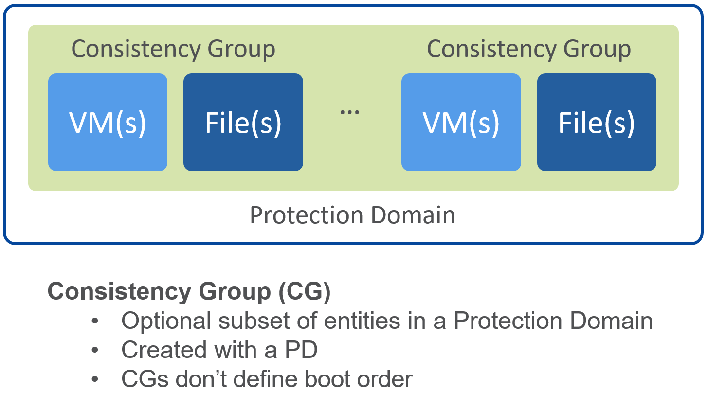

**Protection Domain (PD): Concepts**

- Replication is the process of asynchronously copying snapshots from one cluster to one or more Remote sites.
- **Async DR**: PD is defined group of entities (VMs, files, and Volume Groups) that are always backed up locally, and optionally replicated to one or more Remote Sites.

  - Local and remote container have different names.
  - Configure one or more Remote Sites (i.e. different clusters).

- **Sync/Metro PD**: Active local Storage Container linked to a Standby Container at Remote Site.

  - Local and remote container have the same name.

- **Consistency Group**: Optional subset of entities in a Protection Domain, created with PD.
- **Scheduler**: A schedule is a PD property that specifies snapshot intervals and snapshot retention.

  - Retention can be set different for local and remote snapshots

- **Snapshot**: Read-only copy of the state and data of a VM, file, or Volume Group at a specific point in time.

-----------------------------------------------------

Replication Schedule
++++++++++++++++++++++++++++++++++

**Retention policies for local and remote sites**

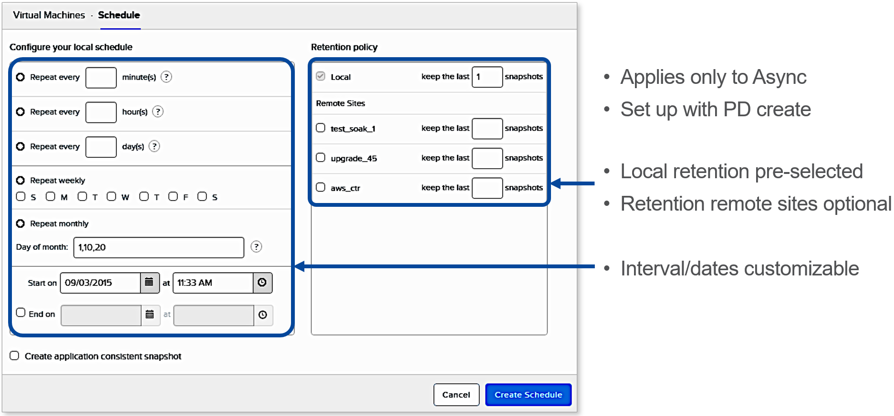

**DR Setup Steps – Schedule & Retention**

- For backup / archival only purposes, it is possible to configure a Storage-only Nutanix cluster as a Remote Site which will act as a Backup Target.

  - This will allow data to be replicated to / from the Storage-only cluster.

-----------------------------------------------------

Remote Site
++++++++++++++++++++++++++++++++++

**Mapping of networks and Storage Containers**

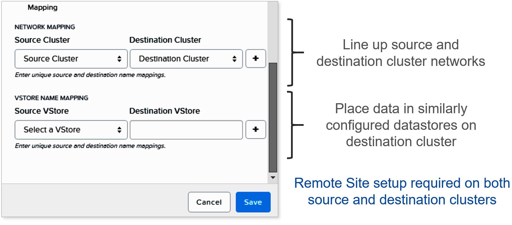

-----------------------------------------------------

Protection Domain Considerations
++++++++++++++++++++++++++++++++++

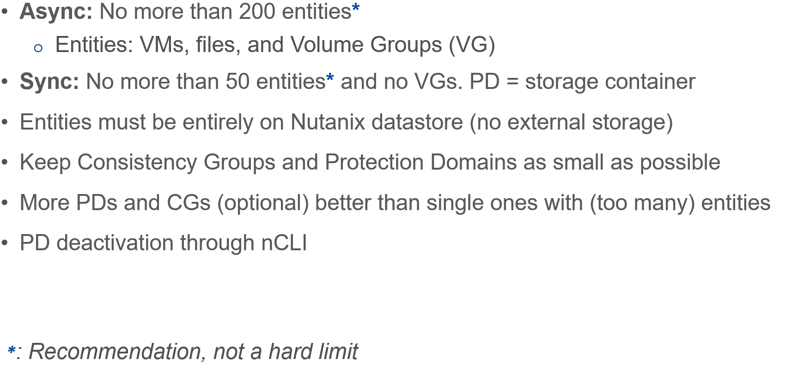

-----------------------------------------------------

Questions
++++++++++++++++++++++

:doc:`Questions`

-----------------------------------------------------

Bonus Material
++++++++++++++++++++++

-----------------------------------------------------

Asynchronous Replication: Migrate 
!!!!!!!!!!!!!!!!!!!!!!!!!!!!!!!!!

**Option available on local site**

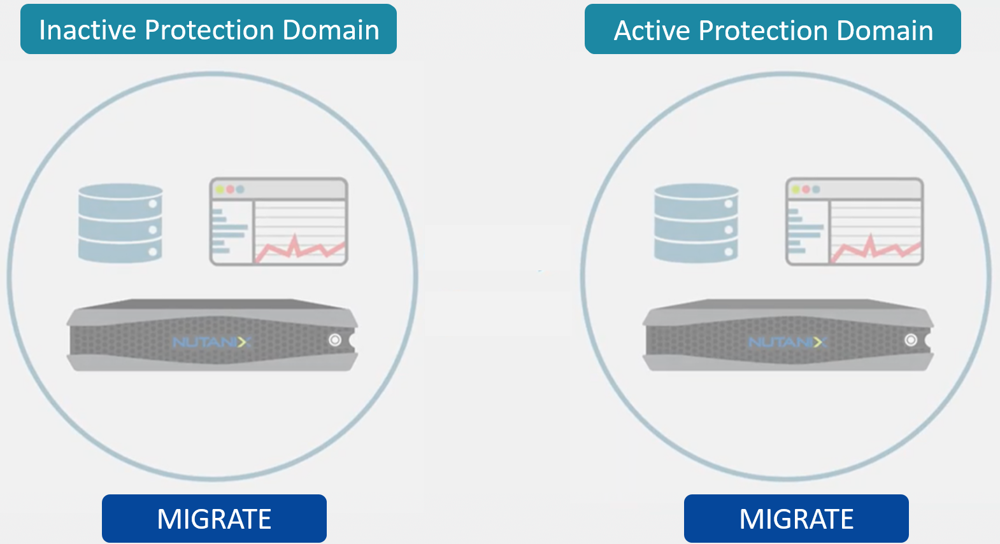

**Migrate is used when the source Protection Domain is still available.**

- Creates and replicates a snapshot of the PD
- Powers off VMs on the local site
- Creates and replicates another snapshot of the PD
- Unregisters all VMs and volume groups and removes their associated files
- Marks local site PD as inactive
- stores all VM and VGs from last snapshot and registers with new UUIDs at remote site
- Marks remote site PD as active
- VMs will NOT be powered on automatically!

-----------------------------------------------------

Asynchronous Replication: Activate 
!!!!!!!!!!!!!!!!!!!!!!!!!!!!!!!!!!

**Option available on remote site**

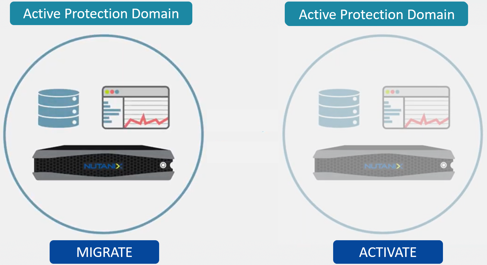

**Activate is used in a failure situation**

- Last made and replicated snapshots will be used to restore VMs
- Registers the VMs and VGs on the recovery site
- Marks the failover site PD as active

-----------------------------------------------------

Remote & Branch Office (ROBO) Solution
!!!!!!!!!!!!!!!!!!!!!!!!!!!!!!!!!!!!!!!

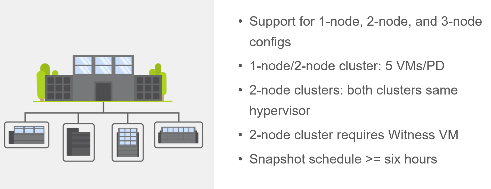

Nutanix offers the ability to use an NX-1155 appliance as a single-node backup target for an existing Nutanix cluster. Because this target has different resources than the original cluster, you primarily use it to provide backup for a small set of VMs. This utility gives SMB and ROBO customers a fully integrated backup option. 

**The following are best practices for using a single-node backup target:**

- All protection domains combined should be under 30 VMs.
- To speed up restores, limit the number of VMs in each protection domain.
- Limit backup retention to a three-month policy. We recommend seven daily, four weekly, and three monthly backups. 
- Map an NX-1155 to only one physical cluster. 
- Set the snapshot schedule to six hours or more. 
- Turn off deduplication.

**One- and two-node Clusters**

Nutanix one- and two-node clusters follow the same best practices as the single-node backup target because of limited resources on the NX-1175S nodes. The only difference for one- and two-node clusters is that all protection domains should have only five VMs per node

**One-Node Clusters**

One-node clusters are a perfect fit if you have low availability requirements and need strong overall management for multiple sites. One-node clusters provide resiliency against the loss of a hard drive while still offering great remote management. Nutanix supports one-node clusters with ESXi and AHV only.  Nutanix also offers the NX-1155 specifically as a backup target for remote sites using native Nutanix snapshots for replication.

**Two-Node Clusters**

Two-node clusters offer reliability for smaller sites that must be cost effective and run with tight margins. These clusters use a witness only in failure scenarios to coordinate rebuilding data and automatic upgrades. You can deploy the witness offsite up to 500 ms away for ROBO and 200ms when using Metro Availability. Multiple clusters can use the same witness for two-node and metro clusters. Nutanix supports two-node clusters with ESXi and AHV only.

**Three-Node Clusters**

Although a three-node system may cost more money up front, it is the gold standard for remote and branch offices. Three-node clusters provide excellent data protection by always committing two copies of your data, which means that your data is safe even during failures. Three-node clusters also rebuild your data within 60 seconds of a node going down. The Acropolis Distributed Storage Fabric (DSF) not only rebuilds the data on the downed node, it does so without any user intervention.

A self-healing Nutanix three-node cluster also obviates needless trips to remote sites. We recommend designing these systems with enough capacity to handle an entire node going down, which allows the loss of multiple hard drives, one at a time. Because there is no reliance on RAID, the cluster can lose and heal drives, one after the next, until available space runs out.

-----------------------------------------------------

NearSync
!!!!!!!!

**Recovery Point Objective: 1 minute**

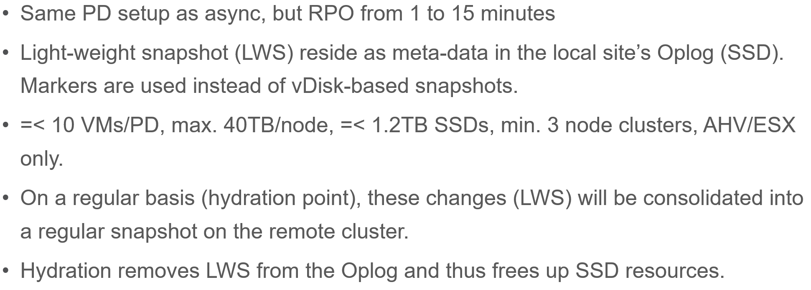

For every Light-weight Snapshot (LWS), the feature uses markers into the OpLog instead of creating a new vdisk for every snapshot like in Async DR. 

These changes are known as lightweight snapshots and they are replicated to the remote cluster on a regular basis.

For all NearSync entities, every Write - whether sequential or random - goes through OpLog; no bypassing OpLog for larger block sizes or sequential writes as with regular async replication.

On a regular basis (hydration point), these changes (LWS) will be consolidated into a regular snapshot on the remote cluster.

LWS resides in the OPLOG which is carved out of the SSDs. Hydration removes LWS from the OPLOG and thus frees up SSD resources: operations log-based LWS never land on HDDs.

To configure NearSync, in the *Repeat every ## minutes* enter a desired number between 1 and 15 (both included) as the scheduled time interval.

-----------------------------------------------------

Cloud Connect
!!!!!!!!!!!!!

**Remote Site either physical cluster or Cloud**

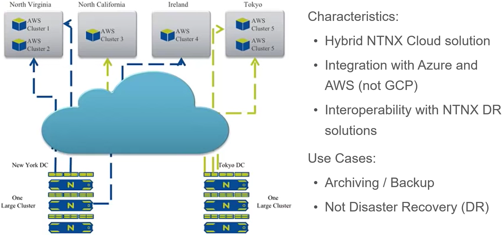

The Nutanix Cloud Connect feature enables you to configure Amazon Web Services (AWS) as a Remote Site for virtual machine backups.  The AWS Remote Site is a single-node cluster which creates an m1.xlarge EC2 instance. A bucket is created in AWS S3 that can store up to 30 TB of data

**The Nutanix Cloud Connect feature also enables you to configure Azure Virtual Machines (currently D3).**

- AWS = Amazon Web Services
- Cloud Connect is meant for backup/archive, not for running VMs.

-----------------------------------------------------

References
!!!!!!!!!!

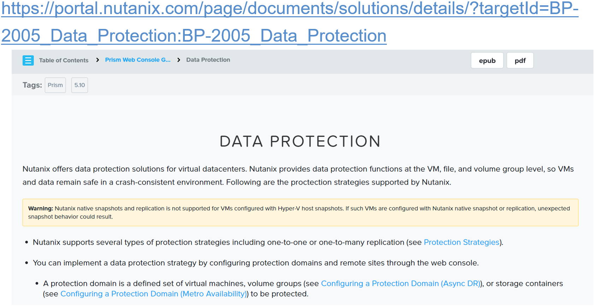

`Data Protection <https://portal.nutanix.com/page/documents/solutions/details/?targetId=BP-2005_Data_Protection:BP-2005_Data_Protection>`_

-----------------------------------------------------

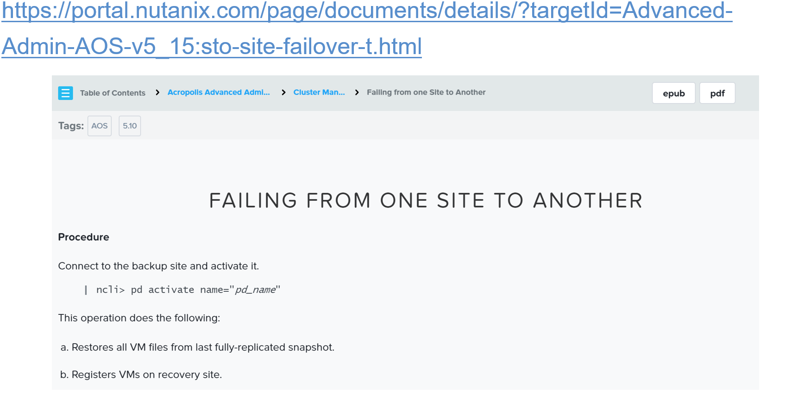

`Failing From one Site to Another <https://portal.nutanix.com/page/documents/details/?targetId=Advanced-Admin-AOS-v5_15:sto-site-failover-t.html>`_

-----------------------------------------------------

.. figure:: images/DataProtectionandDisasterRecovery.png

`Data Protection and Disaster Recovery <https://www.nutanix.com/go/enterprise-cloud-data-protection-on-nutanix>`_

-----------------------------------------------------

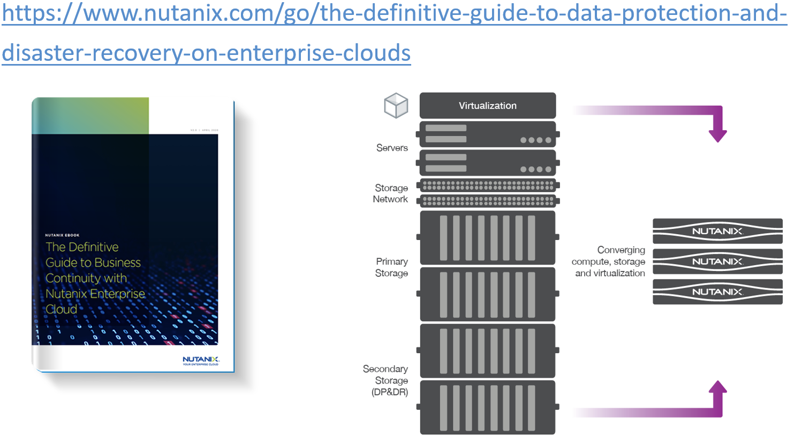

`Definitive Guide to Data Protection and Disaster Recovery <https://www.nutanix.com/go/the-definitive-guide-to-data-protection-and-disaster-recovery-on-enterprise-clouds>`_

-----------------------------------------------------

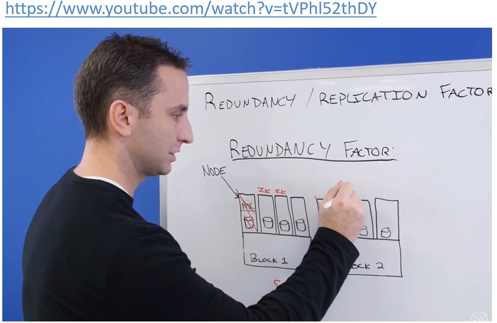

`Redundancy Factor vs. Replication Factor <https://www.youtube.com/watch?v=tVPhl52thDY>`_

-----------------------------------------------------

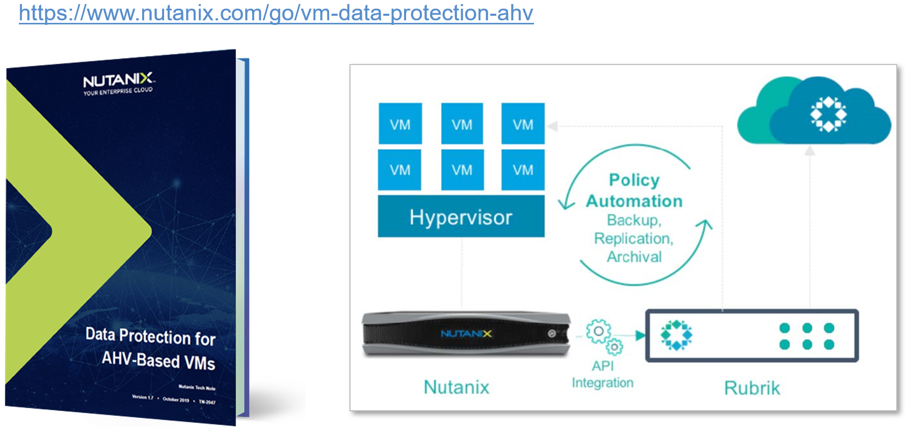

`Data Protection for AHV-Based VMs <https://www.nutanix.com/go/vm-data-protection-ahv>`_

