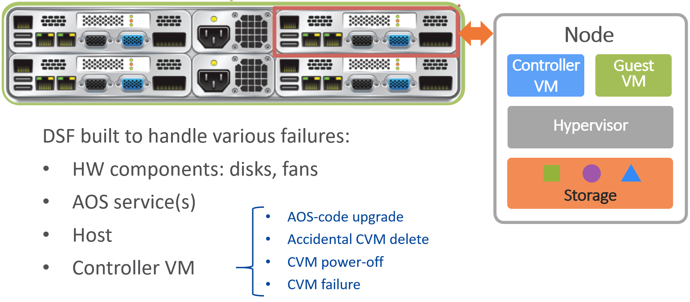
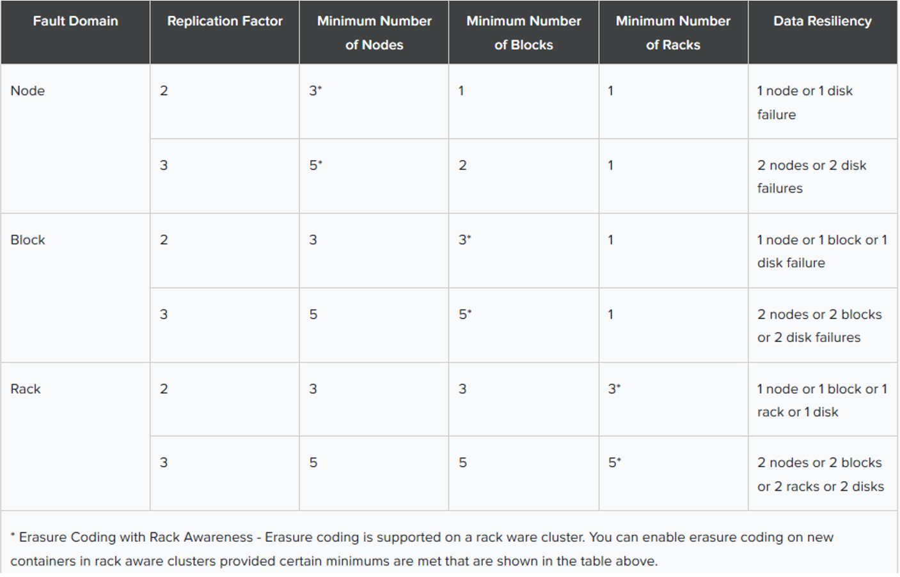
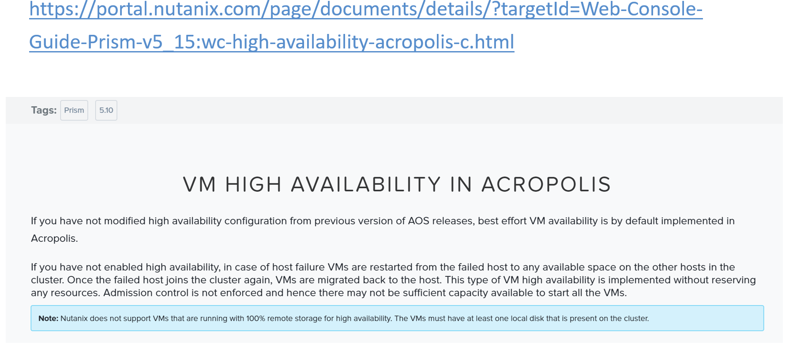
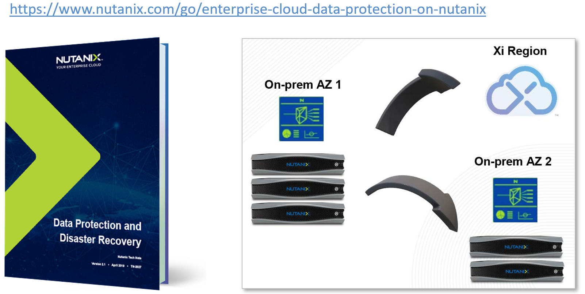
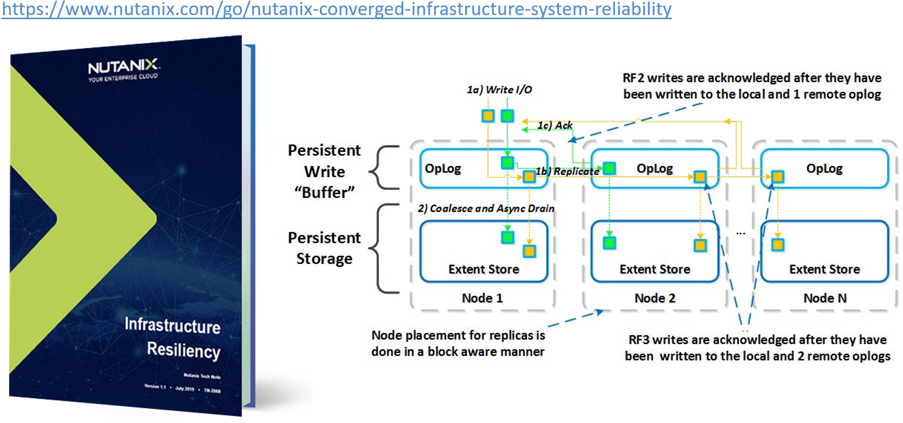
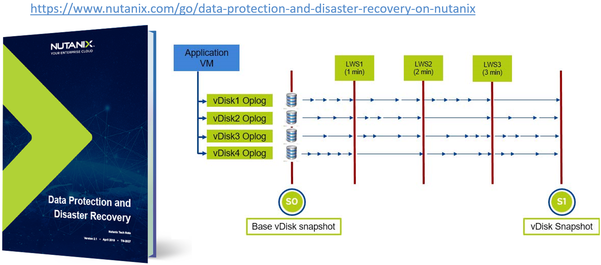

.. Adding labels to the beginning of your lab is helpful for linking to the lab from other pages
.. _Data_Resiliency_1:

-----------------
Data Resiliency
-----------------

Session 9

-----------------------------------------------------

VM High Availability
++++++++++++++++++++++++

.. figure:: images/VMHighAvailability.png

**VM High Availability in Acropolis**

- In the event the Acropolis Master becomes partitioned, isolated, or fails, a new Acropolis Master will be elected on the healthy portion of the cluster.

  - If a cluster becomes partitioned (for example, X nodes can't talk to the other Y nodes) the side with quorum will remain up and VM(s) will be restarted on those hosts.

**There are two main types of resource reservations for HA:**

- Reserve Hosts

  - Reserve X number of hosts where X is the number of host failures to tolerate (such as 1, 2, and so forth).

    - This is the default when all hosts with the same amount of RAM.

- Reserve Segments

  - Reserve Y resources across N hosts in the cluster.

    - This will be a function of the cluster FT level, the size of the running VMs, and the number of nodes in the cluster.

      - This is the default when some hosts have different amounts of RAM.

- From AOS 5.0 or later releases, you can implement the VM High Availability only by using the Segment-based Reservation method.

  - In segment-based reservation, the cluster is divided into segments to ensure enough space is reserved for any host failure.

    - Each segment corresponds to the largest VM that is guaranteed to be restarted in case a failure occurs.

- In Acropolis-managed clusters, you can enable High Availability for the cluster to ensure that VMs can be migrated and restarted on another host in case of failure.

-----------------------------------------------------

Affinity
++++++++++++++++++++++++

.. figure:: images/Affinity.png

**Host Affinity - Edit | Migrate VM**

- Guest VMs Running in an Affinity/Anti-Affinity Rules Environment:

  - Hypervisor upgrades might not complete successfully in environments where third-party or other applications apply affinity or anti-affinity rules.

- For example, some anti-virus appliances or architectures might install an anti-virus scanning guest VM on each node in your cluster.

  - This guest VM might not be allowed to power off or migrate from the host being upgraded, causing maintenance mode to time out. In this case, disable such rules or power off such VMs before upgrading.

**Affinity related acli commands:**

- Retrieve affinity nodes for a given VM : vm.affinity_nodeget
- Enable VM-host affinity : vm.affinity_set
- Unset affinity setting of specified VMs : vm.affinity_unset

https://portal.nutanix.com/page/documents/details/?targetId=Web-Console-Guide-Prism-v5_15:ahv-affinity-policies-c.html

**You can define 2 types of affinity policies:**

1. VM-Host Affinity Policy

- You can use this policy to specify that a selected VM can run only on the members of the Affinity Host List. 

  - The VM-Host Affinity Policy controls the placement of the VMs. 

- This policy checks and enforces where a VM can be hosted when powered on or migrated.

2. VM-VM Anti-Affinity Policy

- You can use this policy to specify Anti-Affinity between the virtual machines.

- The Anti-Affinity policy keeps the specified virtual machines apart in such a way that when a problem occurs with one host, you should not lose both the virtual machines. 

  - However, this is a preferential policy. 

**Affinity Rules (VM-to-Host)**

- Restrict which hosts a VM can run on.

  - For example, Run apps only on high-performance nodes/blocks (such as SQL incl. 8150, excluding 6035)

- Set in Prism upon VM creation, or edit after VM created (offline | online).

**Anti-Affinity Rules (VM-to-VM)**

- Restrict VMs from running on same host(s).

  - Normally doesn’t but can if an HA event occurs.

- Set in cli (not Prism).

  - Requires VM Group
  - VMs in same VM Group not running on same hosts.

**Licensing**

- (Anti-)Affinity Rules available with all licenses

  - See HERE (Starter / Pro / Ultimate).

-----------------------------------------------------

Anti-Affinity
++++++++++++++++++++++++

.. figure:: images/AntiAffinity.png

**To set anti-affinity (CLI):**

1. SSH into cluster
2. Type acli
3. Create a VM group
4. Add VMs to VM group
5. Activate Anti-affinity for VM group
6. Power on VMs

**Anti-Affinity Rules (VM-to-VM)**

- Restrict VMs from running on same host(s).
  - Normally doesn’t but can if an HA event occurs.

- Set in cli (not Prism).

  - Requires VM Group
  - VMs in same VM Group not running on same hosts.

**Licensing**

- (Anti-)Affinity Rules available with all licenses

  - See HERE (Starter / Pro / Ultimate).

-----------------------------------------------------

Component Unavailability Scenarios
++++++++++++++++++++++++++++++++++

**Not necessarily dealing with a failure**

**Component Unavailability & HW Failure Scenarios**

- Component unavailability is not a matter of IF but WHEN and part of any datacenter lifecycle.

  - The Nutanix architecture was designed with this inevitability in mind using various forms of hardware and software redundancy. 

    - A cluster can tolerate a single failure of a variety of components while still running user VMs and responding to commands through the management console, typically without a performance penalty.

- A Nutanix node is comprised of a physical host and a CVM.

  - Either component can fail without impacting the rest of the cluster.

-----------------------------------------------------

Drive / M.2 Failure
++++++++++++++++++++++++++++++++++

.. figure:: images/DriveM2Failure.png

**Drive Failure**

- In a cluster with Replication Factor 2, losing 2 drives on different nodes and in the same storage tier means that some VM data extents could lose both replicas. 

**SSD devices store a few key items :**

- Nutanix Home (CVM core).

  - Nutanix Home is mirrored across the first 2 SSDs to ensure availability.

- Cassandra (Metadata Storage).

  - As of AOS 5.0 Cassandra is shared across SSDs in the node (currently up to 4) with an initial reservation of 15GiB per SSD.

    - You can leverage some Stargate SSD if metadata usage increases.
	
      - In dual SSD systems, metadata will be mirrored between the SSDs.
	  
  - The metadata reservation per SSD is 15 GiB (30GiB for dual SSD, 60GiB for 4+ SSD).
  
    - Most models ship with 1 or 2 SSDs, however the same construct applies for models shipping with more SSD devices.
	
      - For example, if we apply this to an example 3060 or 6060 node which has 2 x 400GB SSDs, this would give us 100GiB of Oplog , 40GiB of Unified Cache, and ~440GiB of Extent Store SSD capacity per node.

  - Oplog  (persistent write buffer). The Oplog  is distributed among all SSD devices. 

  - Unified Cache (SSD cache portion)
  
  - Extent Store (persistent storage)

**Since HDD devices are primarily used for bulk storage, their breakdown is much simpler:**

- Curator Reservation (Curator Storage).
- Extent Store (Persistent Storage).

**Oplog :**

- The Oplog is similar to a filesystem journal and is built as a staging area to handle bursts of random writes, coalesce them, and then sequentially drain the data to the extent store.

  - Upon a write, the Oplog  is synchronously replicated to another n number of CVM’s Oplogs before the write is acknowledged for data availability purposes. 

- All CVM Oplogs partake in the replication and are dynamically chosen based upon load.
  - The Oplog  is stored on the SSD tier on the CVM to provide extremely fast write I/O performance, especially for random I/O workloads.

- All SSD devices participate and handle a portion of Oplog  storage.
  - For sequential workloads, the Oplog  is bypassed and the writes go directly to the extent store.
- If data is currently sitting in the Oplog  and has not been drained, all Read requests will be directly fulfilled from the Oplog until they have been drained, where they would then be served by the extent store/unified cache.
  - For containers where fingerprinting (also known as Dedup) has been enabled, all write I/Os will be fingerprinted using a hashing scheme allowing them to be deduplicated based upon the fingerprint in the unified cache.

-----------------------------------------------------

Hardware Failure: Awareness Levels
++++++++++++++++++++++++++++++++++

**Based on Fault Tolerance** 

**Block Failure**

- A minimum of 3 blocks (RF-2) must be utilized for Block Awareness to be activated, otherwise node awareness will be the default.

  - With DSF, data replicas will be written to other blocks in the cluster to ensure that in the case of a block failure or planned downtime the data remains available.

    - This is true for both RF2 and RF3 scenarios, as well as in the case of a block failure.

  - An easy comparison would be “node awareness,” where a replica would need to be replicated to another node which will provide protection in the case of a node failure. 

    - Block Awareness further enhances this by providing Data Availability assurances in the case of block outages.

  - As of Acropolis base software version 4.5, Block Awareness is best effort and doesn't have strict requirements for enabling.

    - In case of insufficient space across blocks, data copies are kept on the same block.

      - This was done to ensure clusters with skewed storage resources (such as storage-heavy nodes) don't disable the feature.

        - With that stated, it is however still a best practice to have uniform blocks to minimize any storage skew.

- Block Fault Tolerance is the Nutanix cluster's ability to make redundant copies of any data and place the data on nodes that are not in the same (physical) block.

  - Block Fault Tolerance is applied automatically when certain conditions are met: 

    - Metadata must also be block fault tolerant.
    - Every storage tier in the cluster contains at least one drive on each block.
    - Every storage container in the cluster has replication factor of at least two.
    - For RF 2, there are a minimum of three blocks in the cluster.
    - There is enough free space in all the tiers to accommodate data movement across DSF.
    - Erasure coding is not enabled on any storage container.

- In the case of a block failure, the under-replicated guest VM data is copied to other blocks in the cluster.

  - One (RF2) or two (RF3) Oplog copies remain available.

-----------------------------------------------------

Node or Host Unavailability
++++++++++++++++++++++++++++++++++

.. figure:: images/NodeorHostUnavailability.png

-----------------------------------------------------

CVM Resiliency
++++++++++++++++++++++++++++++++++

**AOS upgrade, CVM delete/power-off/failure**

.. figure:: images/CVMResiliency.png

-----------------------------------------------------

References
+++++++++++++++++++++++++

.. figure:: images/FailureandScenarios.png

`Failure and Scenarios <https://portal.nutanix.com/page/documents/details/?targetId=Web-Console-Guide-Prism-v5_15:arc-failure-modes-c.html>`_
"""""""""""""""""""""""""""""""""""""""""""""""""""""""""""""""""""""""""""""""""""""""""""""""""""""""""""""""""""""""""""""""""""""""""""""

-----------------------------------------------------

`VM High Availability in Acropolis <https://portal.nutanix.com/page/documents/details/?targetId=Web-Console-Guide-Prism-v5_15:wc-high-availability-acropolis-c.html>`_
""""""""""""""""""""""""""""""""""""""""""""""""""""""""""""""""""""""""""""""""""""""""""""""""""""""""""""""""""""""""""""""""""""""""""""""""""""""""""""""""""""""

-----------------------------------------------------

`Data Protection and Disaster Recovery <https://www.nutanix.com/go/enterprise-cloud-data-protection-on-nutanix>`_
"""""""""""""""""""""""""""""""""""""""""""""""""""""""""""""""""""""""""""""""""""""""""""""""""""""""""""""""""

-----------------------------------------------------

.. figure:: images/DefinitiveGuidetoDataProtectionandDisasterRecovery.png

`Definitive Guide to Data Protection and Disaster Recovery <https://www.nutanix.com/go/the-definitive-guide-to-data-protection-and-disaster-recovery-on-enterprise-clouds>`_
""""""""""""""""""""""""""""""""""""""""""""""""""""""""""""""""""""""""""""""""""""""""""""""""""""""""""""""""""""""""""""""""""""""""""""""""""""""""""""""""""""""""""""

-----------------------------------------------------

.. figure:: images/RedundancyFactorvsReplicationFactor.png

`Redundancy Factor vs. Replication Factor <https://www.youtube.com/watch?v=tVPhl52thDY>`_
"""""""""""""""""""""""""""""""""""""""""""""""""""""""""""""""""""""""""""""""""""""""""

-----------------------------------------------------

`Infrastructure Resiliency <https://www.nutanix.com/go/nutanix-converged-infrastructure-system-reliability>`_
"""""""""""""""""""""""""""""""""""""""""""""""""""""""""""""""""""""""""""""""""""""""""""""""""""""""""""""

-----------------------------------------------------

`Data Protection and Disaster Recovery <https://www.nutanix.com/go/data-protection-and-disaster-recovery-on-nutanix>`_
""""""""""""""""""""""""""""""""""""""""""""""""""""""""""""""""""""""""""""""""""""""""""""""""""""""""""""""""""""""

-----------------------------------------------------

Questions
++++++++++++++++++++++

This is a link to the Questions : :doc:`Questions`

