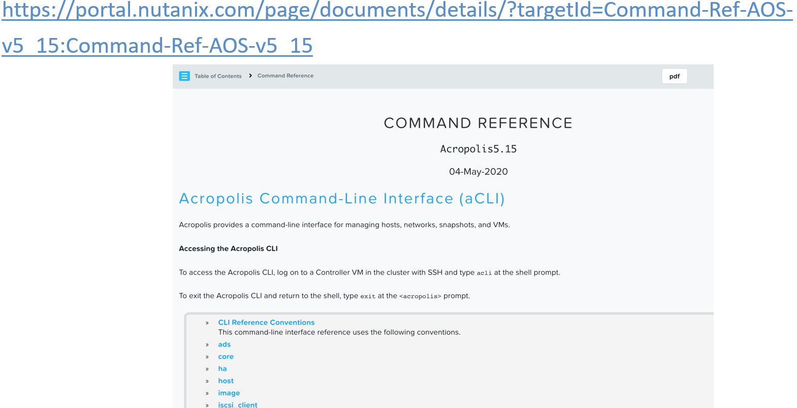
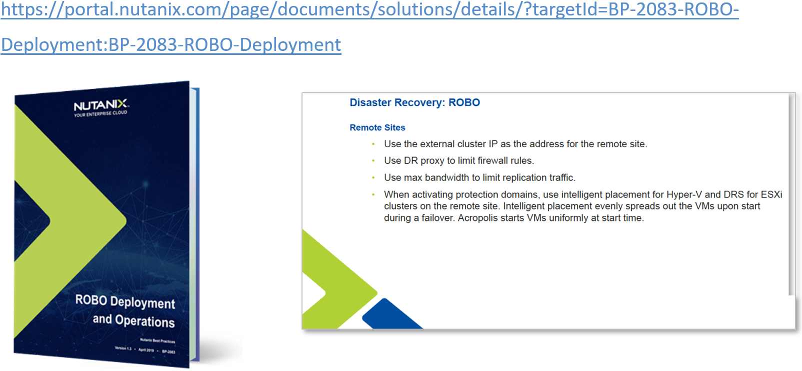

.. Adding labels to the beginning of your lab is helpful for linking to the lab from other pages
.. _Distributed_Storage_Fabric_1:

--------------------------
Distributed Storage Fabric
--------------------------

Session 7

-----------------------------------------------------

VMs, CVMs and DSF
++++++++++++++++++++++++

.. figure:: images/RESTAPIExplorerSample.png

-----------------------------------------------------

Storage Containers
++++++++++++++++++++++++

.. figure:: images/RESTAPIExplorerSample.png

-----------------------------------------------------

References
+++++++++++++++++++++++++

`Prism Element (Web Console) - Guide <https://portal.nutanix.com/page/documents/details/?targetId=Web-Console-Guide-Prism-v5_15:Web-Console-Guide-Prism-v5_15>`_

.. figure:: images/webconsoleguide.png

`Prism Central Guide <https://portal.nutanix.com/page/documents/details/?targetId=Prism-Central-Guide-Prism-v5_15:Prism-Central-Guide-Prism-v5_15>`_

.. figure:: images/prismcentralguide.png

`Command-Line Interface nCLI and aCLI <https://portal.nutanix.com/page/documents/details/?targetId=Command-Ref-AOS-v5_15:Command-Ref-AOS-v5_15>`_

`Nutanix REST API Reference <https://portal.nutanix.com/page/documents/details/?targetId=API-Ref-AOS-v5_15:man-rest-api-v1-u.html>`_

.. figure:: images/NutanixRESTAPIReference.png

`Nutanix PowerShell Cmdlets <https://portal.nutanix.com/page/documents/details/?targetId=API-Ref-AOS-v510:ps-ps-cmdlets-c.html>`_

.. figure:: images/NutanixPowerShellCmdlets.png

`Nutanix ROBO Deployment and Operations <https://portal.nutanix.com/page/documents/solutions/details/?targetId=BP-2083-ROBO-Deployment:BP-2083-ROBO-Deployment>`_

-----------------------------------------------------

Questions
++++++++++++++++++++++

This is a link to the Questions : :doc:`Questions`

