.. Adding labels to the beginning of your lab is helpful for linking to the lab from other pages
.. _Distributed_Storage_Fabric_1:

--------------------------
Distributed Storage Fabric
--------------------------

Session 7

-----------------------------------------------------

VMs, CVMs and DSF
++++++++++++++++++++++++

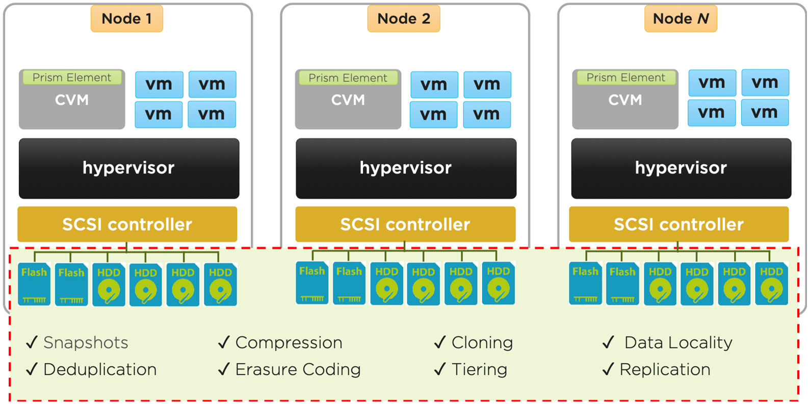

-----------------------------------------------------

Storage Containers
++++++++++++++++++++++++

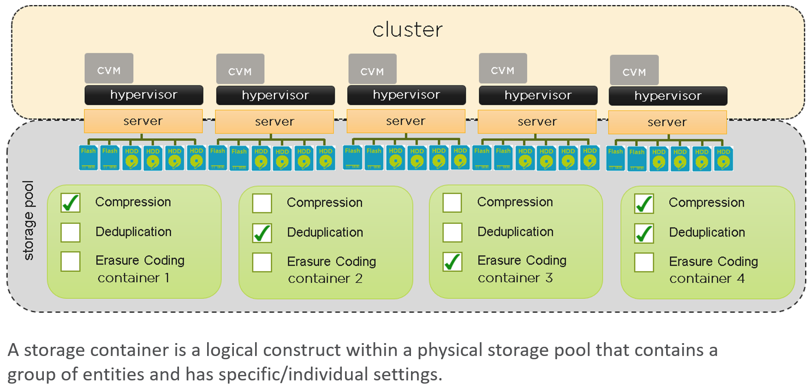

-----------------------------------------------------

DSF Cluster-wide Tier Balancing
++++++++++++++++++++++++++++++++++++

**Information Life-cycle Manager (ILM): hot/cold data**

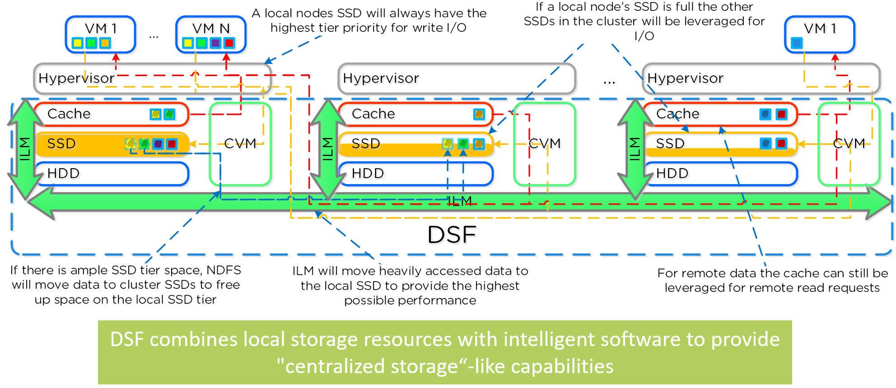

Distributed Storage Fabric (DSF) combines local storage resources with intelligent software to provide "centralized storage“-like capabilities.

A common question is what happens when a local node’s SSD becomes full?  As mentioned in the Disk Balancing section, a key concept is trying to keep uniform utilization of devices within disk tiers.  In the case where a local node’s SSD utilization is high, disk balancing will kick in to move the coldest data on the local SSDs to the other SSDs throughout the cluster.  This will free up space on the local SSD to allow the local node to write to SSD locally instead of going over the network.  A key point to mention is that all CVMs and SSDs are used for this remote I/O to eliminate any potential bottlenecks and remediate some of the hit by performing I/O over the network.

The other case is when the overall tier utilization breaches a specific threshold *curator_tier_usage_ilm_threshold_percent (Default=75)* where DSF ILM will kick in and as part of a Curator job will down-migrate data from the SSD tier to the HDD tier.  This will bring utilization within the threshold mentioned above or free up space by the following amount [curator_tier_free_up_percent_by_ilm (Default=15)], whichever is greater. The data for down-migration is chosen using last access time. In the case where the SSD tier utilization is 95%, 20% of the data in the SSD tier will be moved to the HDD tier (95% –> 75%). 

However, if the utilization was 80%, only 15% of the data would be moved to the HDD tier using the minimum tier free up amount.

-----------------------------------------------------

Data Localization: Write I/Os
++++++++++++++++++++++++++++++

**Information Lifecycle Management (ILM) performs data movement**

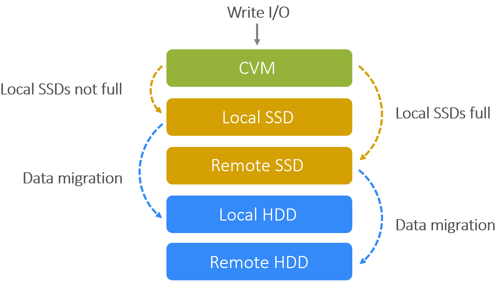

Storage Tiering and Prioritization
Using disk balancing, storage capacity is pooled among all nodes in a Nutanix cluster where ILM keeps hot data local.  A similar concept applies to disk tiering, in which the cluster’s SSD and HDD tiers are cluster-wide and DSF ILM is responsible for triggering data movement events. A local node’s SSD tier is always the highest priority tier for all I/O generated by VMs running on that node, however all of the cluster’s SSD resources are made available to all nodes within the cluster.  The SSD tier will always offer the highest performance and is a very important thing to manage for hybrid arrays.

**Guest VM Data Management**

Two (2) important attributes of a Nutanix cluster: **Data Resiliency** and **Data Locality**.

- When *writing* data, the cluster will make a copy on another node. This is **Data Resiliency**. It ensures that the cluster can lose a node without losing data (at least one copy is available in the cluster). So the cluster stays up and running after losing a node. By default, data is written to the SSD. If data is random write, it goes to the Oplog (which is SSD). If data is sequential write, it goes to the SSD portion of the Extent Store. If the local SSD is full, it will go to a remote SSD. This data migration takes place behind the scenes where cold data in the SSDs is migrated to the HDDs.
- When *reading* data, the cluster will read it from the local memory, local SSD, or local HDD. This is **Data Locality**. 

**The Nutanix Information Life-cycle Manager (ILM) feature will determine tier placement dynamically based upon I/O patterns and will move data between tiers.**

**Guest VM Write Request:**

- Going through the hypervisor, writes are sent to the CVM on the (local) host.

  - To provide a rapid response to guest VM, data is first stored in Oplog, then distributed across 10 GbE network to other nodes (metadata drives) in the cluster. 

**Guest VM Read Request:**

- Going through the hypervisor, reads are sent to the CVM which reads from local copy.  If no local copy is present, the local CVM reads across the network from a host that does contain a copy.  The File System automatically tiers data across different types of storage devices using intelligent data placement algorithms.  These algorithms make sure that the *most frequently used data* is available in **memory** or in **flash** for the fastest possible performance.
- The **Extent Store** is the persistent bulk storage of DSF and spans SSD and HDD and is extensible to facilitate additional devices/tiers.  Data entering the Extent Store is either being drained from the Oplog, or is sequential in nature and has bypassed the OpLog directly. 

-----------------------------------------------------

Data Locality
++++++++++++++++++++++++++++++

**Read/Write IOs served by local CVMs**

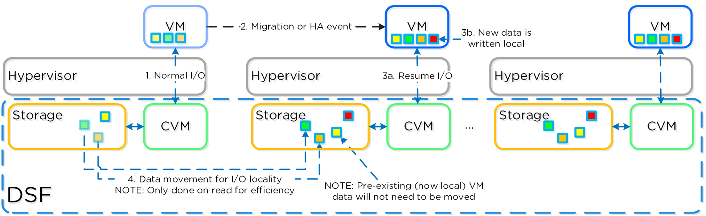

**Data Locality**

Being a converged (compute+storage) platform, I/O and data locality are critical to cluster and VM performance with Nutanix.  All read/write IOs are served by the local Controller VM (CVM) which is on each hypervisor adjacent to normal VMs.  A VM’s data is served locally from the CVM and sits on local disks under the CVM’s control.  

When a VM is moved from one hypervisor node to another (or during a HA event), the newly migrated VM’s data will be served by the now local CVM. When reading old data (stored on the now remote node/CVM), the I/O will be forwarded by the local CVM to the remote CVM.  All write I/Os will occur locally right away.  DSF will detect the I/Os are occurring from a different node and will migrate the data locally in the background, allowing for all read I/Os to now be served locally.  The data will only be migrated on a read as to not flood the network.

-----------------------------------------------------

Storage Container Settings
++++++++++++++++++++++++++++++

**Create Storage Container Script**

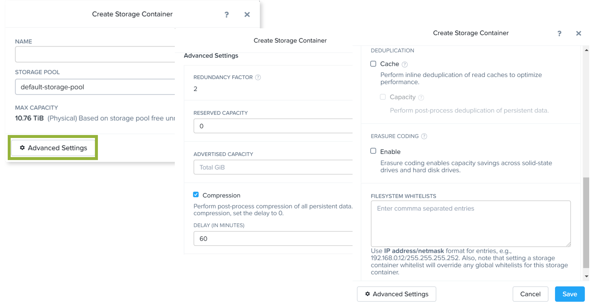

Software-defined intelligence is taking the core logic from normally proprietary or specialized hardware (e.g. ASIC / FPGA) and performing those functionalities in software on commodity hardware. 

For Nutanix, we take the traditional storage logic (e.g. RAID, deduplication, compression, etc.) and put that into software that runs in each of the Nutanix Controller VMs (CVM) on standard hardware.

-----------------------------------------------------

Storage Capacity Optimization
++++++++++++++++++++++++++++++

**100% software-defined**

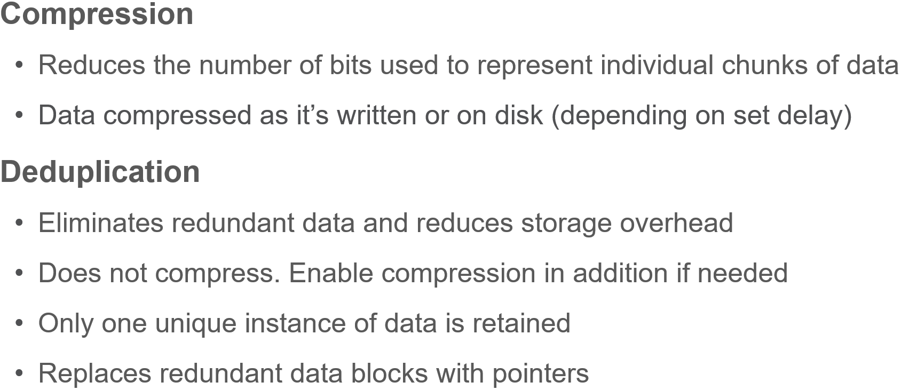

**Compression Overview**

- Almost always use **inline compression** (compression delay = 0), as it will compress only larger/sequential writes and not affect random write performance. 

  - This will also increase the usable size of the SSD tier, increasing effective performance and enabling more data to sit in the SSD tier. 

- For larger or sequential data that is written and compressed inline, the replication for RF will be shipping the compressed data, further increasing performance since it is sending less data across the wire. 
- Inline compression also pairs perfectly with erasure coding. 
  - For instance, an algorithm may represent a string of bits with a smaller string of 0s and 1s by using a dictionary for the conversion between them, or the formula may insert a reference or pointer to a string of 0s and 1s that the program has already seen.

- Text compression can be as simple as removing all unneeded characters, inserting a single repeat character to indicate a string of repeated characters, and substituting a smaller bit string for a frequently occurring bit string.
  - Data compression can reduce a text file to 50% or a significantly higher percentage of its original size.

-----------------------------------------------------

Compression
++++++++++++++++++++++++++++++

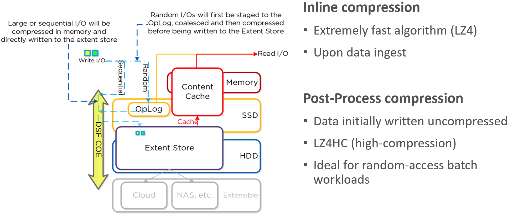

**Compression Process**

Inline compression compresses sequential streams of data or large I/O sizes (>64K) when written to the Extent Store (SSD + HDD). This includes data draining from OpLog as well as sequential data skipping it.
Offline compression initially writes the data as normal (in an uncompressed state) and then leverages the Curator framework to compress the data cluster-wide. When inline compression is enabled but the I/Os are random in nature, the data is written uncompressed in the OpLog, coalesced, and then compressed in memory before being written to the Extent Store.

Nutanix leverages LZ4 and LZ4HC for data compression. Normal data is compressed using LZ4, which provides a very good blend between compression and performance. For cold data, LZ4HC is used to provide an improved compression ratio.

**Workloads less suitable for compression**

- Applications performing native data compression,  including JPEG or MPEG
- Systems featuring native compression such as SQL server databases
- Workloads generating heavy random write operations
- Workloads that frequently update data (CAD)
- Data already storage optimized, like VCAI snapshots, linked clones, and so forth

-----------------------------------------------------

Erasure Coding (EC-X)
++++++++++++++++++++++++++++++

**EC-X Strip: 2-4 Data blocks; 1 (RF2) - 2 (RF3) Parity blocks**

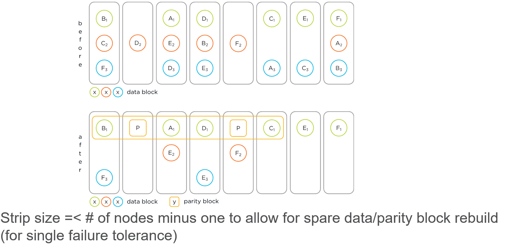

**EC-X Process**

Erasure Coding is performed post-process and leverages the Curator MapReduce framework for task distribution. Since this is a post-process framework, the traditional write I/O path is unaffected.  In this scenario, we have RF3 data whose primary copies are local and replicas are distributed to other nodes throughout the cluster.

Erasure Coding is a method of data protection that breaks data into blocks, then expands and encodes the block with redundant data.

This optimizes (i.e. reduces) data storage while still providing the ability to tolerate multiple failures.  Similar in concept to RAID parity calculation

Encodes a strip of data blocks on different nodes and calculates parity based on the configured replication factor (RF)

**Erasure Coding**

- A cluster must have at least four nodes in order for erasure coding to be enabled
- Do not use erasure coding on datasets with many overwrites. Optimal for snapshots, file server archives, backups and other “cold” data
- Read performance may be degraded during failure scenarios
- Erasure coding is a backend job; achieving savings might take time

-----------------------------------------------------

Deduplication and Compression Best Practices
++++++++++++++++++++++++++++++++++++++++++++

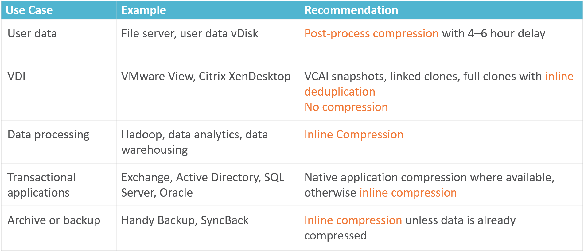

**Deduplication and Compression Best Practices**

- VCAI = (Horizon) View Composer API for Array Integration.

  - Turning on deduplication for VAAI (vStorage APIs for Array Integration) clone or linked clone environments is not recommended.

-----------------------------------------------------

Viewing Overall Capacity Optimization
++++++++++++++++++++++++++++++++++++++++++++

**Prism Storage Dashboard**

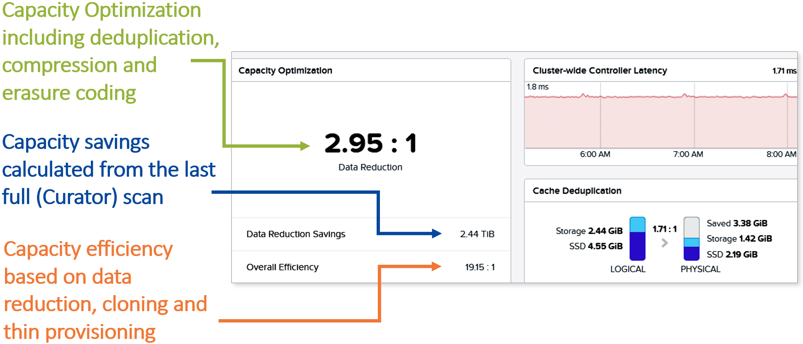

-----------------------------------------------------

References
+++++++++++++++++++++++++

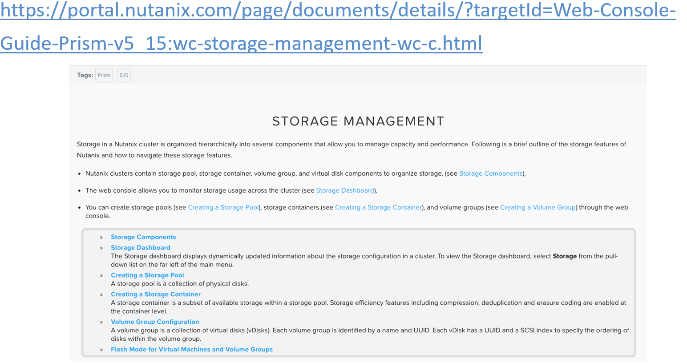

`Storage Management <https://portal.nutanix.com/page/documents/details/?targetId=Web-Console-Guide-Prism-v5_15:wc-storage-management-wc-c.html>`_
"""""""""""""""""""""""""""""""""""""""""""""""""""""""""""""""""""""""""""""""""""""""""""""""""""""""""""""""""""""""""""""""""""""""""""""""""

-----------------------------------------------------

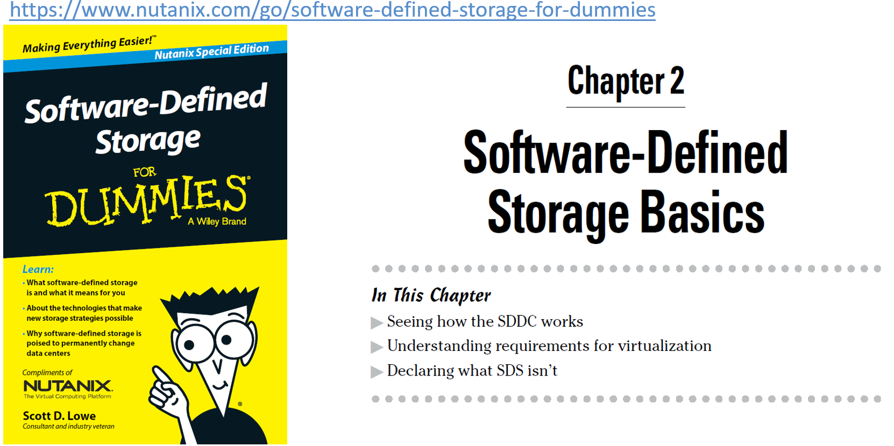

`Software-Defined Storage for Dummies <https://www.nutanix.com/go/software-defined-storage-for-dummies>`_
"""""""""""""""""""""""""""""""""""""""""""""""""""""""""""""""""""""""""""""""""""""""""""""""""""""""""

-----------------------------------------------------

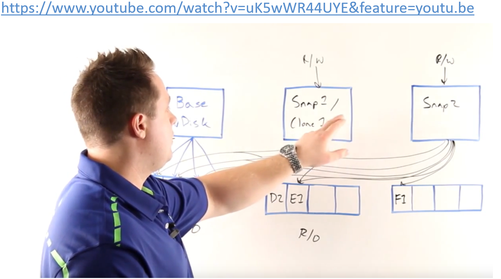

`Snapshots and Clones <https://www.youtube.com/watch?v=uK5wWR44UYE&feature=youtu.be>`_
""""""""""""""""""""""""""""""""""""""""""""""""""""""""""""""""""""""""""""""""""""""

-----------------------------------------------------

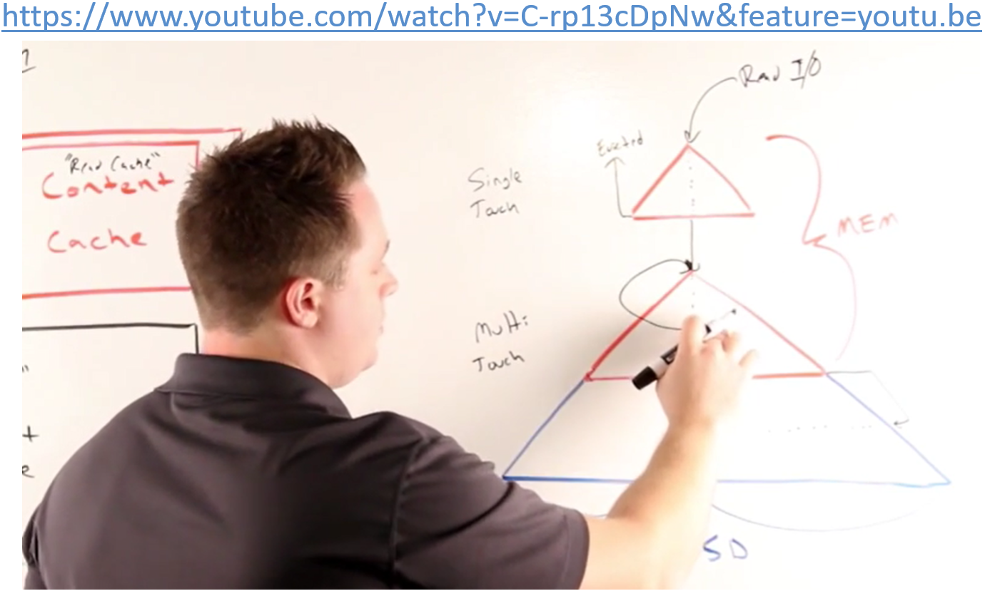

`Deduplication <https://www.youtube.com/watch?v=C-rp13cDpNw&feature=youtu.be>`_
"""""""""""""""""""""""""""""""""""""""""""""""""""""""""""""""""""""""""""""""

-----------------------------------------------------

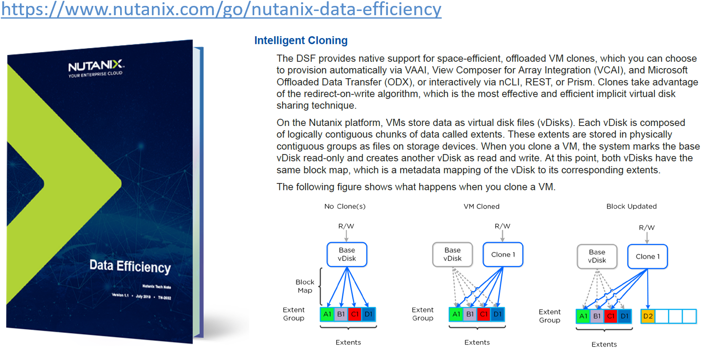

`Data Efficiency <https://www.nutanix.com/go/nutanix-data-efficiency>`_
"""""""""""""""""""""""""""""""""""""""""""""""""""""""""""""""""""""""

-----------------------------------------------------

Questions
++++++++++++++++++++++

This is a link to the Questions : :doc:`Questions`

