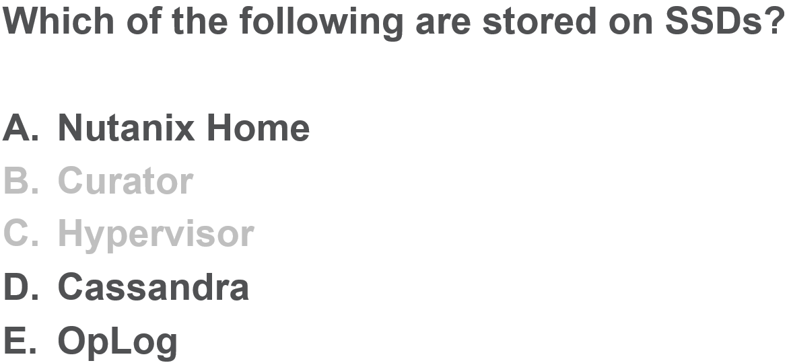

.. Adding labels to the beginning of your lab is helpful for linking to the lab from other pages
.. _E_answer_9:

-------------
Answer 9
-------------

The original 5 storage containers are all 15TB/3 = 5TB in size.

Adding the two (2) new storage containers and their 1TB reserved capacity, the common pool has now dwindled to 5TB – 1TB – 1TB = 3 TB.

Containers A and B both have 1 TB reserved, hence their raw capacity is 3TB (common pool) + 1TB (reserved capacity) = 4TB  

Back to the Question: :ref:`E_question_9`

Next Question: :ref:`E_question_10`

