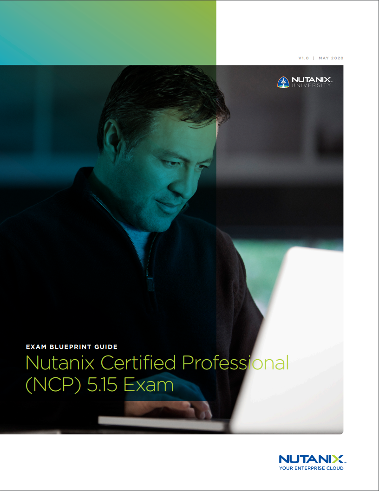
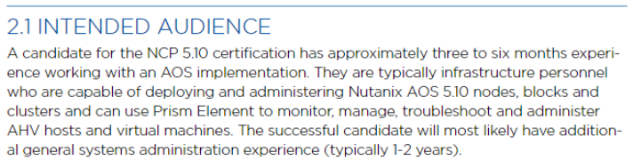
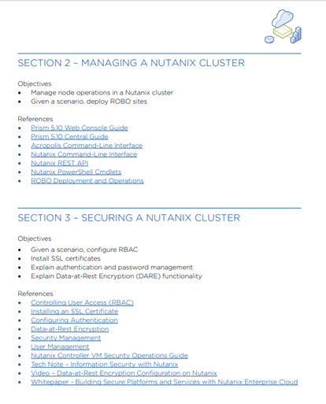

.. _getting_started:

---------------
Getting Started
---------------

Welcome to the Nutanix Certified Professional - Multicloud Infrastructure 5.15 Exam Prep Workshop.  The NCP-MCI 5.15 certification validates your skills and abilities in deploying, administering, and troubleshooting AOS 5.15.

This short workshop is intended to provide a highlight of the NCP exam including briefly discussing the objectives covered by the exam and reviewing practice questions. This is intended to supplement the Enterprise Cloud Administration training course, hopefully you have already attended that course with an instructor or reviewed the modules at Nutanix University.

At the end of the workshop you will know how to sign up to the exam, be armed with the testing details, have a solid overview of the topics on the exam and be familiar with the question format.
                                             

Agenda
++++++++++++++++++++++++

- Introductions
- Nutanix Certified Professional Overview
- Nutanix Concepts
- Managing a Nutanix Cluster
- Securing a Nutanix Cluster
- Nutanix Networking
- VM Creation and Management
- Health Monitoring and Alerts
- Distributed Storage Fabric
- Acropolis Storage Services
- Data Resiliency
- Data Protection
- Prism Central
- Cluster Maintenance and Life-Cycle Operations
- Exam tips and tricks

Introductions
+++++++++++++++++++++++++++++++

- Name
- Familiarity with Nutanix

Objectives
+++++++++++++

ECA refresh 
Practice questions

- Test knowledge
- Question layout and standards
- Get into the exam mindset

Each section of the workshop is split in to primary material, questions, bonus material and references. There is also a pool of Extra Questions at the end.  The workshop is expected to run about four hours, not including breaks, bonus material or extra questions.  

Exam Blueprint Guide
++++++++++++++++++++

Nutanix doesn't teach to the exam - this day follows the Blueprint

The Exam Blueprint Guide (EBG), available in the NCP learning plan at NutanixUniversity or on the Certifications page at nutanix.com, lists all of the pertinent information about the exam.

The EBG covers topics such as the retake policy and the scoring method.  

Key details 
...........

- 75 questions covering twelve sections
- 120 minute time limit

The exam normally requires scheduling at least 24 hours in advance and is remote-proctored.

Audience
..........

The Exam Blueprint Guide also describes the intended audience:

Objectives
..........

A key resource on the EBG is the list of objectives the exam covers including references. You should be familiar with the technologies and features described as well as the references listed.

