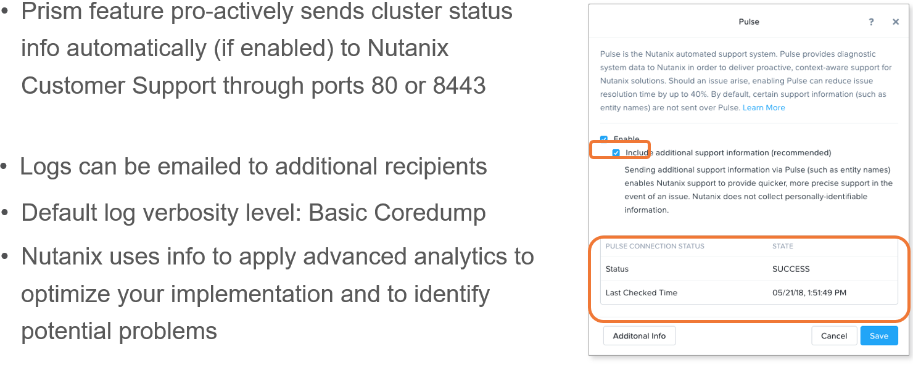
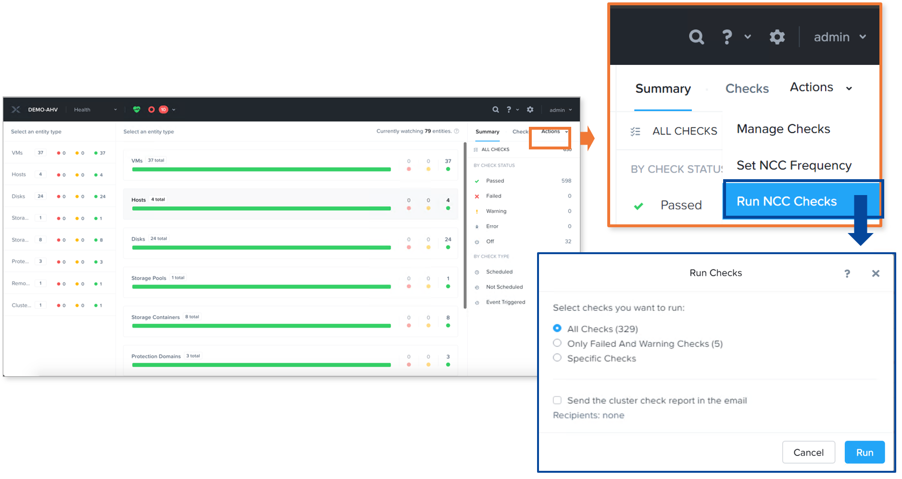
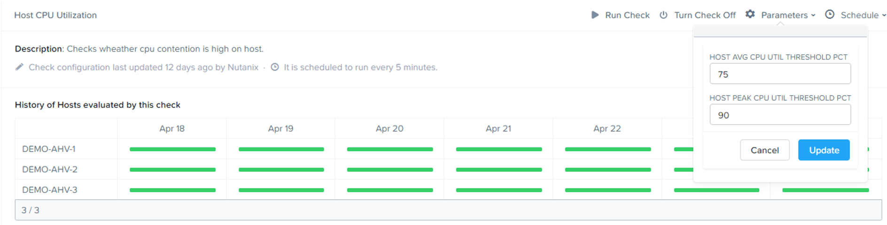
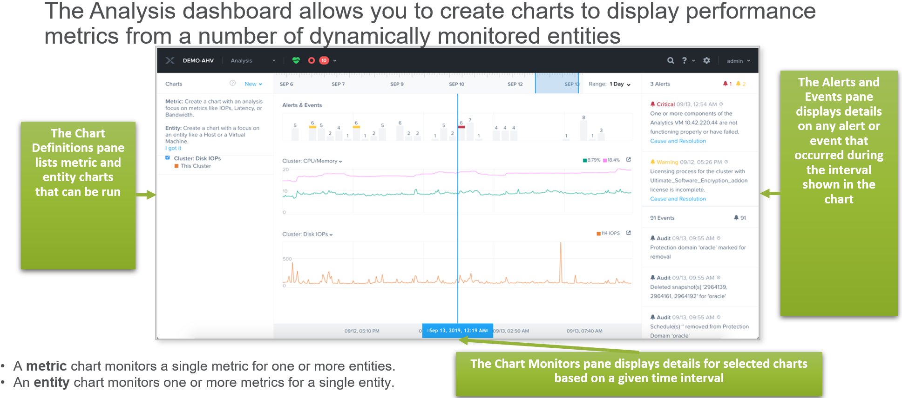
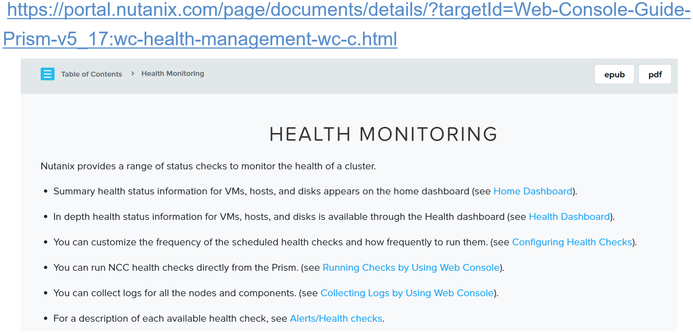
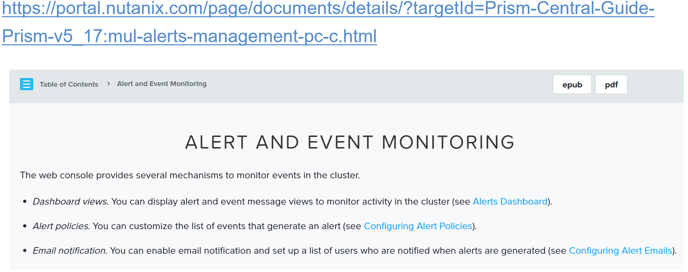

.. Adding labels to the beginning of your lab is helpful for linking to the lab from other pages

.. title:: NCP Bootcamp - Health Monitoring and Alerts

.. _Health_Monitoring_and_Alerts_1:

---------------------------------------
Health Monitoring and Alerts
---------------------------------------

Session 6

-----------------------------------------------------

Pulse
++++++++++++++++++++++++++++++++

Feature **enabled** by default

- Pulse provides diagnostic system data to Nutanix support teams to deliver proactive, context-aware support for Nutanix solutions. The Nutanix cluster automatically and unobtrusively collects this information with no effect on system performance.  Pulse shares only basic system-level information necessary for monitoring the health and status of a Nutanix cluster.

- Information includes:

  - System Alerts
  - Current Nutanix Software Version
  - Nutanix Processes and Controller VM Information
  - Hypervisor Details such as Type and Version
  
- When Pulse is enabled, it sends a message once every 24 hours to a Nutanix support server by default.  Pulse also collects the most important data-like system-level statistics and configuration information more frequently to automatically detect issues and help make troubleshooting easier.  With this information, Nutanix support can apply advanced analytics to optimize your implementation and to address potential problems.

- Pulse is enabled by default.  You can enable (or disable) Pulse at any time.  

- Pulse sends messages through ports 80/8443/443 or through your mail server.

-----------------------------------------------------

Health Checks
++++++++++++++++++++++++++++++++

GUI / CLI use same command set

-----------------------------------------------------

Customizable Thresholds
++++++++++++++++++++++++++++++++

Health dashboard > Actions > Manage Checks

-----------------------------------------------------

Analysis Dashboard
++++++++++++++++++++++++++++++++

Create Metric and Entity charts

**Analysis Dashboard**

- The Analysis dashboard allows you to create charts that can monitor dynamically a variety of performance measures.

  - To view the Analysis dashboard:
  
    - Select Analysis from the drop-down list on the far left of the main menu.
	
- The Analysis dashboard includes 3 sections:

  - Chart Definitions

    - The pane on the left lists the charts that can be run.

    - There are 2 types of charts:

      - A metric chart monitors a single metric for one or more entities.
      - An entity chart monitors one or more metrics for a single entity. 

    - Chart Monitors
	
      - When a chart definition is checked, the monitor displays in the middle pane.

        - The Range Picker field at the top sets the time interval for the monitors.

      - An Alerts & Events monitor always displays first.

    - Alerts and Events

      - Any alerts and events that occur during the interval specified by the time line in the middle pane display in the pane on the right.

-----------------------------------------------------

References
++++++++++++++++++++++

`Health Monitoring <https://portal.nutanix.com/page/documents/details/?targetId=Prism-Central-Guide-Prism-v5_17:mul-alerts-management-pc-c.html>`_
""""""""""""""""""""""""""""""""""""""""""""""""""""""""""""""""""""""""""""""""""""""""""""""""""""""""""""""""""""""""""""""""""""""""""""""""""""""""""""""""""

-----------------------------------------------------

`Alert and Event Monitoring <https://portal.nutanix.com/page/documents/details/?targetId=Web-Console-Guide-Prism-v5_17:wc-health-management-wc-c.html>`_
""""""""""""""""""""""""""""""""""""""""""""""""""""""""""""""""""""""""""""""""""""""""""""""""""""""""""""""""""""""""""""""""""""""""""""""""""""""""""""""""""

-----------------------------------------------------

Questions
++++++++++++++++++++++

This is a link to the Questions : :doc:`Questions`
