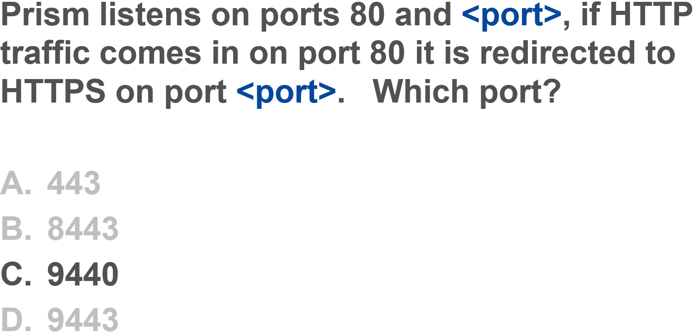

.. Adding labels to the beginning of your lab is helpful for linking to the lab from other pages
.. _MANC_answer_1:

-------------
Answer 1
-------------

Prism listens on ports 80 and 9440, if HTTP traffic comes in on port 80 it is redirected to HTTPS on port 9440

Back to the Question: :ref:`MANC_question_1`

Next Question: :ref:`MANC_question_2`

