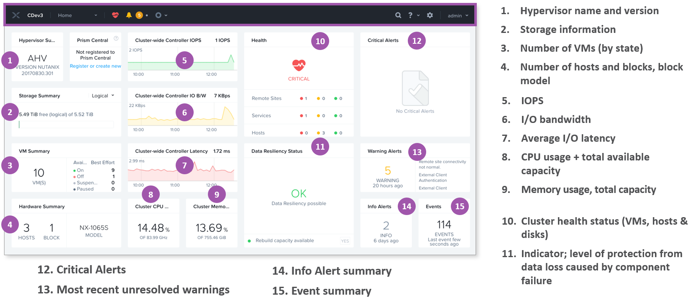
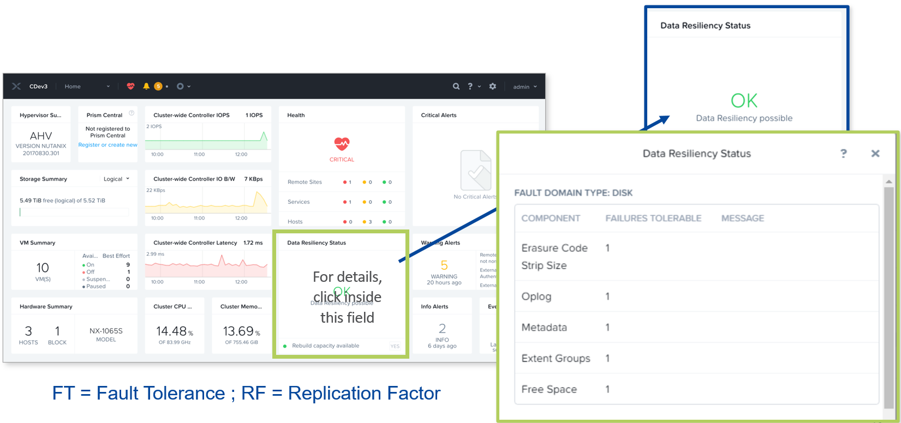
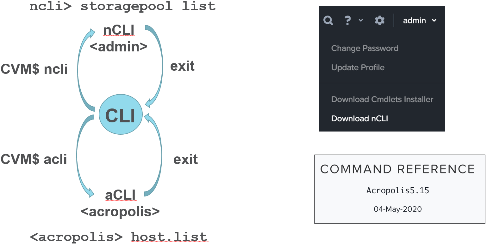
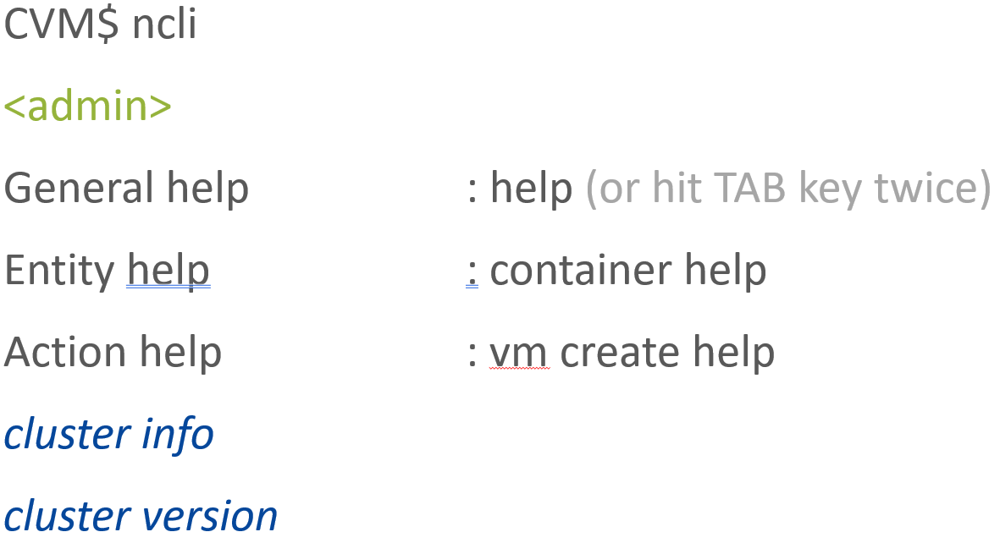
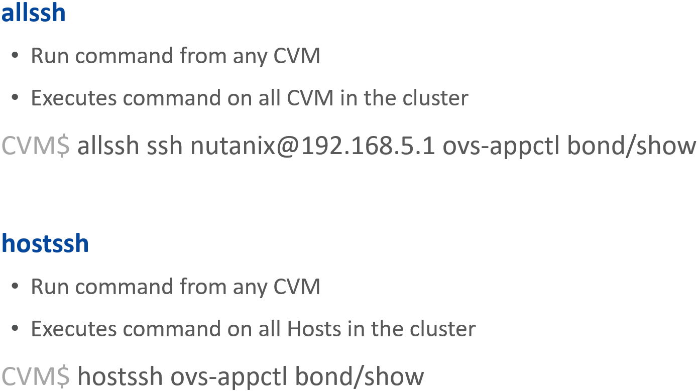
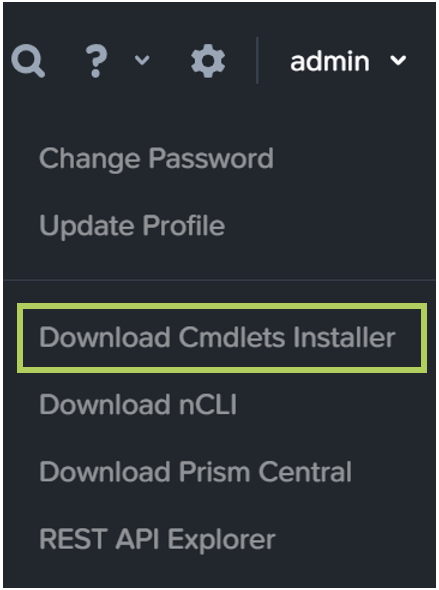
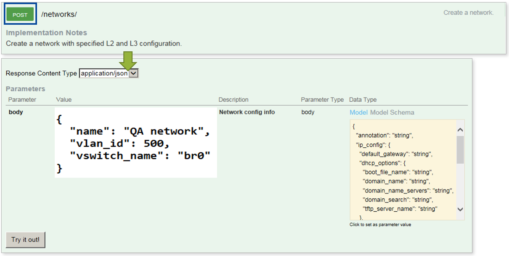
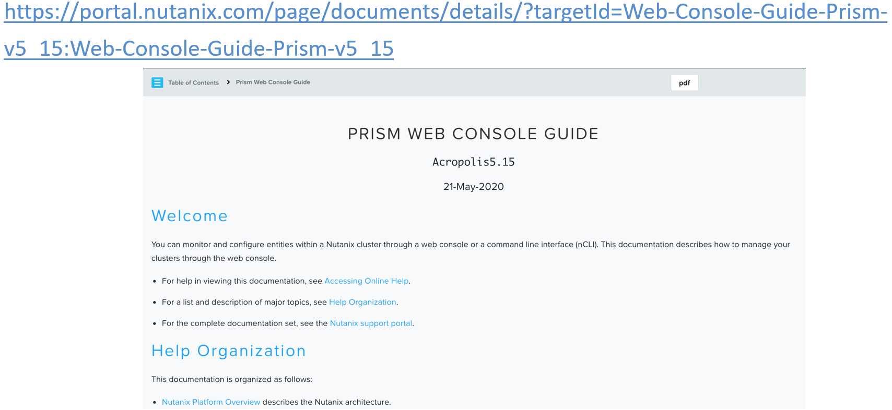
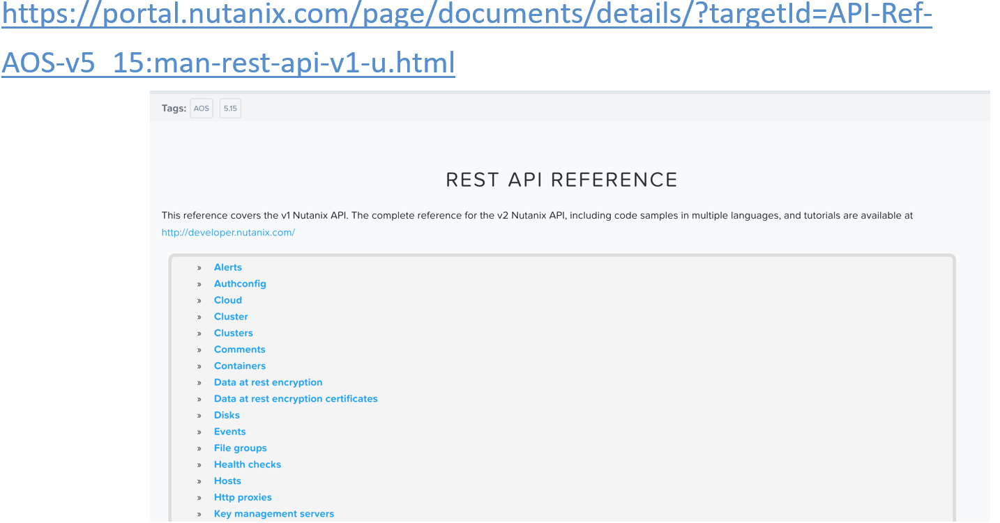
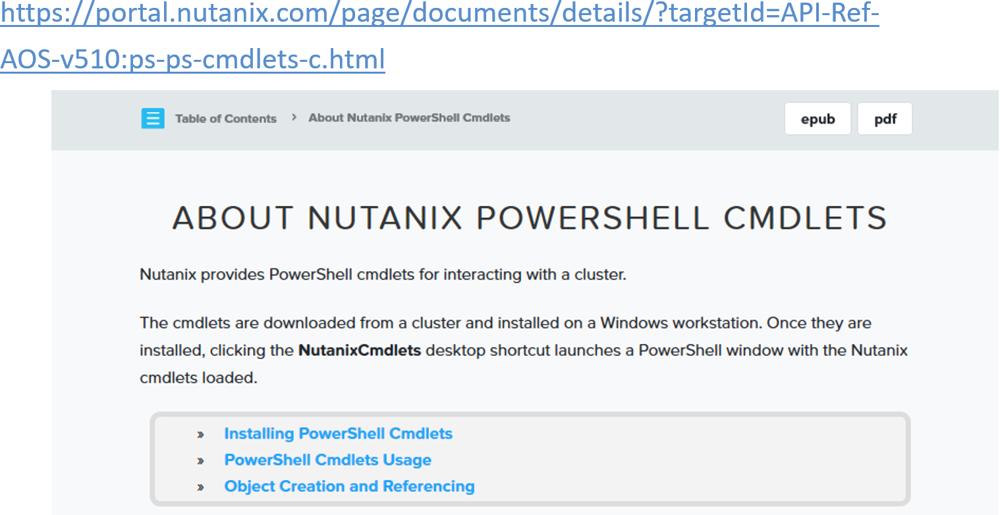

.. Adding labels to the beginning of your lab is helpful for linking to the lab from other pages
.. _Managing_a_Nutanix_Cluster_1:

--------------------------
Managing a Nutanix Cluster
--------------------------

Session 2

-----------------------------------------------------

Cluster Management
++++++++++++++++++++++++

Graphical interface (UI) and Command Line (CLI)

.. figure:: images/ClusterManagement.png

**Prism (HTML5 GUI)**

- Prism (Element)

- Prism Central (Pro)

**Nutanix PowerShell**

**REST API Explorer**

**CLI** (SSH, e.g. PuTTY)

- Bash (Linux shell)

- nCLI  (Nutanix CLI)

- aCLI (Acropolis CLI)

- eCLI (Support)

**There are several methods to manage a Nutanix implementation**

- Graphical UI – Prism Element and Prism Central

  - Preferred method for management
  - Manage entire environment (when using Prism Central)

- Command Line Interfaces

  - nCLI – Get status and configure entities within a cluster
  - ACLI – Manage the Acropolis portion of the Nutanix environment

- Nutanix PowerShell Cmdlets – For use with Windows PowerShell

- REST API – Exposes all GUI components for orchestration and automation

-----------------------------------------------------

Prism Architecture
++++++++++++++++++

Prism Element, Prism Central

.. figure:: images/PrismArchitecture.png

Prism is the Nutanix UI used for administrative purposes and is broken down into two main components:

- Prism Central (PC)

  - 1:many cluster manager that provides a single, centralized management interface for managing multiple Nutanix clusters.  
  - Optional software appliance (VM).
  
- Prism Element (PE)

  - Localized cluster manager built-in to the CVM and used for local cluster management and operations.  
  - 1:1 cluster manager

Prism listens on ports 80 and 9440. If HTTP traffic comes in on port 80 it is redirected to HTTPS on port 9440.

Interfaces
""""""""""

- HTML5 (PE/PC)
- API (e.g. REST, Powershell, Java, Python)
- CLI (aCLI, nCLI)

Configuration management:
"""""""""""""""""""""""""

- VM management:

  - VM Operations: Create, delete, update, power, pause/resume VMs, access via remote console
  - Resource Scheduling: Determine initial placement of VMs based on CPU and memory availability
  - Migration: Live migrate VMs across nodes
  - Snapshots and Clones: Rapidly create efficient snapshots and clones of VMs
  - High Availability: Auto-restart VMs on a different host upon host failures.
  - IP Management: Assign dynamic IP addresses to a VM at creation for the life of the VM. Acropolis uses VXLAN tunnels for IP address management.
  - Analytics: Monitor and report key metrics for both VMs and the infrastructure, including hypervisor and physical nodes
  - Remote Console: Remote access all types of virtual machines and operating systems to operate at the console level.

- Host Management:

  - Host Profiles: Standardize configuration of hosts within a cluster based on user-provided information
  - Virtual Networking: Setup and configure VLAN-backed virtual networks spanning the cluster. Use built-in IP management
  - Upgrades: Non-Disruptive rolling Hypervisor upgrade in a Nutanix cluster
  - Maintenance Mode: Put hosts into maintenance mode for upgrades and host removals
  - Scaling: Easily add and remove nodes in minutes

- Storage policy - compression, deduplication, erasure coding
- Data protection – snapshots, backup, disaster recovery, replication
- Monitoring – analytics, compliance, alarms, health status

-----------------------------------------------------

Prism Element
++++++++++++++++++++++++

Less than 10 secs to determine if there’s need for action

The Home dashboard displays cluster-level performance and usage statistics on the left, health status info in the middle, and the most recent alert and event messages on the right.  The cluster name displays on the far left of the menu bar, next to the entity drop-down.

Prism is an end-to-end management solution for a virtualized datacenter, streamlining common hypervisor and VM tasks.

Focus is on common operational tasks in four areas:

- Infrastructure management
- Operational insight
- Capacity planning
- Performance monitoring

-----------------------------------------------------

Prism Element: Data Resiliency
++++++++++++++++++++++++++++++++++++++++

RF -> FT

RF2=FT1 and RF3=FT2

FT0 (zero) means cluster still running, but no additional failures can be tolerated

-----------------------------------------------------

Command Line Interfaces
++++++++++++++++++++++++

References found on Portal

Run system administration commands against a Nutanix cluster from:

- A local machine

- Any CVM in the cluster

Two CLIs:

- nCLI – Get status and configure entities within a cluster

- aCLI – Manage hosts, networks, snapshots and VMs the Acropolis portion of the Nutanix environment

Acropolis 5.5 Command Reference Guide

- Contains nCLI, aCLI and CVM commands

Remote system login (Downloaded nCLI): ncli -s management_ip_addr -u 'username' -p 'user_password'

General help: ncli> help
Entity help (e.g. containers): ncli> container help
Action help (e.g. creating a VM): ncli> vm create help

-----------------------------------------------------

nCLI Command Syntax
++++++++++++++++++++++++

Behaves like any Linux (no man pages)

``ncli> entity action parameter1=value …``
``container create name=<name> res-capacity=<#_in_GB>``

-----------------------------------------------------

aCLI Command Syntax
++++++++++++++++++++++++

acli: help <entity> ; ncli: <entity> help

.. figure:: images/aCLICommandSyntax.png

-----------------------------------------------------

allssh vs. hostssh
++++++++++++++++++++++++

Always run commands from CVM

-----------------------------------------------------

PowerShell
++++++++++++++++++++++++

Always run commands from CVM

Windows PowerShell is an intuitive and interactive scripting language built on the .NET framework
Nutanix PowerShell Cmdlets utilize a getter/setter methodology:
Typical syntax is  <Verb>-NTNX<Noun>

Examples:

- ``move-NTNXVirtualMachine``

- ``get-NTNXAlert``

System administration tasks using PowerShell

- Same API, different interface

- Minimum requirements:
  - PowerShell v2
  - .NET framework 4

- Downloaded Prism installer based on AOS version
- Extra set of PowerShell cmdlets 

``Get-NutanixCluster -Server cvm_ip_addr``

-----------------------------------------------------

REST API Explorer
++++++++++++++++++++++++

HTTP requests to retrieve/edit entities in JSON format  

.. figure:: images/RESTAPIExplorer.png

Allows an external system to interrogate a cluster using a script that makes REST API calls

Uses HTTP requests (Get, Post, Put, and Delete) to retrieve info or make changes to the cluster

Responses are coded in JSON format

Prism Element includes a REST API Explorer

-----------------------------------------------------

REST API Explorer: Sample
+++++++++++++++++++++++++

Allows an external system to interrogate a cluster using a script that makes REST API calls.
Uses HTTP requests (Get, Post, Put, and Delete) to retrieve info or make changes to the cluster.
Responses are coded in JSON format.

Prism Element includes a REST API Explorer
- Displays a list of cluster objects that can be managed by the API
- Sample API calls can be made to see output

Sample API script/call creates a Network (POST operation) on default distributed switch br0.
- Specify content in the body in JSON format
- Clicking the “Try It Out” button really means “execute” and cannot be undone for POST and DELETE operations.

-----------------------------------------------------

References
+++++++++++++++++++++++++

`Prism Element (Web Console) - Guide <https://portal.nutanix.com/page/documents/details/?targetId=Web-Console-Guide-Prism-v5_15:Web-Console-Guide-Prism-v5_15>`_
""""""""""""""""""""""""""""""""""""""""""""""""""""""""""""""""""""""""""""""""""""""""""""""""""""""""""""""""""""""""""""""""""""""""""""""""""""""""""""""""""

-----------------------------------------------------

`Prism Central Guide <https://portal.nutanix.com/page/documents/details/?targetId=Prism-Central-Guide-Prism-v5_15:Prism-Central-Guide-Prism-v5_15>`_
""""""""""""""""""""""""""""""""""""""""""""""""""""""""""""""""""""""""""""""""""""""""""""""""""""""""""""""""""""""""""""""""""""""""""""""""""""""""""""""""""

-----------------------------------------------------

.. figure:: images/cliref.png

`Command-Line Interface nCLI and aCLI <https://portal.nutanix.com/page/documents/details/?targetId=Command-Ref-AOS-v5_15:Command-Ref-AOS-v5_15>`_
""""""""""""""""""""""""""""""""""""""""""""""""""""""""""""""""""""""""""""""""""""""""""""""""""""""""""""""""""""""""""""""""""""""""""""""""""""""""""""""""""

-----------------------------------------------------

`Nutanix REST API Reference <https://portal.nutanix.com/page/documents/details/?targetId=API-Ref-AOS-v5_15:man-rest-api-v1-u.html>`_
""""""""""""""""""""""""""""""""""""""""""""""""""""""""""""""""""""""""""""""""""""""""""""""""""""""""""""""""""""""""""""""""""""""""""""""""""""""""""""""""""

-----------------------------------------------------

`Nutanix PowerShell Cmdlets <https://portal.nutanix.com/page/documents/details/?targetId=API-Ref-AOS-v510:ps-ps-cmdlets-c.html>`_
""""""""""""""""""""""""""""""""""""""""""""""""""""""""""""""""""""""""""""""""""""""""""""""""""""""""""""""""""""""""""""""""""""""""""""""""""""""""""""""""""

-----------------------------------------------------

.. figure:: images/robo.png

`Nutanix ROBO Deployment and Operations <https://portal.nutanix.com/page/documents/solutions/details/?targetId=BP-2083-ROBO-Deployment:BP-2083-ROBO-Deployment>`_
""""""""""""""""""""""""""""""""""""""""""""""""""""""""""""""""""""""""""""""""""""""""""""""""""""""""""""""""""""""""""""""""""""""""""""""""""""""""""""""""""

-----------------------------------------------------

Questions
++++++++++++++++++++++

This is a link to the Questions : :doc:`Questions`
