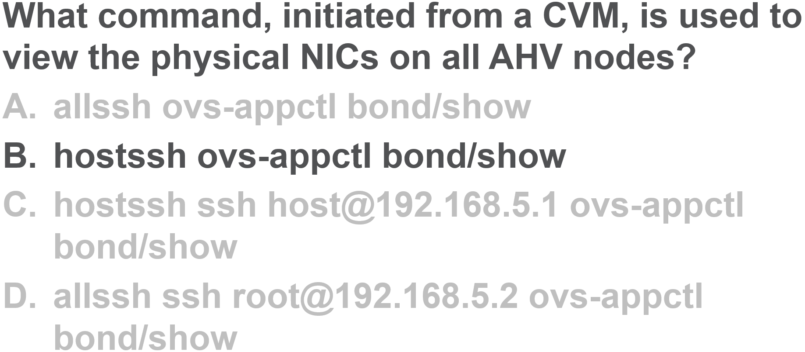

.. Adding labels to the beginning of your lab is helpful for linking to the lab from other pages
.. _NET_answer_5:

-------------
Answer 5
-------------

allssh ovs-appctl bond/show							: needs to run command from host not directly from CVM
hostssh ovs-appctl bond/show						: correct answer
hostssh ssh host@192.168.5.1 ovs-appctl bond/show	: hostssh needs to have “ssh host@192.168.5.1” removed 
allssh ssh root@192.168.5.2 ovs-appctl bond/show	: wrong IP: points to CVM (192.168.5.2) instead of Host (192.168.5.1)

Back to the Question: :ref:`NET_question_5`

Next Question: :ref:`NET_question_6`

