.. title:: NCP Bootcamp - Nutanix Networking

.. Adding labels to the beginning of your lab is helpful for linking to the lab from other pages
.. _nutanix_networking_1:

--------------------------
Nutanix Networking
--------------------------
 
Session 4

-----------------------------------------------------

Network Configuration
++++++++++++++++++++++++++++++++

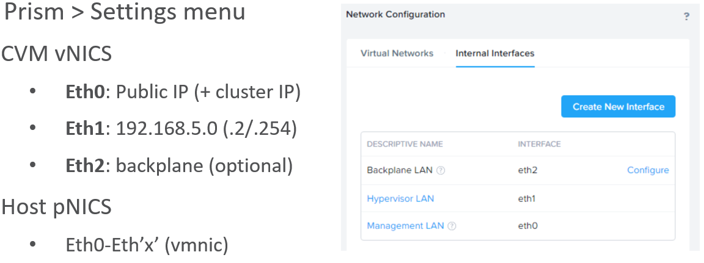

Eth2: Network segmentation is designed to separate management traffic from backplane (storage and CVM) traffic 

Separates storage traffic from routable management traffic for security purposes

Separate virtual networks are created for each traffic type

-----------------------------------------------------

VM Network: Enabling IPAM
++++++++++++++++++++++++++++++++

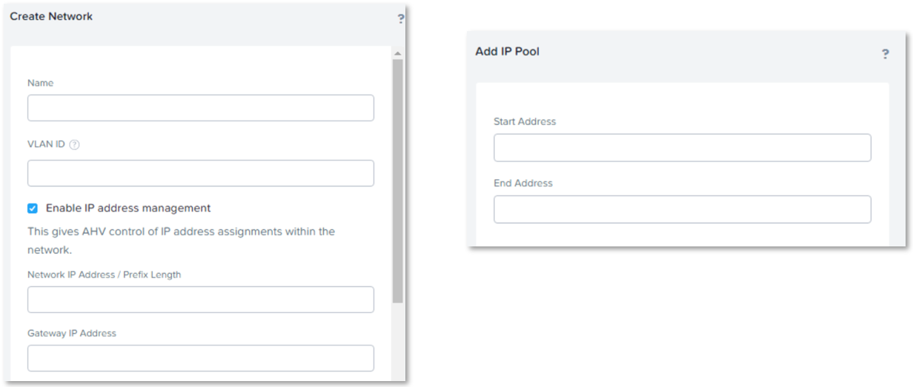

Enabling IPAM on a User VM Network.

During the VM Network creation process, if you decide to enable IPAM, you will be prompted to provide an IP Pool start and end address

Provide the required values and click Submit

-----------------------------------------------------

Prism Network Dashboard
++++++++++++++++++++++++++++++++

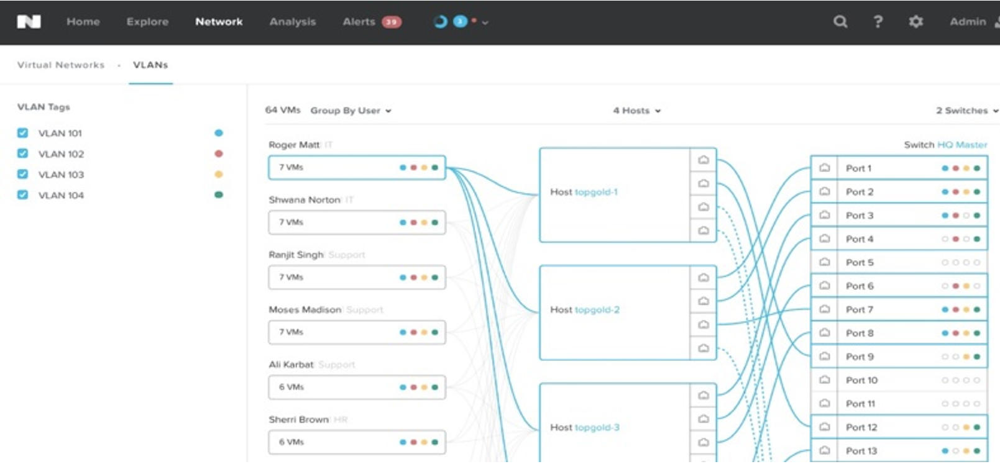

**Providing Network Connectivity to VMs**

- Two different ways to provide VM connectivity: managed and unmanaged networks
  - With *unmanaged networks*, VMs get direct connection to their VLAN of choice
  - With *managed networks*, AHV (Acropolis master) can perform IP address management (IPAM) for VMs, handing out IP addresses via configurable DHCP pools
  
**While a physical server connects to a physical network, a VM connects to a virtual network.**

- In the case of AHV, it supports unmanaged and managed virtual networks.
  - An unmanaged network is simply a VLAN.
- A managed network is a VLAN plus IPAM.

  - IPAM stands for IP address management.
  
    - It is the cluster capability to function like a DHCP server to assign an IP address to a VM that sits on the managed network.
   
- You can create a virtual network from the Prism web console, nCLI, or the Nutanix REST API.
- Tech Topx Video walks through AHV networking concepts, including both CLI and Prism examples:  https://youtube/pxQGCXNoD9U

*IPAM*

- CVM administrative L3 process to track device IP addresses
- Creates associations between interface’s MAC address and IP addresses
- Requires predefined pool of IP addresses for IPAM DHCP server

-----------------------------------------------------

Network Visualization
++++++++++++++++++++++++++++++++

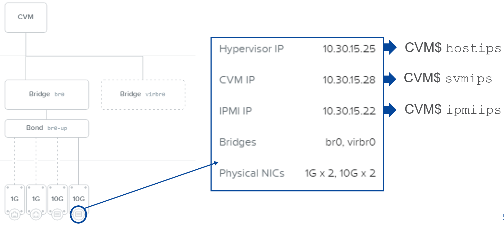

**Network Visualization in Prism – Specific Host**

*Host NTNX-block_ID-B Details*

- Note: Some newer Intel Gigabit NICs have a hardware limitation that means the maximum MTU they can support is 8996 (instead of 9000).

  - If your interfaces aren't coming up and you are trying to use 9000, this could be the reason and can be difficult to debug.

- Try setting all your MTUs to 8996 and see if it resolves your issues. 

-----------------------------------------------------

vSwitch Implementation (AHV)
++++++++++++++++++++++++++++++++

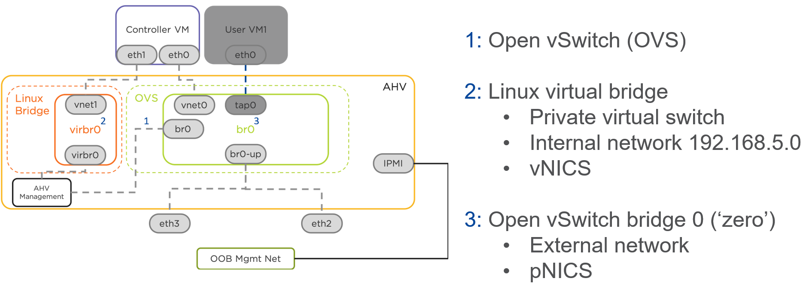

**vSwitch Implementation (AHV) Overview**

- While a physical network sits on a physical switch, a virtual network sits on a virtual switch.

  - Two virtual switches are created by default:

    - A Linux bridge (virbr0)

    - An open vSwitch bridge (br0).
   
- The Linux bridge is a private virtual switch.

  - It has no physical adapter and is dedicated to the communication between the CVM and the internal interface on the AHV bridge called virbr0.

    - This virbr0 is preconfigured with a private IP address 192.168.5.1.
	- 192.168.5.2 and 192.168.5.254 are configured on the CVM 

- The open vSwitch br0 is a public virtual switch.

  - It has one or more physical adapters attached to the network switches.

    - CVMs talk to one another across this open vSwitch.

  - Also, VMs talk to one another and also with the physical network through this open vSwitch.

- Since br0 has similar configuration on all AHV hosts, these br0 collectively appear like a single distributed virtual switch.

  - Also when a virtual network is created, it is created on all AHV hosts.

Each AHV server maintains an OVS instance, and all OVS instances combine to form a single logical switch.

-----------------------------------------------------

Networking Best Practices (AHV)
++++++++++++++++++++++++++++++++

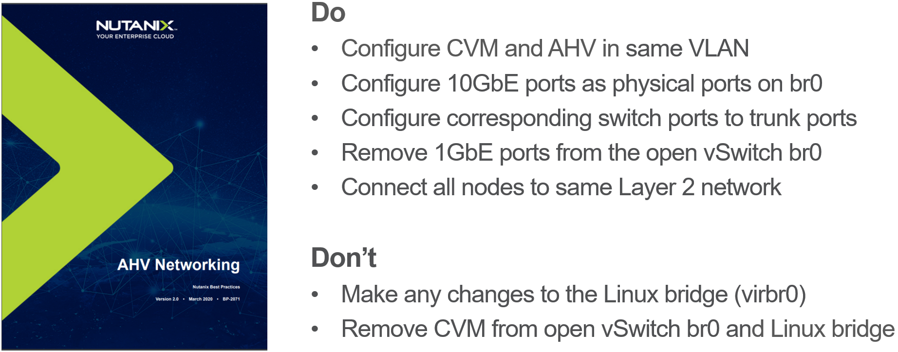

**Network Best Practices (AHV)**

- Add the CVM and the Acropolis hypervisor to the same VLAN.

  - Do not add any other device, including guest VMs, to the VLAN to which the CVM and hypervisor host are assigned.
  
- Aggregate the 10GbE interfaces on the physical host to an OVS bond on the default OVS bridge br0 and trunk these interfaces on the physical switch.

  - Do not include 1GbE interfaces; keep those detached or configure them on additional bridge.
  
- Add all the nodes that belong to a given cluster to the same Layer 2 network segment.

- Do not remove the CVM from either the OVS bridge br0 or the native Linux bridge virbr0.

  - Native Linux bridge virbr0: Connects CVM with AHV and internal storage.
  - OVS bridge br0: Connects (C)VMs with AHV and 1GbE/10GbE interfaces (to public network through external physical switch).

-----------------------------------------------------

Load Balancing Modes
++++++++++++++++++++++++++++++++

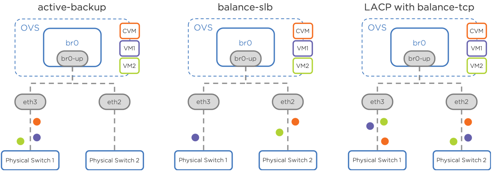

**Active-Passive**

- Provides only fault tolerance
- No special hardware required (physical switches available for redundancy)
- CVM and guest VM follow same activity path
- Only one NIC actively used for traffic
- No traffic load balancing

**Load Balancing Modes: Balance-SLB**

- In this mode, all links are active. Given two 10GbE ports on the open vSwitch, the open vSwitch has 20 Gbps of network bandwidth.
- This mode provides load balancing based on the VM MAC address.
- Due to this pinning behavior, a VM’s virtual interface is limited to 10 Gbps of network bandwidth.

**Load Balancing Modes: Balance-TCP**

- Balance-TCP (Transmission Control Protocol – TCP 80/443)
- Preferred load balancing mode for aggregate throughput
- All links are active
- Link aggregation (LACP)
- Requires upstream switch configuration

-----------------------------------------------------

AHV vSwitch Management: Open Virtual Switch
+++++++++++++++++++++++++++++++++++++++++++++++

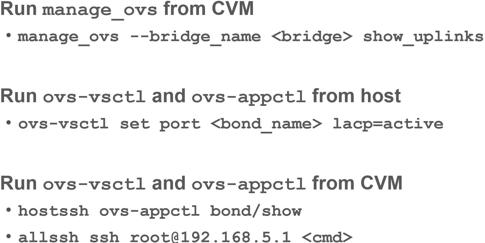

-----------------------------------------------------

References
++++++++++++++++++++++

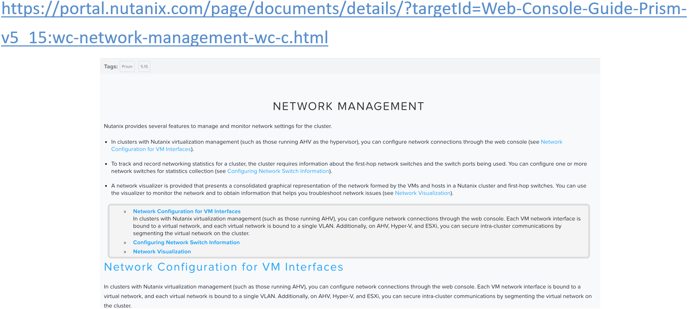

`Network Management <https://portal.nutanix.com/page/documents/details/?targetId=Web-Console-Guide-Prism-v5_15:wc-network-management-wc-c.html>`_
""""""""""""""""""""""""""""""""""""""""""""""""""""""""""""""""""""""""""""""""""""""""""""""""""""""""""""""""""""""""""""""""""""""""""""""""""""""""""""""""""

-----------------------------------------------------

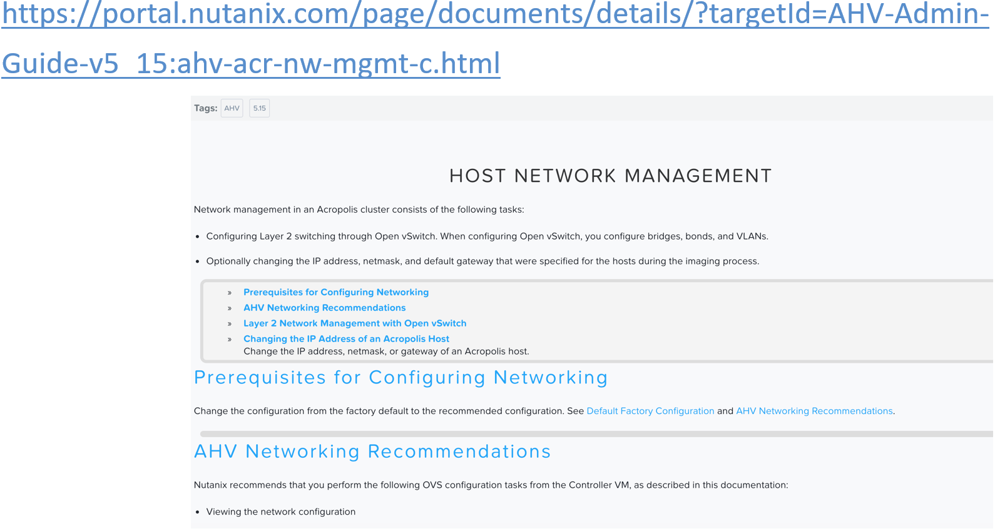

`Host Network Management <https://portal.nutanix.com/page/documents/details/?targetId=AHV-Admin-Guide-v5_15:ahv-acr-nw-mgmt-c.html>`_
""""""""""""""""""""""""""""""""""""""""""""""""""""""""""""""""""""""""""""""""""""""""""""""""""""""""""""""""""""""""""""""""""""""""""""""""""""""""""""""""""

-----------------------------------------------------

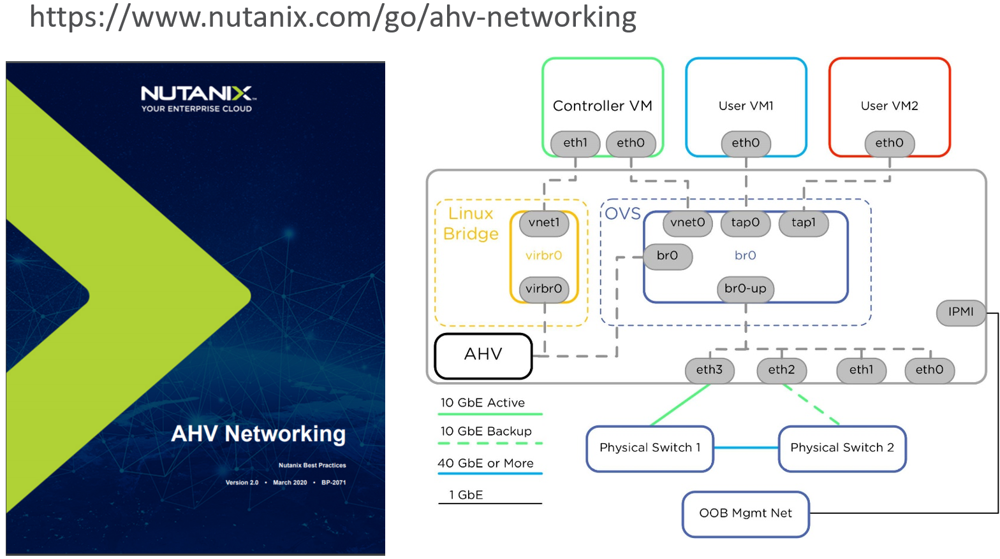

`AHV Networking Best Practices Guide <https://www.nutanix.com/go/ahv-networking>`_
""""""""""""""""""""""""""""""""""""""""""""""""""""""""""""""""""""""""""""""""""""""""""""""""""""""""""""""""""""""""""""""""""""""""""""""""""""""""""""""""""

-----------------------------------------------------

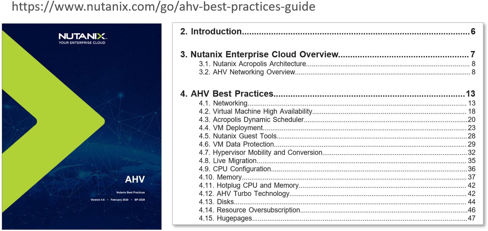

`AHV Best Practices Guide <https://www.nutanix.com/go/ahv-best-practices-guide>`_
""""""""""""""""""""""""""""""""""""""""""""""""""""""""""""""""""""""""""""""""""""""""""""""""""""""""""""""""""""""""""""""""""""""""""""""""""""""""""""""""""

-----------------------------------------------------

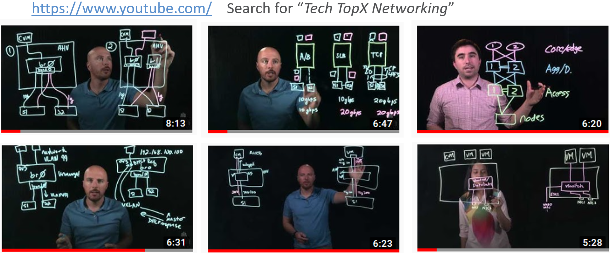

**nu.school Tech TopX Networking Series**

-----------------------------------------------------

Questions
++++++++++++++++++++++

This is a link to the Questions : :doc:`Questions`

