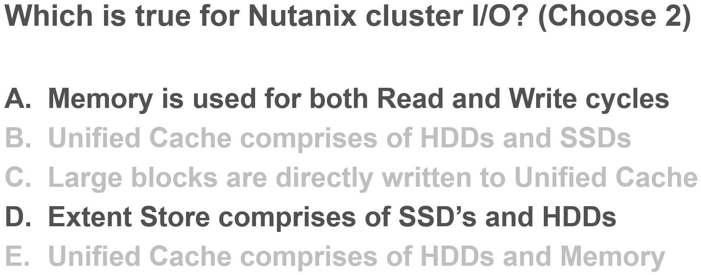

.. Adding labels to the beginning of your lab is helpful for linking to the lab from other pages
.. _NC_answer_2:

-------------
Answer 2
-------------

A. Memory is used for both Read and Write cycles		: Correct
B. Unified Cache comprises of HDDs and SSDs 			: Incorrect. Extent Store comprises of HDDs and SSDs 
C. Large blocks are directly written to Unified Cache 	: Incorrect. Large blocks are directly written to the Extent Store 
D. Extent Store comprises of SSD’s and HDDs				: Correct
E. Unified Cache comprises of HDDs and Memory			: Incorrect. Unified Cache comprises of SSDs and HDDs (and NVMe)

Back to the Question: :ref:`NC_question_2`

Next Question: :ref:`NC_question_3`

