.. title:: NCP Bootcamp - Nutanix Concepts
  
.. _nutanix_concepts:

-----------------
Nutanix Concepts
-----------------

Session 1

-----------------------------------------------------

What is (Server) Virtualization
++++++++++++++++++++++++++++++++

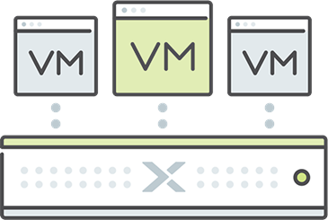

- **Host** computer on which hypervisor runs
- **Hypervisor** creates/manages guest VMs and presents VMs with virtual O.S.
- **Guest virtual machine (VM)**  emulation of a physical computer, based on a computer architecture

**Summary**

Virtualization, as the name implies, creates a virtual version of a once-physical item. In a datacenter, the most commonly virtualized items include operating systems, servers, storage devices, or desktops. With virtualization, technologies like applications and operating systems are abstracted away from the hardware or software beneath them. 
Hardware virtualization involves virtual machines (VMs), which take the place of a “real” computer with a “real” operating system.

How does virtualization work? 
One of the main reasons businesses use virtualization technology is server virtualization, which uses a hypervisor to “duplicate” the hardware underneath. In a non-virtualized environment, the guest operating system (OS) normally works in conjunction with the hardware. When virtualized, the OS still runs as if its on hardware, letting companies enjoy much of the same performance they expect without hardware. Though the hardware performance vs. virtualized performance isn’t always equal, virtualization still works and is preferable since most guest operating systems don’t need complete access to hardware.  As a result, businesses can enjoy better flexibility and control and eliminate any dependency on a single piece of hardware. Because of its success with server virtualization, virtualization has spread to other areas of the datacenter, including applications, networks, data, and desktops.

Put simply, virtualization solutions streamline your enterprise datacenter. It abstracts away the complexity in deploying and administering a virtualized solution, while providing the flexibility needed in the modern datacenter.

**Virtualization Terminology:**

- Host (machine): a computer on which a hypervisor runs. 
- Hypervisor: creates a virtual version of a once-physical system. Manages multiple guest VMs simultaneously. Apps and O.S. are abstracted away from the hardware. VMs are presented with a virtual O.S.
- Guest (virtual) machine: virtual machine (VM). VMs have run their own OS. Interaction with physical hardware is done through para-virtualized drivers 

-----------------------------------------------------

Nutanix HCI 
++++++++++++++++++++++
CPU, Memory, Storage, Network

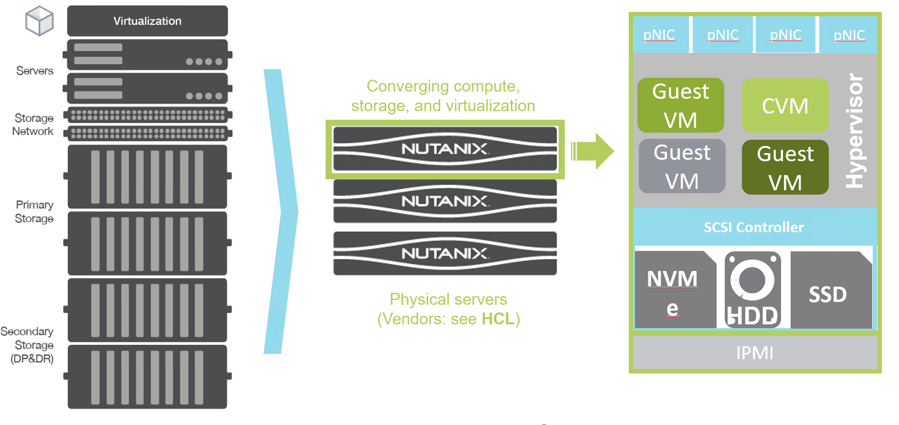

HCL: Hardware Compatibility Matrix (Support Portal) 
IPMI: Intelligent Platform Management Interface

**Hyperconverged infrastructure (HCI):** combines x86-based compute and storage resources with intelligent software to create flexible building blocks.  

HCI replaces legacy infrastructure.

https://www.nutanix.com/hyperconverged-infrastructure

-----------------------------------------------------

Hardware Platforms
++++++++++++++++++++++

Eligible hardware vendor platforms and configurations as per HCL

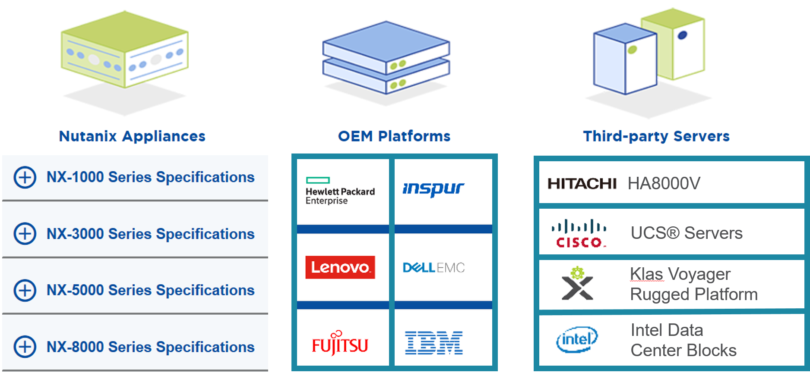

The software solution runs on nodes from a variety of manufacturers that are either all-flash for optimal performance, or a hybrid combination of SSD and HDD that provides a combination of performance and additional capacity.   
Source: https://www.nutanix.com/content/nutanix/en/products/hardware-platforms 

The Nutanix Enterprise Cloud Platform is also available on industry-leading OEM appliance platforms from HPE, Lenovo, Fujitsu, InSpur, Dell EMC and IBM.

See the Hardware Compatibility List (HCL) on the Support Portal (Documentation section).

**Third-Party Server Vendors**

The Nutanix Enterprise Cloud Platform is also available as a software option through your local reseller on Cisco and HPE x86 servers, and on specialized rugged x86 platforms from Crystal and Klas Telecom:

- Cisco Hardware 
- Hitachi Hardware
- HPE Hardware
- Inspur Hardware
- Intel Hardware
- Klas Hardware

**Supported Architectures**

Nutanix currently supports both x86 and IBM POWER architectures, pulling key logic from hardware and doing it in software (software-defined) on commodity hardware. Benefits include:

- Rapid release cycles
- Elimination of proprietary hardware reliance
- Utilization of commodity hardware for better economics
- Lifespan investment protection

To elaborate on the last point: old hardware can run the latest and greatest software. This means that a piece of hardware years into its depreciation cycle can run the latest shipping software and be feature parity with new deployments shipping from the factory. 

-----------------------------------------------------

Cluster Construct
++++++++++++++++++++++

A cluster consists of a number of nodes, located in blocks

- **Block** Physical chassis with 1 to 4 nodes
- **Node** Single physical server within block

  - **Node Ports** IPMI, USB, VGA, (Q)SFP
- **Cluster** Logical bundling of physical nodes

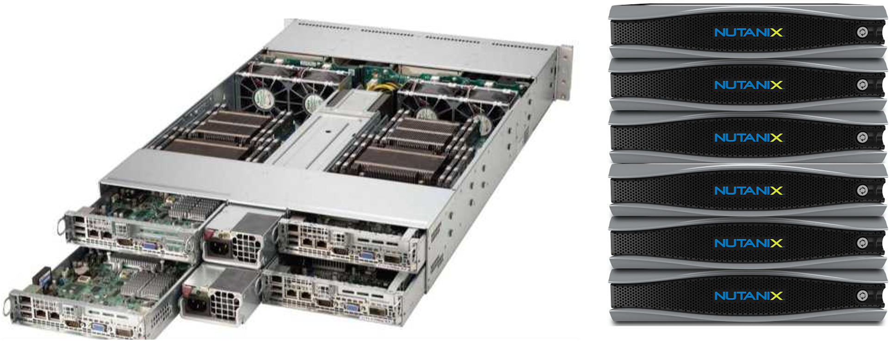

-----------------------------------------------------

Nutanix Hyperconverged
++++++++++++++++++++++

Freedom of choice across hypervisors

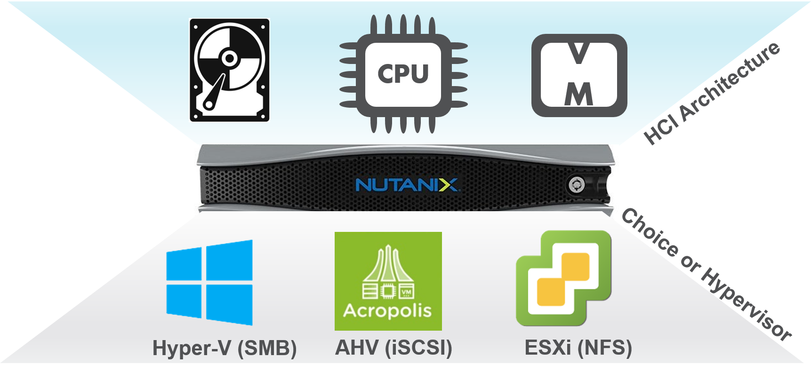

-----------------------------------------------------

NTNX Hyper-converged Infrastructure (HCI)
++++++++++++++++++++++++++++++++++++++++++++++

Single pre-configured guest VM (CVM) runs AOS on every node

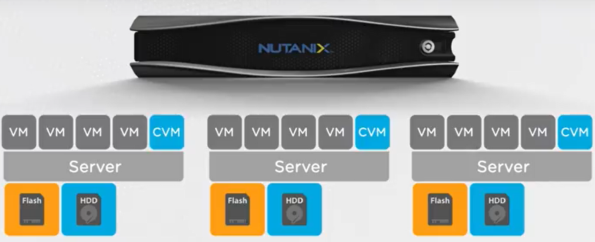

Source: https://www.enterpriseai.news/2014/10/09/nutanix-goes-flash-server-storage-hybrids/

Nutanix AHV Hypervisor balances CPU, Memory (RAM), and Storage IO resources to achieve the best possible quality of service for all VM’s running on the platform. 

-----------------------------------------------------

Nutanix AOS Services
++++++++++++++++++++++

AOS Services run on every CVM in the cluster

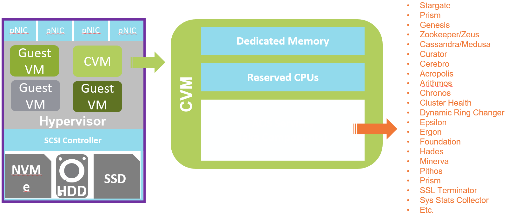

All hosts within the cluster have visibility into shared Nutanix datastores through the Controller VMs. 
Guest VM data is written locally and replicated on other nodes for high availability.

**Do not, under any circumstances:**

- Use the Reset System Configuration option of ESXi
- Delete the Nutanix Controller VM
- Take a snapshot of the Controller VM for backup

More AOS details can be found on nutanixbible.com    

A large number of AOS services are running inside the CVM.

- Apache Zookeeper implements Zeus, which is the Nutanix library that all other components use to access the cluster configuration.
- Medusa is a Nutanix abstraction layer that sits in front of the database that holds metadata. A modified form of Apache Cassandra distributes the database across all nodes in the cluster.
- From the perspective of the hypervisor, Stargate is the main point of contact for the Nutanix cluster. 
- In the Nutanix cluster, each node runs a Curator process that watches over the entire process.

-----------------------------------------------------

DSF Provides Tiering and Data Locality
++++++++++++++++++++++++++++++++++++++++++++++

Using intelligent data placement algorithms

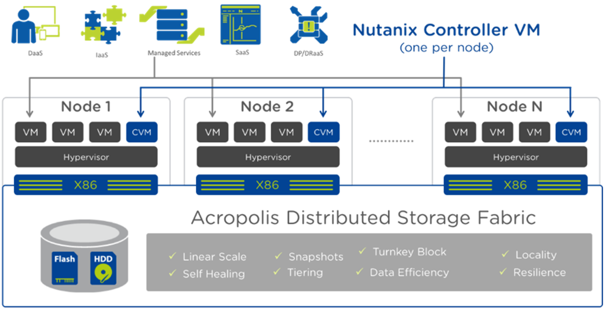

For best performance, algorithms make sure the most frequently used data is available in memory or in flash on the node local to the VM.

-----------------------------------------------------

Redundancy Factor (RF)
++++++++++++++++++++++

Either RF2 or RF3

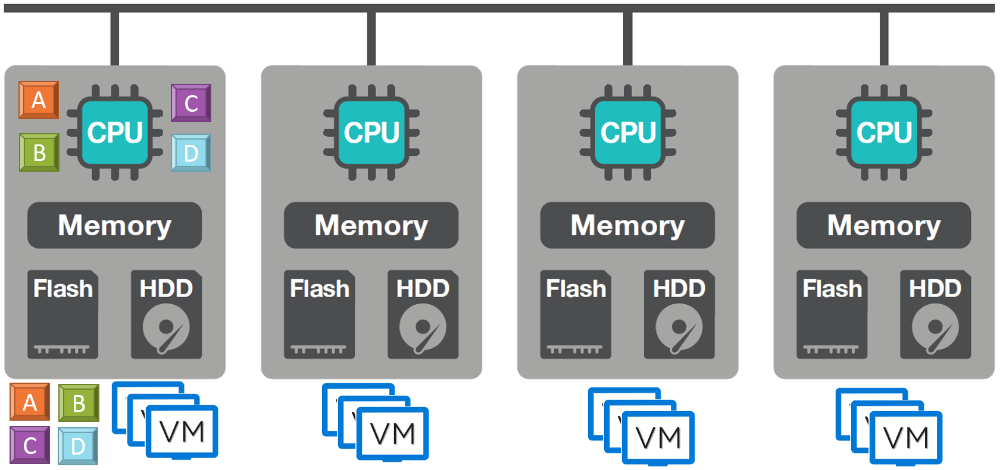

Why no data is lost upon node failure:
- Write I/O’s directly written to SSD
- Write I/O’s replicated to other nodes (depends on RF)
- Memory only used for Read I/O’s 

-----------------------------------------------------

Intra-cluster CVM-to-CVM Communication
++++++++++++++++++++++++++++++++++++++++++++++

Enables data replication (RF2/RF3), AOS Services monitoring, self-healing

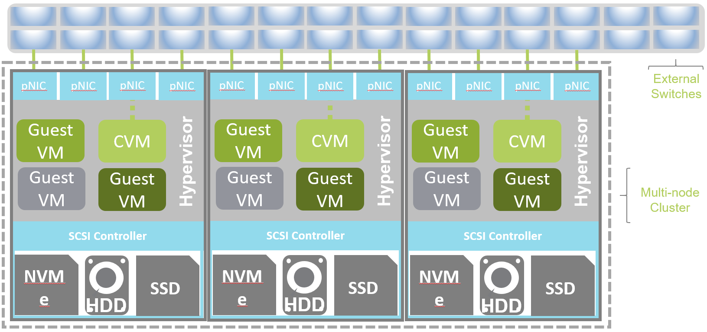

For best performance, AOS algorithms make sure the most-frequently-used data is available in memory or in flash on the node local to the VM. 

With Distributed Storage Fabric (DSF), data replicas will be written to one (Replication Factor 2, aka RF2) or two (RF3) other nodes in the cluster to ensure that in the case of a node/block/rack unavailability (e.g. planned downtime) or failure, the data remains available. This is called “node awareness”. 

-----------------------------------------------------

Prism Overview
++++++++++++++++++++++

Prism (Element) vs. Prism Central

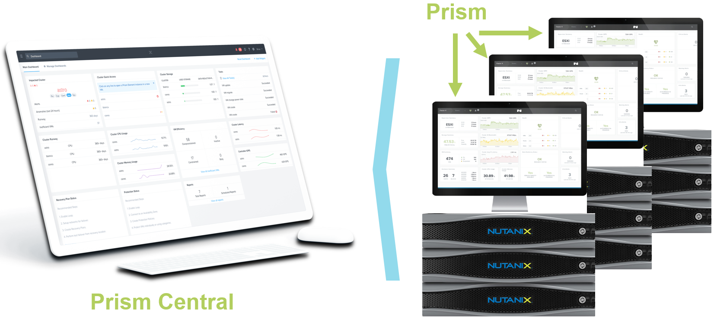

Prism (aka Prism Element) is the Nutanix built-in HTML-5 based console for local, single-cluster configuration and management. 

Prism Central (PC) spans multiple Prism (Element) consoles, providing a single pane of glass and single-sign on for multiple clusters.  

Individual clusters (Prism Element) register to the Prism Central. PC, a single VM or multi-VM, is configured by the user. 

-----------------------------------------------------

Licensing
++++++++++++++++++++++

License by capacity, appliance, or specific use cases/workloads

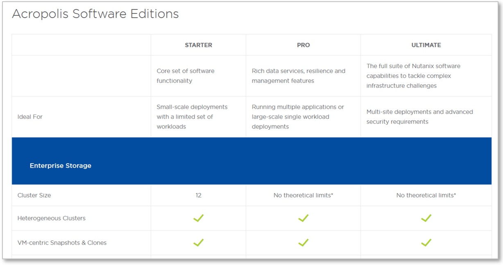

AOS (Acropolis)

- Starter
- Pro
- Ultimate

Prism Central

- Standard ("Starter")
- Pro (a.k.a. Prism Pro)

Nutanix Licensing Models

Select a Nutanix AOS license model based on the needs of your organization. You can license by capacity, by appliance, or by specific use cases and workloads. All licensing models include product entitlements for AOS, AHV, and Prism.

This page can be found on the Nutanix web Site nutanix.com  under Products, followed by Software Options.

-----------------------------------------------------

Enterprise Cloud Components
++++++++++++++++++++++++++++++

License by capacity, appliance, or specific use cases/workloads

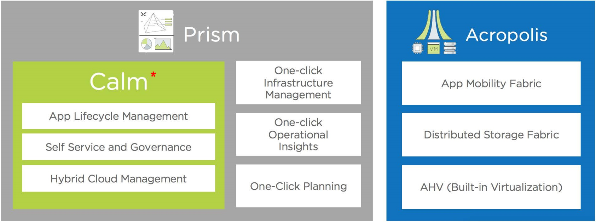

An Enterprise Cloud is a unified IT operating environment that provides a single point of control for private, public and distributed clouds for managing infrastructure and applications. 

Nutanix Enterprise Cloud delivers a consistent, high-performance and seamless experience for cloud-delivered services and applications.

- **Acropolis:** A software-driven infrastructure stack, converging storage, virtualization, networking and security that delivers applications. This data plane is made up of App Mobility Fabric (AMF), Distributed Storage Fabric (DSF) and hypervisor integration.

  - **App Mobility Fabric (AMF)** – logical construct built into Nutting solutions that allows application and data to freely move between environments. The AMF abstracts the workloads (Containers, VMs, etc.) from the hypervisor, which is what provides this ability to easily move applications and datas around.
  - **Distributed Storage Fabric (DSF)**  – distributed system that pool storage resources and provides storage platform capabilities such as snapshots, disaster recovery, compression, erasure coding, and more. Nodes work together across a 10 GbE network to form a Nutanix cluster and the DSF.
  - **Hypervisor** –  ESXi, Hyper-V, and Acropolis Hypervisor (AHV)

- **Prism:** Complete infrastructure management and operations. Provides management UI for administrators to configure and monitor the cluster. This web interface also provides access to REST APIs and the nCLI.
- **Calm:** Application automation and orchestration in private and public clouds, such as Amazon Web Services (AWS) and Google Cloud Platform.

-----------------------------------------------------

Nutanix Product Portfolio
++++++++++++++++++++++++++++++

A journey from Core to Essentials to Enterprise

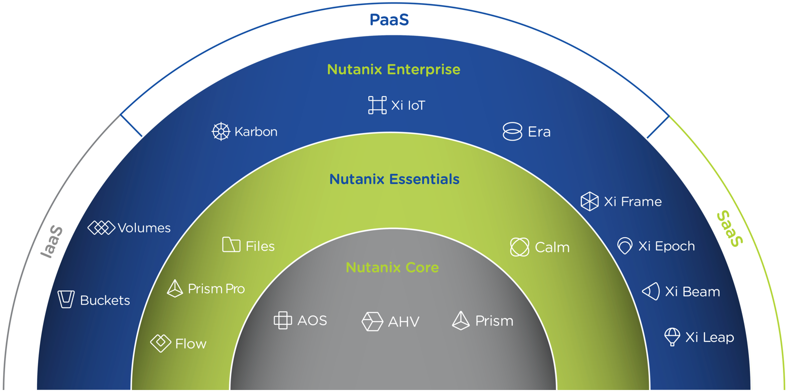

Products & Platforms
Over the years the Nutanix Platform capabilities have grown substantially, shown here as a journey from Core to Essentials to Enterprise.  Refer to the Nutanix website for the latest portfolio and offerings. 

- Datacenter Modernization (Core): Core includes the foundational Nutanix products facilitating the migration from complex 3-tier infrastructure to a simple HCI platform. AOS provides all of the core services (storage, upgrades, replication, etc.), Prism provides the control plane and management console and AHV provides a free virtualization platform (NOTE: you can also use ESXi, Hyper-V and XenServer). Core capabilities include: Core Platforms (HCI), Storage Services, Virtualization, Centralized Management & Operations, Upgrades, and Replication / DR
- Enabling Private Cloud (Essentials): Essentials is focused on providing the capabilities to enable Core infrastructure to be consumed like a private cloud. Flow provides network segmentation and security, Files provides file services and Calm provides self-service, quotas and orchestration capabilities. Essentials capabilities include: Advanced Analytics & Anomaly Detection, Automation & Orchestration, Self-service Portal (SSP) and Quotas, Micro-segmentation, and File Services.
- Enabling Hybrid Cloud (Enterprise): Enterprise is focused on providing the ability to migrate workloads between clouds and cloud services. This includes features like Beam which is focused on cost governance and compliance across cloud and on-premise deployments as well as other cloud services like Frame (DaaS) and Xi Leap (DRaaS).  Enterprise capabilities include: Policy Driven DR / Run-book Automation, DRaaS, Hybrid Cloud Cost Governance & Compliance, Desktops As-A-Service (DaaS), Database As-A-Service (RDS), Kubernetes / Docker Services, Object Storage, Block Services

**AHV:** Native virtualization that eliminates expensive hypervisor lock-in.
**Prism:** Simplified infrastructure management with one-click operations.
**Volumes:** A native scale-out block storage solution.
**Calm:** Comprehensive, app-centric lifecycle management and cloud orchestration.
**Prism Pro:** Predictive analytics for critical planning, performance, and operational insights—powered by advanced machine learning.
**Flow:** Advanced network automation and app-centric network security.
**Mine Secondary StorageFiles:** Simple, scalable, and reliable file storage for your enterprise cloud.
**Xi Beam:** Multicloud optimization service reduces costs and enhances cloud security compliance.
**Move:** Easy application migration to the cloud of your choice.
**Xi Leap:** Natively integrated, cloud-based disaster recovery.
**Objects:** Scalable S3-compatible object storage for the multi-cloud era.
**X-ray:** Real-world, scenario-driven HCI benchmarking.
**Xi IoT:** Edge platform for delivering secure, actionable real-time analysis for IoT use cases.
**Xi Frame:** Cloud-based desktop-as-a-service runs any application in any browser.
**Karbon:** Simplified provisioning, operations, and lifecycle management for Kubernetes.
**Era:** Elegant and efficient one-click operations that simplify database administration.

-----------------------------------------------------

What’s in a Name?
++++++++++++++++++++++

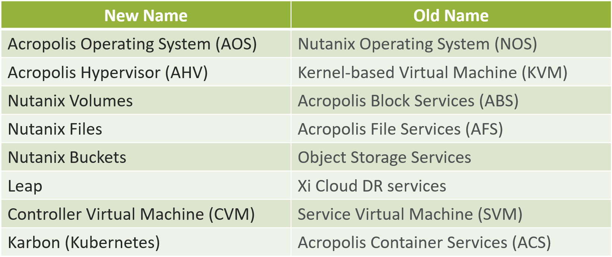

-----------------------------------------------------

References
++++++++++++++++++++++

Simple Explanation of How Nutanix Works Video
- https://www.youtube.com/watch?v=wfFuohZwi5Q

Nutanix Bible
- https://nutanixbible.com 

my.nutanix.com Support Portal

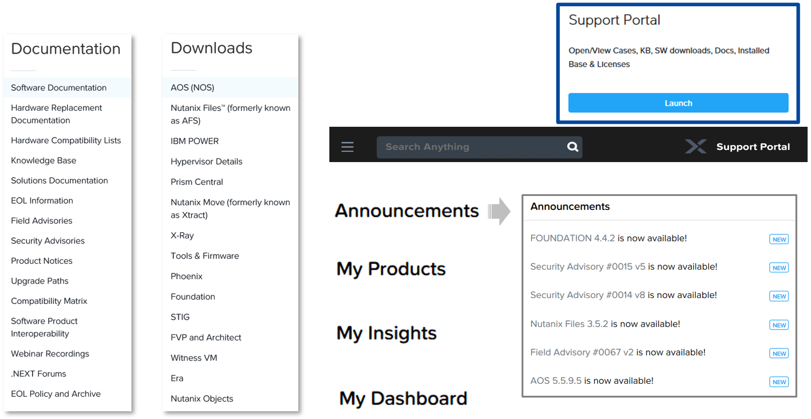

-----------------------------------------------------

Questions
++++++++++++++++++++++

This is a link to the Questions : :doc:`Questions`
