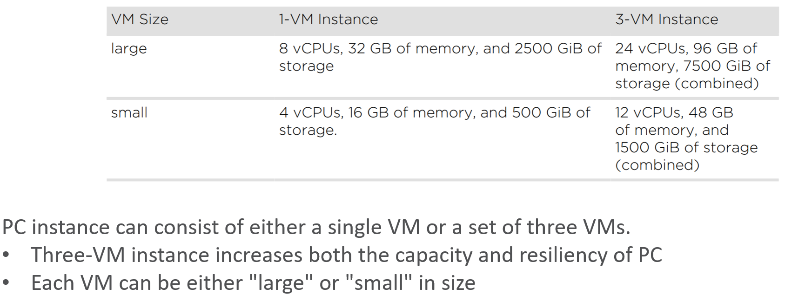
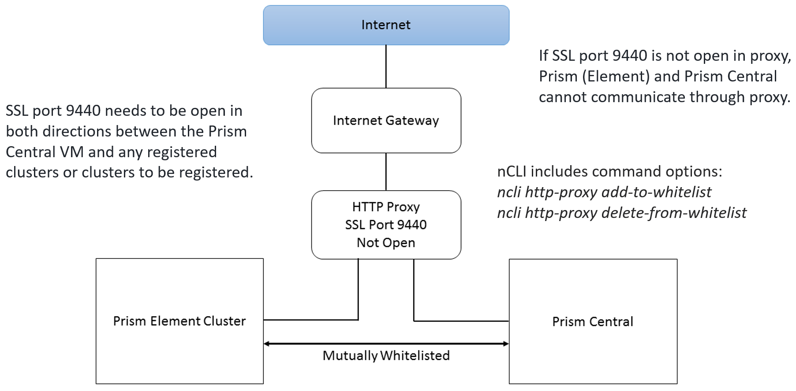
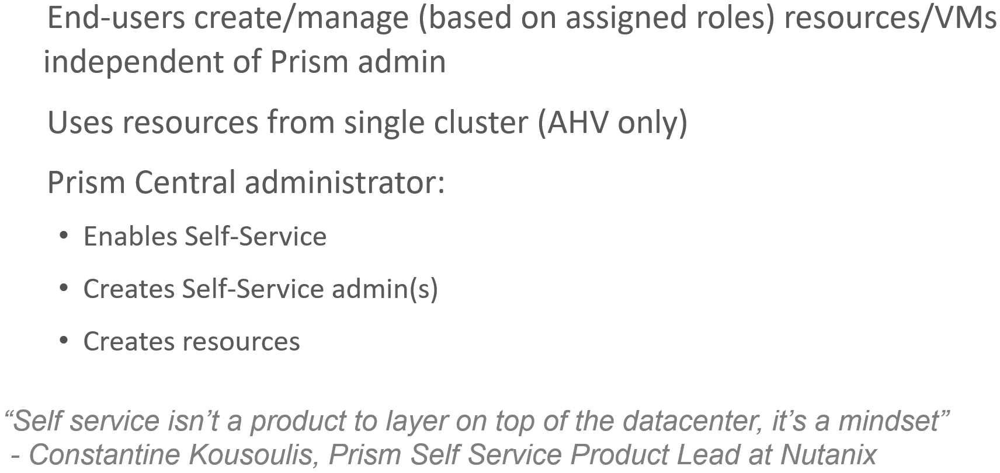
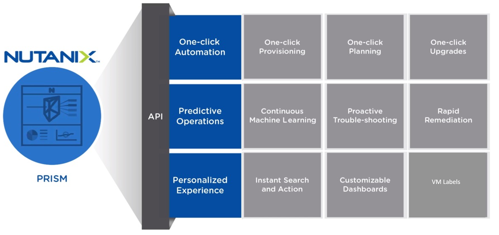
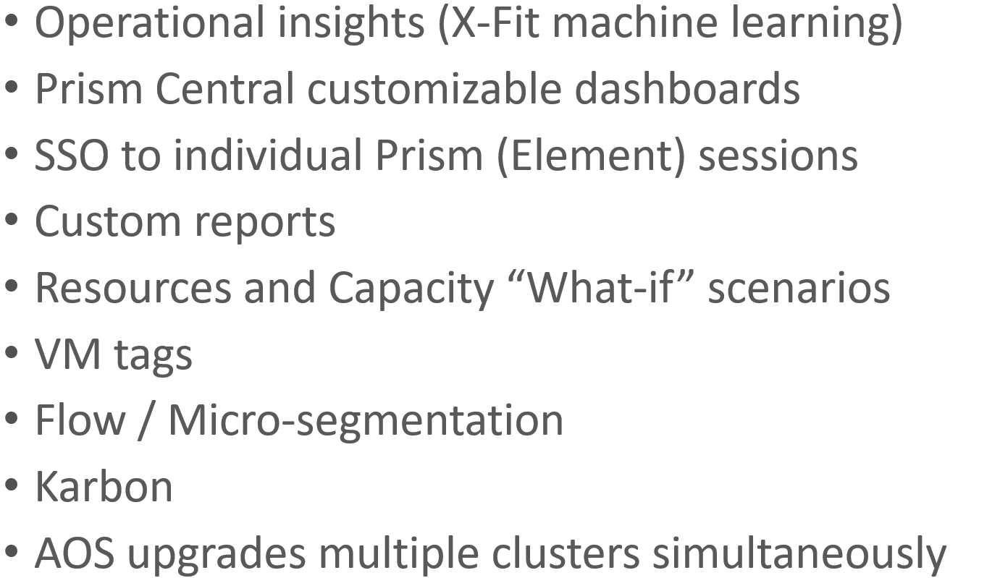
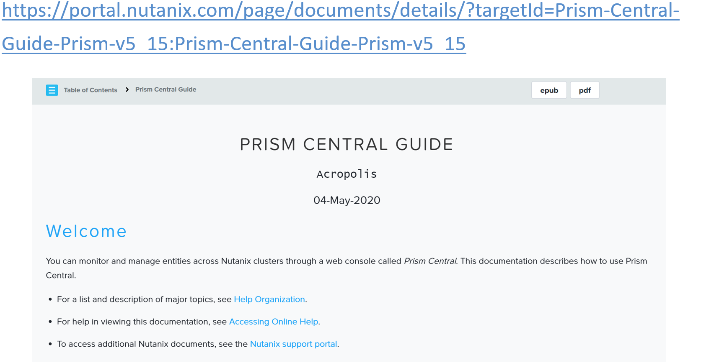
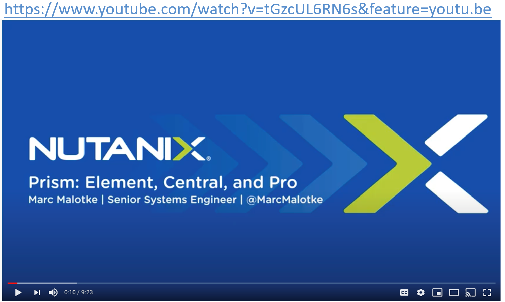
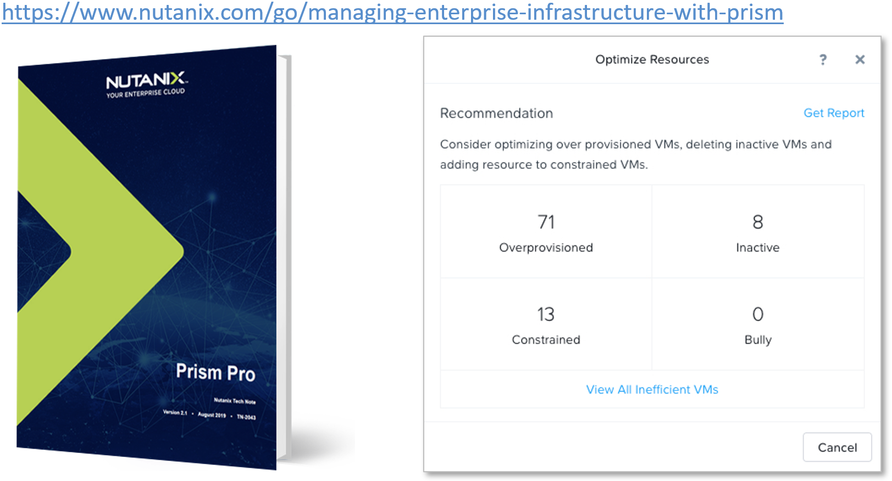

.. Adding labels to the beginning of your lab is helpful for linking to the lab from other pages
.. _Prism_Central_1:

-------------
Prism Central
-------------

Session 11

-----------------------------------------------------

Management Interfaces: PC
++++++++++++++++++++++++++++++++

**Install also for single cluster deployments**

.. figure:: images/ManagementInterfacesPC.png

-----------------------------------------------------

Prism Central Instances
++++++++++++++++++++++++++++++++

**Install also for single cluster deployments**

-----------------------------------------------------

Prism Element <> Prism Central Proxy
++++++++++++++++++++++++++++++++++++++

**Whitelists needed if SSL port 9440 closed**

**Who needs to use the whitelist method?**

SSL port 9440 needs to be open in both directions between the Prism Central VM and any registered clusters or clusters to be registered.

- If you are implementing a proxy server in your cluster environment with this port open, you do not need to whitelist Prism Central and its managed/registered clusters. 
- For more info, refer to the `Prism Central v5.15 Guide <https://portal.nutanix.com/page/documents/details?targetId=Prism-Central-Guide-Prism-v5_15:Prism-Central-Guide-Prism-v5_15>`_

**The nCLI includes ncli http-proxy add-to-whitelist and ncli http-proxy delete-from-whitelist command options for use when you are implementing a proxy server in your cluster environment.**

- E.g. *nutanix@cvm$ ncli http-proxy add-to-whitelist target-type=ipv4_address target=10.11.12.13*

-----------------------------------------------------

(Prism) Self-Service
++++++++++++++++++++++++++++++++++++++

**Prism Central feature (AOS 5.5 or later)**

**The Prism Self Service feature allows you to create projects where consumers of IT infrastructure within an enterprise—individual users or teams such as development, test, and DevOps—can provision and manage VMs in a self-service manner, without having to engage IT in day-to-day operations.**

**Now implemented through Prism Central (only), Self-Service was pre-AOS 5.5 hosted on a cluster through Prism Element.**

- Clusters registered to Prism Central 5.5 or later must be running AOS 5.5 or later to take advantage of the user self-service features.
- While Prism Central enables infrastructure management across clusters, Self-Service allows end-users to consume that infrastructure in an independent self-service manner.
- SSP uses the resources provided by a single AHV cluster. Other hypervisors, ESXi and Hyper-V, are not supported platforms for Prism Self Service.

**There are three primary roles when configuring Prism Self Service:**

1. Prism Central administrator. The Prism Central administrator enables Prism Self Service and creates one or more self-service administrators. Prism Central administrators also create VMs, images, and network configurations that may be consumed by self-service users.
2. Self-service administrator. The self-service administrator performs the following tasks:

- Creates a project for each team that needs self-service and adds Active Directory users and groups to the projects.
- Configures roles for project members.
- Publishes VM templates and images to the catalog.
- Monitors resource usage by various projects and its VMs and members, and then adjusts resource quotas as necessary.

A Prism Central administrator can also perform any of theses tasks, but they are normally delegated to a self-service administrator. 

3. Project user. These are the users assigned to a project by a self-service administrator. They can perform any action that the self-service administrator grants them. The permissions are determined by the roles assigned to the users and groups in the project. When project users log in, they see a custom self-service GUI interface that shows only what the role permissions allow. Project users create and manage only what they need.

-----------------------------------------------------

Questions
++++++++++++++++++++++

This is a link to the Questions : :doc:`Questions`

-----------------------------------------------------

Bonus Material
++++++++++++++++++++++

-----------------------------------------------------

Cluster Management: Prism
!!!!!!!!!!!!!!!!!!!!!!!!!

-----------------------------------------------------

Prism Pro Features
!!!!!!!!!!!!!!!!!!

**Management of Registered Clusters**

-----------------------------------------------------

References
!!!!!!!!!!!

`Prism Central <https://portal.nutanix.com/page/documents/details/?targetId=Prism-Central-Guide-Prism-v5_15:Prism-Central-Guide-Prism-v5_15>`_

-----------------------------------------------------

`Prism Element - Prism Central - Prism Pro <https://www.youtube.com/watch?v=tGzcUL6RN6s&feature=youtu.be>`_

-----------------------------------------------------

`Prism Pro Tech Note <https://www.nutanix.com/go/managing-enterprise-infrastructure-with-prism>`_

