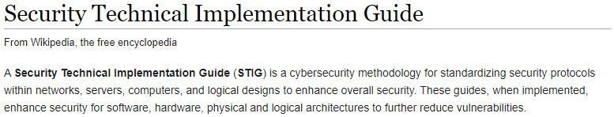
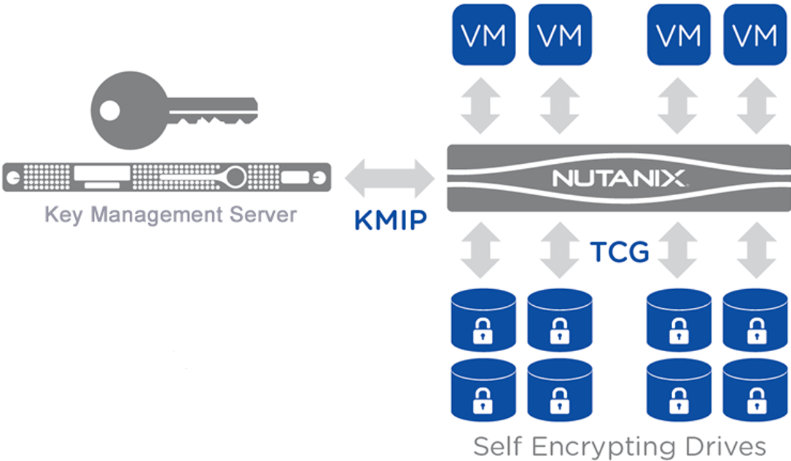
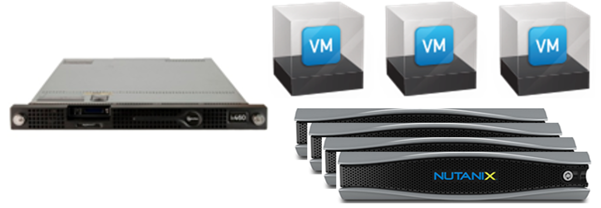
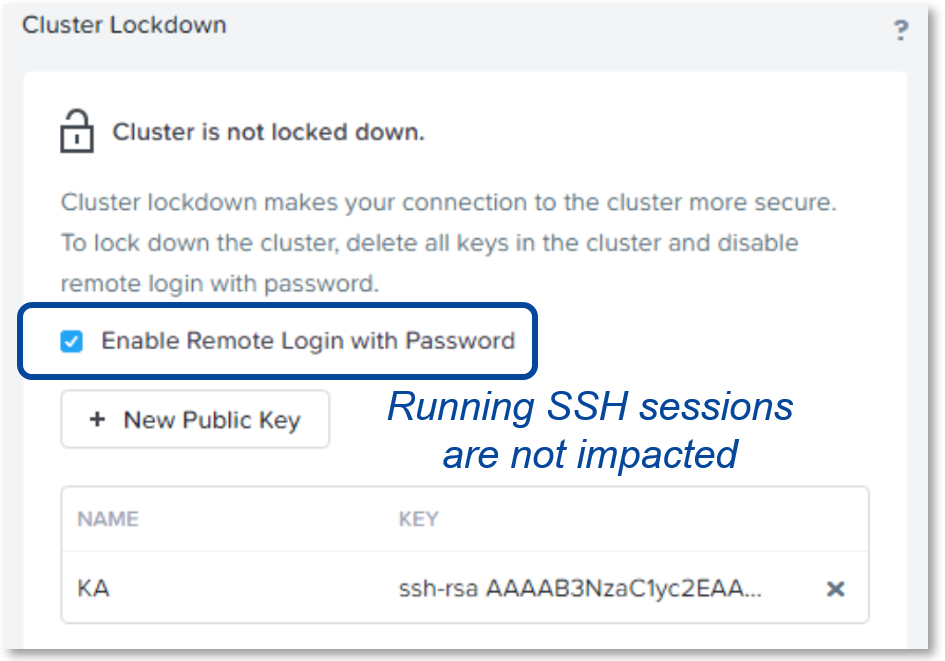
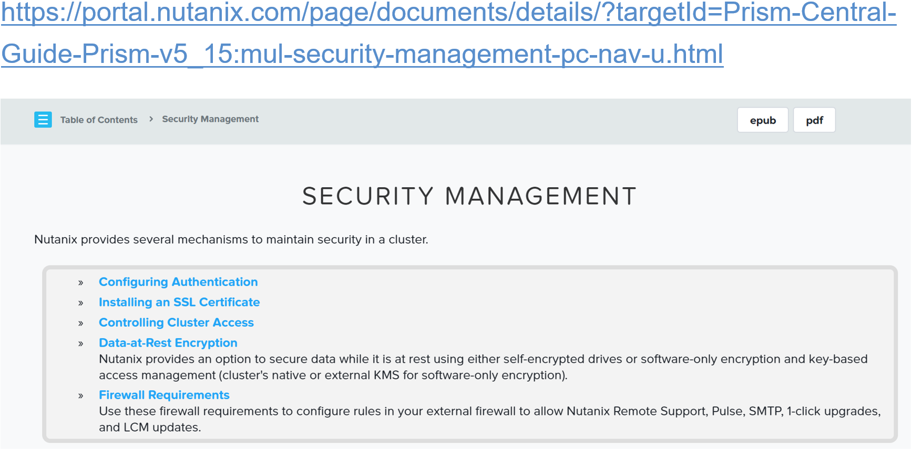
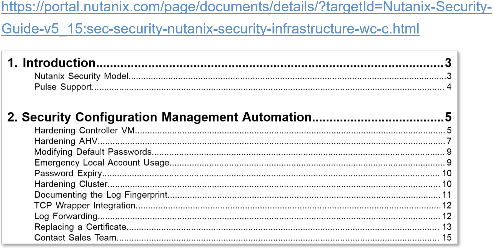

.. Adding labels to the beginning of your lab is helpful for linking to the lab from other pages
.. _Securing_a_Nutanix_Cluster_1:

--------------------------
Securing a Nutanix Cluster
--------------------------

Session 3

-----------------------------------------------------

STIG : Security Technical Implementation Guide
++++++++++++++++++++++++++++++++++++++++++++++++

STIG Implementation - https://public.cyber.mil/stigs/

To make the STIGs usable by all organizations, the STIGs are provided in machine-readable XCCDF.xml format in addition to the human-readable PDF format.  This enables organizations to use tools that can read STIGs and automatically validate the security baseline of a deployment, reducing the accreditation time required to stay within compliance from months to days.

- Defines secure IT environment
- Security Configuration Management Automation (SCMA) monitors over 800 security entities

  - storage
  - virtualization
  - management

- XCCDF Support

-----------------------------------------------------

Data-at-Rest Encryption: Self-encrypting Drives
+++++++++++++++++++++++++++++++++++++++++++++++

- Self-encrypting Drives (SED) or software-enabled

- Requires external key management

- SEDs use FIPS 140-2 validated cryptographic mods

- A non-protected cluster can contain both SED and standard drives (DARE cannot be enabled)

- Each node maintains a set of certificates and keys in order to establish a secure connection with the key management server

**DARE Implementation**

1. Install SEDs for all data drives in a cluster. The drives are FIPS 140-2 Level 2 validated and use FIPS 140-2 validated cryptographic modules.

- Easiest to create a new cluster that includes SED data drives only
- An existing cluster can be converted to support data-at-rest encryption by replacing the existing drives with SEDs (after migrating all the VMs/vDisks off of the cluster while the drives are being replaced).
- **Note:** Contact Nutanix customer support for assistance before attempting to convert an existing cluster.
- A non-protected cluster can contain both SED and standard drives, but Nutanix does not support a mixed cluster when protection is enabled. All the disks in a protected cluster must be SED drives.

2. When data protection for the cluster is enabled, the Controller VM must provide the proper key to access data on a SED. 

- The Controller VM communicates with the SEDs through a Trusted Computing Group (TCG) Security Subsystem Class (SSC) Enterprise protocol.
- A symmetric data encryption key (DEK) such as AES 256 is applied to all data being written to or read from the disk. 
- The key is known only to the drive controller and never leaves the physical subsystem, so there is no way to access the data directly from the drive.
- Another key, known as a key encryption key (KEK), is used to encrypt/decrypt the DEK and authenticate to the drive. 
- Each drive has a separate KEK that is generated through the FIPS compliant random number generator present in the drive controller. 
- The KEK is 32 bytes long to resist brute force attacks. The KEKs are sent to the key management server for secure storage and later retrieval; they are not stored locally on the node (even though they are generated locally).
- Each node maintains a set of certificates and keys in order to establish a secure connection with the key management server.

3. Keys are stored in a key management server that is outside the cluster, and the Controller VM communicates with the key management server using the Key Management Interoperability Protocol (KMIP) to upload and retrieve drive keys. Only one key management server device is required, but it is recommended that multiple devices are employed so the key management server is not a potential single point of failure. Configure the key manager server devices to work in clustered mode so they can be added to the cluster configuration as a single entity that is resilient to a single failure.

4. When a node experiences a full power off and power on (and cluster protection is enabled), the controller VM retrieves the drive keys from the key management server and uses them to unlock the drives. If the Controller VM cannot get the correct keys from the key management server, it cannot access data on the drives.

- If a drive is re-seated, it becomes locked.
- If a drive is stolen, the data is inaccessible without the KEK (which cannot be obtained from the drive). 
- If a node is stolen, the key management server can revoke the node certificates to ensure they cannot be used to access data on any of the drives

-----------------------------------------------------

Data-at-Rest Encryption: Software-based (no SEDs)
+++++++++++++++++++++++++++++++++++++++++++++++++

- Uses AOS; no way to access the data directly from the drive

- DEK applied to data written to disk

- Data is encrypted at all times

- For empty or new clusters

A symmetric data encryption key (DEK) such as AES 256 is applied to all data being written to the disk. The key is known only to AOS, so there is no way to access the data directly from the drive.
The key encryption key (KEK) can be changed at any time. This can be useful as a periodic password rotation security precaution or when a key management server or node becomes compromised. If the key management server is compromised, only the KEK needs to be changed, because the KEK is independent of the drive encryption key (DEK). There is no need to re-encrypt any data, just to re-encrypt the DEK. 

Key Management Server (KMS) options

- Encryption keys on (3-node min.) using cluster’s local KMS - ONLY
- Use of external KMS server(s), with uploaded CVM certificates 

-----------------------------------------------------

Client Authentication & Authorization
++++++++++++++++++++++++++++++++++++++

- Logons can require a combination of a client certificate and username and password

- Use local accounts or Active Directory/OpenLDAP

- SSL certificate-based authentication for console access: replace the default self-signed certificate with a CA signed certificate 

- Assign roles to users (Prism): User Admin, Cluster Admin, and Viewer

When user authentication is enabled for a directory service, all authorized users have full administrator permissions by default. 
You can refine the authentication process by assigning a role (with associated permissions) to organizational units (OUs), groups, or individuals within a directory. 
This procedure allows you to map directory service users to the predefined Prism Central roles of User Admin, Prism Central Admin, and viewer. If the Prism Self Service feature is enabled, you assign roles to users as you add them to a project.

Prism (Central) supports SSL certificate-based authentication for console access. Nutanix recommends that users replace the default self-signed certificate with a CA signed certificate, i.e. install a self-signed or custom SSL certificate. The Controller VM Security Operations Guide includes more information about certificates, such as generating a private key and Certificate Signing Request (CSR).

-----------------------------------------------------

Cluster Lockdown
++++++++++++++++++++++++++++++++++++++

**Password vs. Key Challenged Access**

- Provided in machine-readable XCCDF format
- Implemented via nCLI commands
- Only applies to SSH Access

Administrators can restrict access to a Nutanix cluster
SSH sessions can be restricted through non-repudiated keys

- Each node has a shared public/private key-pair
- Cluster secured by distributing these keys

Remote Login with plaintext username / password can be disabled
SSH access can be completely locked down by disabling remote login and deleting all keys

XCCDF (Extensible Configuration Checklist Description Format) is a specification language for writing security checklists, benchmarks and related types of documents. 

- The specification is designed to support information interchange, document generation, organizational and situational tailoring, automated compliance testing and compliance scoring. 
- It also defines a data model and format for storing results of benchmark compliance testing. XCCDF documents are expressed in XML and can be validated with an XML validating parser.

Nutanix includes five custom STIG components installed with AOS:

- AHV
- AOS
- Prism Web Server
- Prism Reverse Proxy
- JRE
- Provided in machine-readable XCCDF format
- Implemented via nCLI commands

-----------------------------------------------------

Questions
++++++++++++++++++++++

:doc:`Questions`

-----------------------------------------------------

References
+++++++++++++++++++++++++

`Security Management - Guide <https://portal.nutanix.com/page/documents/details/?targetId=Prism-Central-Guide-Prism-v5_15:mul-security-management-pc-nav-u.html>`_

-----------------------------------------------------

`Security Guide - Guide <https://portal.nutanix.com/page/documents/details/?targetId=Nutanix-Security-Guide-v5_15:sec-security-nutanix-security-infrastructure-wc-c.html>`_

