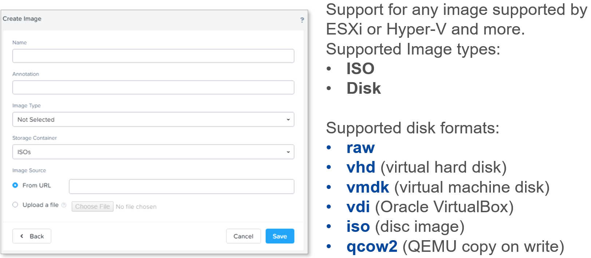
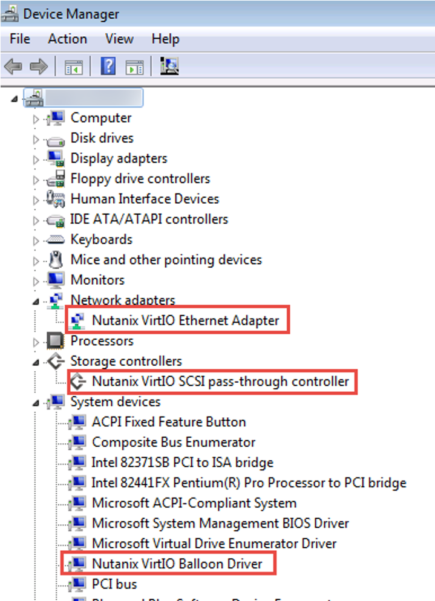
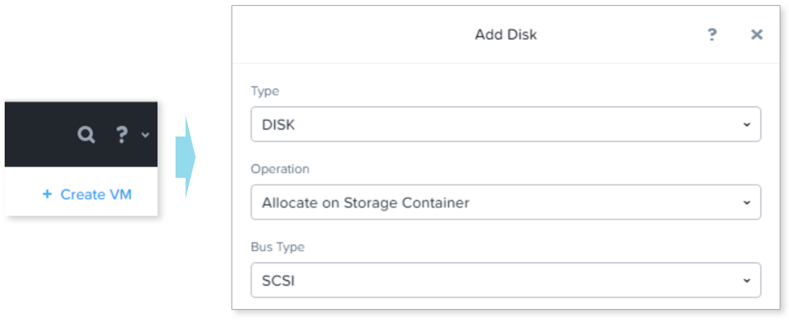
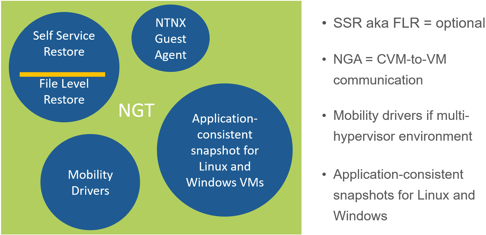
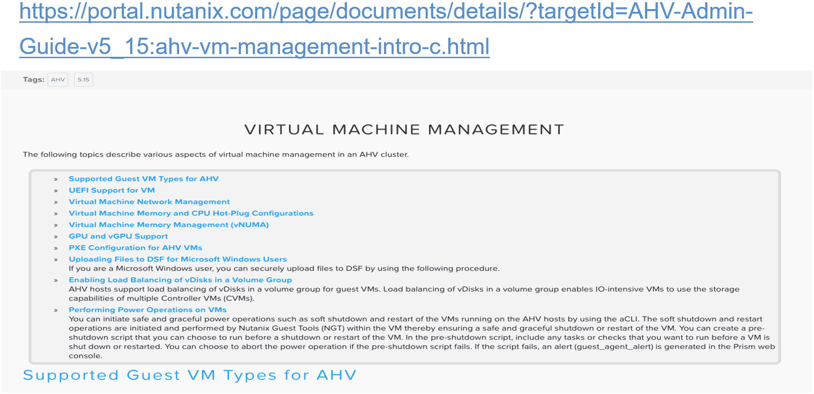
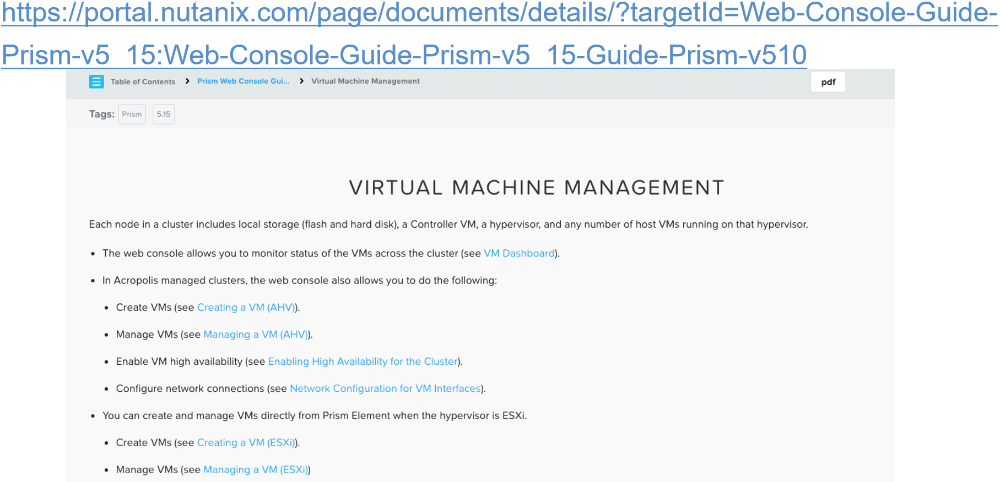
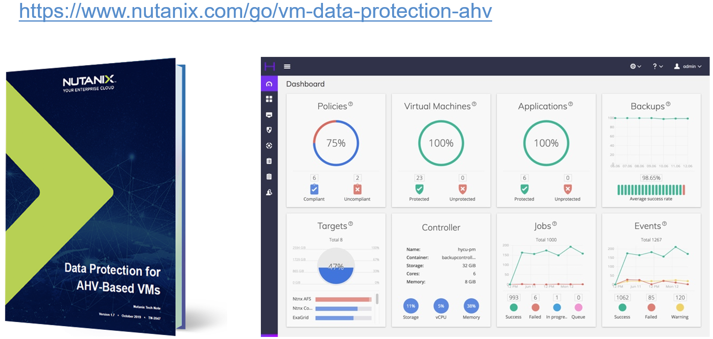
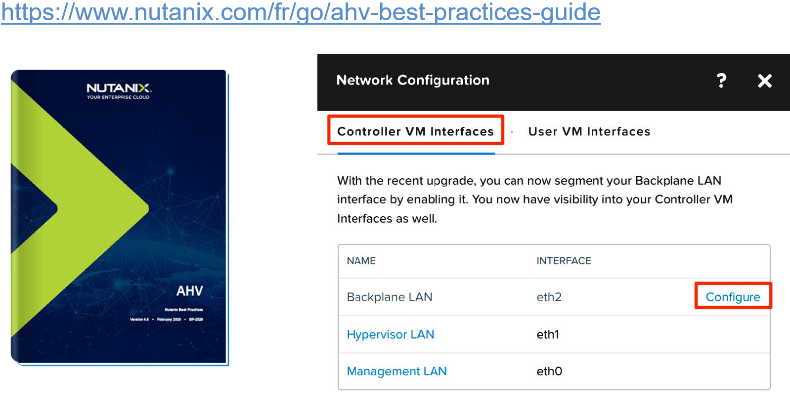

.. Adding labels to the beginning of your lab is helpful for linking to the lab from other pages
.. _VM_Creation_and_Management_1:

.. title:: NCP Bootcamp - VM Creation and Management

--------------------------
VM Creation and Management
--------------------------
 
Session 5

-----------------------------------------------------

Uploading an Image
++++++++++++++++++++++++++++++++

-----------------------------------------------------

Virtual IO Drivers
++++++++++++++++++++++++++++++++

- Enables Windows 64-bit VMs to recognize AHV virtual hardware
- Contains Network, Storage and Ballooning driver (for perf data collection)
- If not added as ISO (CDROM), Windows cannot be installed
- Most modern Linux distributions already include drivers

- Nutanix Support Portal: 

  - Downloads > Tools and Firmware

-----------------------------------------------------

Disk and Bus Type
++++++++++++++++++++++++++++++++

When creating AHV-based VMs

**Default disk types:**

- TYPE = DISK 	: SCSI
- TYPE = CDROM	: IDE

**Use SATA and PCI for older O.S. that don’t support SCSI and/or IDE**

- SCSI : Max. # of disks attached to a VM is 256
- PCI : Max. # of disks attached to a VM is 6
- IDE : Max. # of disks attached to a VM is 4

**Create New VM in AHV from –flat.vmdk**

1. Click the +Create VM button on the Prism Storage dashboard.
2. Enter the same AHV VM details (vCPUs, cores per CPU, Memory, disk size) used to create, or collected from, the ESXi VM that was migrated.
3. Within the VM Create window, click Add new disk.

- The Add Disk dialog box displays.

  a. TYPE: DISK
  b. Operation: Clone From ADFS File (which means pull from Container, not Image Services)
  c. Bus Type:  SCSI (default)
  d. ADSF Path field: Enter a forward slash (“/”) followed by the container name the VM was migrated to (select from list).

  - Enter a forward slash again, this time followed by the VM name (select from list).
  - Once again, enter a slash and select the -flat.vmdk file for the VM (single option).

  e. Size (GIB): Enter the size of the disk (freeform).

4. Click Add.
5. Scroll down within the VM Create window and click the Add New NIC button to provide the VM with a network. After selecting a network, click Add.
6. Optionally, to verify that the VM has migrated successfully, click the VM dashboard Table tab, select the VM, click Power On, and click Launch Console.

-----------------------------------------------------

Nutanix Guest Tools (NGT) Bundle
++++++++++++++++++++++++++++++++

Enable advanced functionalities on VM

**Nutanix Guest Tools Overview**

Nutanix guest tools (NGT) is a software bundle that you can install in a guest virtual machine (Microsoft Windows or Linux) to enable advanced functionality. It consists of the following components:

- Nutanix Guest Agent (NGA) service. Communicates with the Nutanix Controller VM.
- Self Service Restore (SSR) aka File Level Restore (FLR) CLI. Performs self-service file-level recovery from the VM snapshots. Optional when installing NGT
- Nutanix VM Mobility Drivers. Provides drivers for VM migration between ESXi, hyperv or cloud and AHV, in-place hypervisor conversion, and cross-hypervisor disaster recovery (CH-DR) features.
- Application-consistent snapshot for Linux VMs. Supports application-consistent snapshots for Linux VMs by running specific scripts on VM quiesce.
- VSS requestor and hardware provider for Windows VMs. Enables application-consistent snapshots of AHV or ESXi Windows VMs.

To install NGT:

1. Select a VM, then click the Enable Nutanix Guest Tools check box.
2. Select Mount Nutanix Guest Tools to mount the NGT ISO.
3. Click the Self Service Restore (SSR) check box to add SSR capabilities to a Windows VM. (SSR allows a user to mount an earlier snapshot of the vm as a drive and access its files)
4. Click the Enable Nutanix Guest Tools check box. The VSS and application-consistent snapshot feature is enabled by default.
5. Click Submit.

-----------------------------------------------------

References
++++++++++

`Virtual Machine Management (AHV Guide) <https://portal.nutanix.com/page/documents/details/?targetId=AHV-Admin-Guide-v5_15:ahv-vm-management-intro-c.html>`_
""""""""""""""""""""""""""""""""""""""""""""""""""""""""""""""""""""""""""""""""""""""""""""""""""""""""""""""""""""""""""""""""""""""""""""""""""""""""""""

-----------------------------------------------------

`Virtual Machine Management (Prism Guide) <https://portal.nutanix.com/page/documents/details/?targetId=Web-Console-Guide-Prism-v5_15:Web-Console-Guide-Prism-v5_15-Guide-Prism-v510>`_
""""""""""""""""""""""""""""""""""""""""""""""""""""""""""""""""""""""""""""""""""""""""""""""""""""""""""""""""""""""""""""""""""""""""""""""""""""""""""""""""""""""""""""""""""""""

-----------------------------------------------------

`Data Protection for AHV-Based VMs <https://www.nutanix.com/go/vm-data-protection-ahv >`_
"""""""""""""""""""""""""""""""""""""""""""""""""""""""""""""""""""""""""""""""""""""""""

-----------------------------------------------------

`AHV Best Practices Guide <https://www.nutanix.com/go/ahv-best-practices-guide>`_
"""""""""""""""""""""""""""""""""""""""""""""""""""""""""""""""""""""""""""""""""

-----------------------------------------------------

Questions
++++++++++++++++++++++

This is a link to the Questions : :doc:`Questions`

